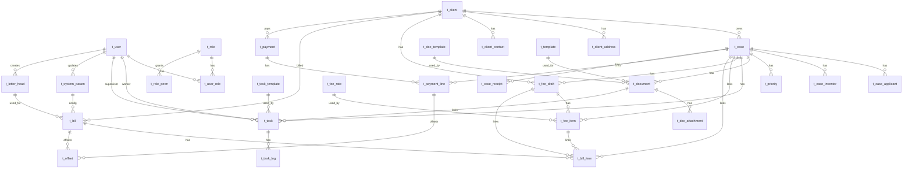

# FPMS MVP1 Database Schema (Mermaid)

## How to read this diagram
- Tables follow `t_*` naming; ORM models typically use `T_*`/`CamelCase`.
- Most tables use UUID primary keys and share audit fields via mixins:
  `created_at`, `updated_at`, `created_by`, `updated_by` (some legacy tables use integer PKs).
- Relationships shown are based on the current models/migrations; some FKs are logical even if not enforced in older data.

## ER Diagram (Mermaid)

## Source of truth
Alembic migrations are the authoritative source of the database shape; models should align with migrations.
