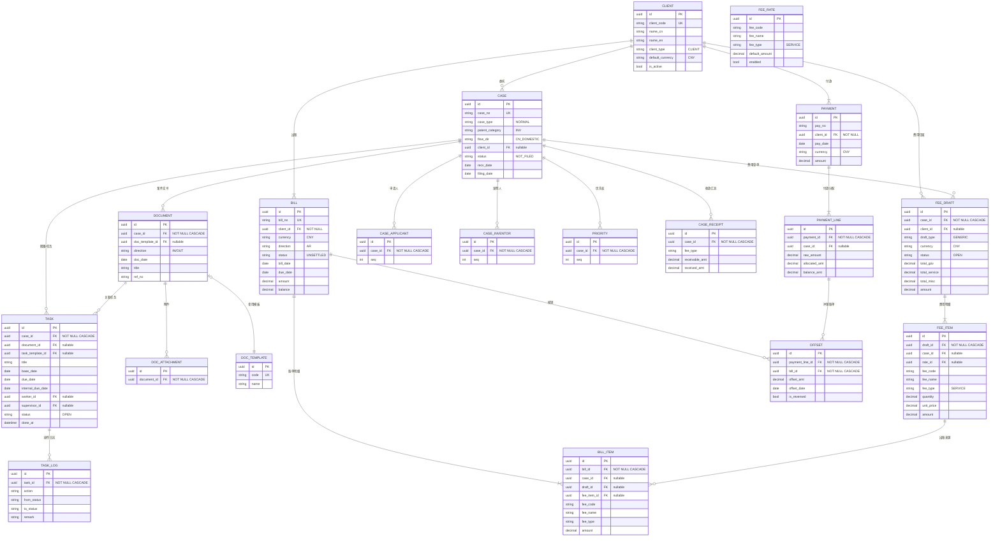

# FPMS MVP1 Entity Relationship Diagram

## ER Diagram

## 核心关系链路

- **Client → Case → Document / Task / FeeDraft** — 业务主线
- **FeeDraft → FeeItem → BillItem → Bill** — 费用出账链
- **Payment → PaymentLine → Offset → Bill** — 收款核销链
- CASCADE 删除沿 Case 向下传播到 Document、Task、FeeDraft、CaseReceipt
