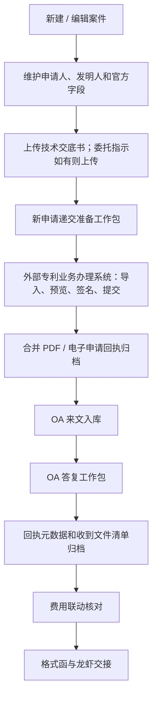

# FPMS P1 端到端演示脚本

生成日期：2026-06-12  
演示对象：专利事务所流程人员、代理助理、代理人、财务人员、管理者  
演示目标：用一件模拟国内发明案件，展示 P1 如何把新申请递交准备、OA 答复、回执归档、收费联动和格式函交接串成一个可复核的工作流，减少重复填写和漏归档。

## 1. 演示定位

P1 不是替代国家知识产权局网页，也不是自动帮工作人员点击提交。P1 的价值是把事务所内部已经维护或应当维护的信息集中整理成“官方工作包”，让工作人员在官方系统办理时少查、少填、少漏，并且在提交后把回执、合并 PDF、费用和信函交接留在 FPMS 中形成闭环。

本次演示覆盖以下客户痛点：

| 客户痛点 | P1 演示回应 |
| --- | --- |
| 新申请和 OA 答复时重复填写申请人、发明人、代理人、页数、费减等信息 | 系统从案件、申请人主数据、发明人、附件和费用草单中带出，缺失时指向维护入口 |
| 新建案件文件 gate 过多，客户明确只提到技术交底书和委托指示 | 技术交底书作为必传 gate；委托指示为“如有则上传” |
| OA 意见陈述中的公式、符号、表格、图片复制到官方网页后容易失真 | Word 正本、纯文本意见、PDF 保真附件和其他证明文件分开组织；PDF 保真附件按“附加文件：其他证明文件”提示 |
| OA 答复完成后容易忘记下载和内部归档电子申请回执 | 回执 PDF 与接收案件编号、提交人、接收时间、收到文件清单作为关闭工作包的硬门禁 |
| 旧系统费减 `0 / 0.7 / 0.85` 容易和现有计费乘数混淆 | P1 明确显示客户减免比例，并转换成系统应缴比例，例如 `0.85 -> 0.15` |
| 信函已有龙虾邮件系统，不希望重做邮件发送 | P1 只生成格式函、命名、抬头和交接清单，不替换龙虾发送 |

## 2. 模拟数据

以下数据均为演示用模拟数据，不对应真实客户、真实案件或真实个人。

| 数据项 | 演示值 |
| --- | --- |
| 客户 | P1全流程客户有限公司 |
| 客户联系人 | 张三老师 |
| 申请人主数据 | P1测试申请人有限公司 |
| 总委托书备案编号 | 总委备-P1-LIVE-001 |
| 发明人 | 李四 |
| 案号 | P1E2E-LIVE |
| 案件名称 | P1全流程测试方法及系统 |
| 申请号 | CN202610000001.0 |
| 专利类型 | 发明 |
| 申请方向 | 国内普通申请 |
| 说明书页数 | 18 |
| 权利要求项数 | 10 |
| 权利要求页数 | 4 |
| 附图页数 | 3 |
| 是否同时提实审 | 是 |
| 客户减免比例 | 0.85 |
| 系统应缴比例 | 0.15 |
| 新申请工作包 | FILING-PD-P1-LIVE |
| OA 答复工作包 | OA-PD-P1-LIVE |
| 费用草单 | FD-PD-P1-LIVE |
| 官费清单 | PL-PD-P1-LIVE |
| 格式函模板 | FORMAT_LETTER_OA1 |

### 2.1 文件清单

| 文件 | FPMS 文件角色 | 演示用途 |
| --- | --- | --- |
| 技术交底书.docx | `TECHNICAL_DISCLOSURE` | 新建案件必传 gate |
| 请求类表格.zip | `FILING_XML_ZIP` | 专利业务办理系统导入准备文件 |
| 意见陈述书.docx | `OA_STATEMENT_WORD` | OA 意见陈述 Word 正本 |
| 意见陈述书.pdf | `OA_STATEMENT_PDF` | 公式/表格/图片保真附件 |
| 修改后的权利要求书.docx | `OA_MODIFIED_CLAIMS` | OA 修改文件 |
| 修改对照页.pdf | `OA_AMENDMENT_COMPARISON` | OA 附加文件 |
| 实验数据.pdf | `OA_OTHER_PROOF` | 其他证明文件 |
| 电子申请回执.pdf | `ELECTRONIC_RECEIPT` | OA 回执归档证据 |
| 第一次审查意见通知书.pdf | `SOURCE_DOCUMENT` | 格式函交接附件 |

## 3. 演示流程总览



演示时建议按这个顺序讲：先说明“系统不替代官方网站”，再展示“系统把要填、要上传、要确认、要归档的内容统一组织起来”。

## 4. 演示脚本

### 4.1 新申请建案与官方字段维护

演示入口：

- `/cases/no/P1E2E-LIVE/edit`
- 可补充展示：`/settings/applicants`

操作步骤：

1. 打开案件编辑页，展示案号、发明名称、申请号、专利类型、申请方向。
2. 展开“申请人信息”。
3. 展示官方提交字段：申请人国籍、证件类型、证件号、官方邮编、官方申请人类型。
4. 展示“发明人信息”，说明中国籍发明人身份证号在案件发明人行维护。
5. 打开 `/settings/applicants`，在搜索框输入 `P1测试申请人有限公司` 后点击“搜索”。
6. 展示申请人主数据中的“总委托书备案编号”，说明案件递交包复用该编号。

需要重点展示：

- `P1测试申请人有限公司`
- `总委备-P1-LIVE-001`
- `统一社会信用代码`
- `91110000P1E2E0000X`
- 发明人 `李四`，国籍 `CN`，中国籍身份证号已维护

客户价值点：

- 申请人/发明人官方字段不是提交前临时补录，而是回到案件或申请人主数据维护。
- 同一申请人的总委托书备案编号只维护一次，关联案件复用。
- 缺失字段会在后续递交准备页提示回维护入口。
- 申请人主数据展示不依赖列表第一页排序，演示时通过搜索定位目标申请人。

证据来源：

- P1 FS AC-01、AC-17。
- `PD-P1-DB-APPLICANT-TOTAL-POA-20260611-01`
- `PD-P1-BE-APPLICANT-TOTAL-POA-API-20260611-01`
- `PD-P1-FE-APPLICANT-TOTAL-POA-UI-20260611-01`
- live E2E `PD-P1-E2E-ANSWER-DELTA-LIVE-20260611-01`

### 4.2 新建案件文件 gate

演示入口：

- 案件编辑页或新申请递交准备页

操作步骤：

1. 展示案件已有 `技术交底书.docx`。
2. 说明技术交底书是新建案件阶段必传。
3. 展示“委托指示（如有）”。
4. 说明委托指示不是固定必传，而是条件 gate。

需要重点展示：

- 技术交底书：已提供。
- 委托指示：如客户提供则上传；未提供时不阻塞所有案件。

客户价值点：

- 客户反馈中明确的新建案件材料被简化为“技术交底书必传、委托指示如有”。
- 不再把后续官方提交文件误放到新建案件 gate 中。

证据来源：

- `相关流程操作-20260526.docx` P0008-P0009。
- P1 FS AC-02。
- `PD-P1-BE-ATTACHMENT-MANIFEST-SERVICE-01`
- `PD-P1-FE-ATTACHMENT-GATES-01`
- live E2E filing preparation assertions。

### 4.3 新申请递交准备

演示入口：

- `/official-workflows/filing-preparation?package_id=FILING-PD-P1-LIVE`

操作步骤：

1. 打开“新申请递交准备”。
2. 展示字段完整性：系统列出发明名称、代理人、页数、权利要求项数、费减比例、申请人字段、总委托书备案编号。
3. 展示缺失字段提示：例如演示数据中“申请人官方邮编缺失”，并提供“到案件页维护”入口。
4. 展示文件角色：技术交底书、委托指示（如有）、XML zip、合并 PDF。
5. 展示官方页面字段清单和官方页面审核动作。
6. 点击“确认页面预览”，展示人工复核记录。
7. 点击“记录导入时间”，展示“专利业务办理系统导入请求类表格”的外部操作证据。

需要重点展示：

- 工作包 `FILING-PD-P1-LIVE`
- 外部系统 `CNIPA_WEB`
- `请求类表格.zip`
- `接收类表格导入`
- `官方页面预览`
- `签名和递交责任`
- `专利业务办理系统导入请求类表格`

客户价值点：

- 递交准备页不是再次填一遍请求书，而是检查 FPMS 已有信息和文件是否可以支撑官方办理。
- 工作人员可以按 checklist 操作官方页面，系统记录人工确认和外部操作时间。
- 为后续 CPC / 专利业务办理系统集成准备字段来源、文件角色、哈希和上传位置，但 P1 不直接提交。

证据来源：

- `相关流程操作-20260526.docx` P0021-P0029。
- P1 FS AC-03、AC-04、AC-10、AC-12。
- `PD-P1-BE-FILING-PACKAGE-API-01`
- `PD-P1-FE-FILING-PREP-01`
- `PD-P1-BE-FILING-TOTAL-POA-READINESS-20260611-01`
- live E2E filing preparation flow。

### 4.4 OA 答复工作包

演示入口：

- `/official-workflows/oa-reply?package_id=OA-PD-P1-LIVE`

操作步骤：

1. 打开“OA答复工作包”。
2. 展示来源官文：第一次审查意见通知书。
3. 展示申请号、发文日期、官方期限、内部任务。
4. 展示答复文书：第一次审查意见答复。
5. 展示意见陈述纯文本：“详见随附 PDF 意见陈述书。”
6. 展示文件清单：意见陈述 Word、PDF 保真附件、修改后的权利要求书、修改对照页、其他证明文件。
7. 展示“补交实验数据：是”。
8. 展示系统提示“不替代签名、扫码或正式提交”。

需要重点展示：

- 申请号 `CN202610000001.0`
- 官文 `第一次审查意见通知书`
- 官方期限 `2026-08-20`
- 内部期限 `2026-08-13`
- `意见陈述书.docx`
- `意见陈述书.pdf`
- `修改后的权利要求书.docx`
- `修改对照页.pdf`
- `实验数据.pdf`

客户价值点：

- OA 答复不再散落在文书、附件、任务、官方网页之间。
- 系统把 `OA_IN`、`OA_OUT`、`reply_to`、附件角色和任务期限串起来。
- 内部创建答复文书不等于官方已提交；必须等回执归档。

证据来源：

- `OA答复流程.docx` P0001-P0008。
- P1 FS AC-05、AC-06、AC-07、AC-15。
- `PD-P1-BE-OA-PACKAGE-API-01`
- `PD-P1-FE-OA-PACKAGE-01`
- live E2E OA reply flow。

### 4.5 PDF 保真附件作为“其他证明文件”

演示入口：

- OA 答复工作包的文件清单区域。

操作步骤：

1. 指出“意见陈述 Word”用于内部正本和可复制文本来源。
2. 指出“PDF保真附件”用于公式、符号、表格、图片无法在官方意见栏正常显示的场景。
3. 展示官方类别已经确定为“附加文件：其他证明文件”。
4. 说明官方“陈述的意见”栏建议写简短说明，例如“详见随附 PDF 意见陈述书”或客户最终确认的话术。

需要重点展示：

- `PDF保真附件`
- `其他证明文件`
- `详见随附 PDF 意见陈述书。`

客户价值点：

- 解决“复制不过去、复制后格式乱”的核心痛点。
- 系统不承诺自动把 Word 公式无损粘贴到官方网页，而是把 PDF 保真和官方附加文件类别明确化。

证据来源：

- `/Users/cfcc/Documents/相关问题解答.docx` P4-P5。
- P1 FS AC-06、AC-12、AC-15。
- `PD-P1-FE-OA-PDF-CATEGORY-FALLBACK-20260611-01`
- live E2E OA file role assertions。

### 4.6 回执元数据与归档硬门禁

演示入口：

- `/official-workflows/oa-reply?package_id=OA-PD-P1-LIVE`

操作步骤：

1. 展示工作包初始状态：待回执归档。
2. 展示缺少回执元数据时，“提交归档检查”不可用或不通过。
3. 在回执归档区域填写：
   - 回执附件 ID：`ATT-PD-P1-LIVE-RECEIPT`
   - 官方接收案件编号：`202606020001`
   - 提交人：`流程人员A`
   - 接收时间：`2026-06-02 10:30`
   - 收到文件清单：意见陈述书、权利要求书、修改对照页、其他证明文件
4. 点击“记录回执元数据”。
5. 点击“确认回执归档”。
6. 点击“提交归档检查”，展示“归档检查已通过”。

客户价值点：

- 回执不只是上传 PDF，还记录官方回执可见的关键元数据。
- OA 工作包关闭以回执为依据，降低“内部保存了答复文件但官方未确认”的风险。
- 如官方回执暂时无法下载，需要走人工 override 和补归档责任，不默认关闭。

证据来源：

- `OA答复流程.docx` P0007-P0008。
- P1 FS AC-07、AC-10、AC-16。
- `PD-P1-BE-RECEIPT-ARCHIVE-API-01`
- `PD-P1-FE-RECEIPT-ARCHIVE-01`
- live E2E receipt archive flow。

### 4.7 收费联动与费减转换

演示入口：

- `/fees/drafts/FD-PD-P1-LIVE?package_id=FILING-PD-P1-LIVE`
- `/fee-management/pay-lists/860612?package_id=FILING-PD-P1-LIVE`

操作步骤：

1. 打开费用草单详情。
2. 展示“费用联动核对”。
3. 展示客户减免比例 `0.85`。
4. 展示系统应缴比例 `0.15`。
5. 展示费减说明：“客户旧系统值表示减免比例 0.85，官方计费应缴比例为 0.15。”
6. 展示官方费率 / 费减清单来源仍为待确认。
7. 展示补充缴费信息模板字段待确认。
8. 打开官费清单详情，展示 `PL-PD-P1-LIVE`、批量上限 `500`、人工官方缴费边界。

需要重点展示：

- 费用草单 `FD-PD-P1-LIVE`
- 官费清单 `PL-PD-P1-LIVE`
- 客户减免比例 `0.85`
- 系统应缴比例 `0.15`
- `内部 pay-list 不是官方上传 Excel`
- `补充缴费信息模板`

客户价值点：

- 解决旧系统费减字段语义混淆。
- 系统提示费用工作流状态，但不误导用户以为已自动生成官方可上传 Excel。
- 费用草单、pay-list、官网批量号单上传边界清楚。

证据来源：

- `相关流程操作-20260526.docx` P0067-P0100。
- `/Users/cfcc/Documents/相关问题解答.docx` P7-P9。
- P1 FS AC-08、AC-13、AC-14、AC-18。
- `PD-P1-BE-FEE-REDUCTION-CONVERSION-20260611-01`
- `PD-P1-FE-FEE-REDUCTION-CONVERSION-20260611-01`
- live E2E fee linkage flow。

### 4.8 格式函生成与龙虾交接

演示入口：

- `/documents/DOC-LETTER-PD-P1-LIVE`

操作步骤：

1. 打开文书详情。
2. 展示“格式函与龙虾交接”区域。
3. 展示格式函模板 `FORMAT_LETTER_OA1`。
4. 展示抬头预览：`张三老师：您好`。
5. 展示邮件/文件标题：`P1E2E-LIVE 第一次审查意见通知书`。
6. 展示生成文件名：`P1E2E-LIVE-一通格式函.docx`。
7. 展示附件：`第一次审查意见通知书.pdf`。
8. 点击“生成交接记录”，展示交接记录状态 `READY`。

客户价值点：

- 系统按最新官方通知匹配格式函，不要求工作人员重新判断模板。
- FPMS 输出格式函、抬头、标题和附件清单，交给龙虾系统继续发送。
- P1 不替换客户当前可用的邮件发送系统，避免无必要切换成本。

证据来源：

- `信函生成操作.docx` P0001-P0007。
- P1 FS AC-09。
- `PD-P1-BE-LETTER-HANDOFF-API-01`
- `PD-P1-FE-LETTER-HANDOFF-01`
- live E2E letter handoff flow。

### 4.9 P1 边界与后续集成展望

演示话术建议：

> 这版 P1 先把 FPMS 内部字段、文件、状态、回执、费用和信函交接整理好。工作人员仍然在国家知识产权局官方系统中完成最终预览、签名、扫码、提交和缴费。这样做的好处是先减少重复填写和漏归档，同时保留人工审核责任边界。等客户确认官方模板、接口范围和合规接入方式后，P2/P3 才讨论 CPC / 专利业务办理系统 direct integration 或更深的自动化。

明确不承诺：

- 不自动登录官方网页。
- 不自动上传到官方系统。
- 不自动签名或扫码。
- 不自动确认提交。
- 不自动下载官方回执。
- 不自动支付官费。
- 不替换龙虾邮件发送系统。
- 不承诺 Word 公式、图片、表格自动无损复制到官方富文本框。

## 5. P1 AC 覆盖表

| AC | 演示位置 | 覆盖说明 |
| --- | --- | --- |
| AC-01 | 4.1 | 申请人/发明人官方字段和总委托书备案编号在现有维护面承载，缺失字段回维护入口 |
| AC-02 | 4.2 | 技术交底书必传，委托指示如有则传 |
| AC-03 | 4.3 | 递交准备页展示字段完整性、维护入口、缺失项和文件角色 |
| AC-04 | 4.3 | 递交准备 checklist 覆盖导入、预览、签名责任、外部操作记录 |
| AC-05 | 4.4 | OA 包带出申请号、官文、期限、reply_to 和任务 |
| AC-06 | 4.4、4.5 | Word 意见陈述、纯文本意见、PDF 保真附件、修改文件和其他证明文件 |
| AC-07 | 4.6 | OA_OUT 不直接关闭；回执归档是硬门禁 |
| AC-08 | 4.7 | 内部费用草单/pay-list 与官方补充缴费 Excel 模板边界分开 |
| AC-09 | 4.8 | 格式函匹配、命名、抬头和龙虾交接 |
| AC-10 | 4.3、4.6 | 工作包状态、人工复核、外部操作、回执归档记录 |
| AC-11 | 4.9 | 明确不承诺 direct submit、RPA、签名、缴费、替换龙虾 |
| AC-12 | 4.2、4.4、4.5 | 文件角色区分新申请、OA 附加角色和归档证明文件 |
| AC-13 | 4.7 | 费用草单、pay-list、官方 Excel 和人工缴费边界 |
| AC-14 | 4.7 | 官方费率来源和补充缴费模板仍待客户提供可读样例 |
| AC-15 | 4.4、4.6 | OA checklist 覆盖云端二次下载、查询、预览、签名、提交、回执 |
| AC-16 | 4.6 | 回执 PDF、接收案件编号、提交人、接收时间和收到文件清单 |
| AC-17 | 4.1、4.3 | 总委托书备案编号按申请人主数据维护并被递交包复用 |
| AC-18 | 4.7 | `0.85 -> 0.15`、`0.7 -> 0.3`、无费减应缴 `1.0` |

## 6. 演示前准备 checklist

### 6.1 必须先重置 P1 演示数据

正式演示前必须重新执行 P1 demo seed，让 `P1E2E-LIVE`、`FILING-PD-P1-LIVE`、`OA-PD-P1-LIVE`、`FD-PD-P1-LIVE`、`PL-PD-P1-LIVE`、`DOC-LETTER-PD-P1-LIVE` 回到初始演示状态。上一轮演示或 E2E 会修改 OA checklist、回执归档和信函交接状态，不重置会导致现场页面状态与脚本不一致。

从仓库根目录执行：

```bash
cd FPMS_Automation_Skeleton_Pack/playwright_ts
npm run demo:p1:seed
```

该命令只清理并重建固定 `PD-P1-LIVE` fixture ID 及其直接子记录，不做通配符删除，不清理真实数据。`SMOKE-*` 数据不能用通配符清理；如确需清理，必须先使用安全 allowlist task 明确每个可删除 ID、来源证据和验证方式。

| 检查项 | 目标状态 |
| --- | --- |
| 后端服务 | `http://127.0.0.1:8000` 可访问 |
| 前端服务 | `http://127.0.0.1:5173` 可访问 |
| 数据库迁移 | 已执行至 Alembic head |
| 模拟数据 | 已运行 `npm run demo:p1:seed` |
| 登录账号 | 演示账号可登录 |
| 浏览器路径 | 已准备案件编辑、递交准备、OA 答复、费用草单、pay-list、文书详情链接 |
| 演示边界 | 讲解前先说明 P1 不自动提交、不自动签名、不自动缴费 |
| 截图备份 | 若现场环境不可用，准备 live E2E 通过记录和关键页面截图 |

## 7. 演示后建议请客户确认的问题

| 分类 | 问题 |
| --- | --- |
| 总委号 | 当 FPMS 客户与官方申请人不是同一对象时，总委托书备案编号应维护在客户、申请人，还是客户-申请人映射关系上？ |
| 代理人 | 代理人资格证号应从员工档案、代理人档案还是案件字段读取？ |
| OA 话术 | “意见陈述正文请见其他证明文件”是否作为复杂意见陈述 PDF 的统一默认话术？ |
| OA 实验数据 | “补交实验数据”是否大多数场景默认否，只作为 checklist 提醒？ |
| 回执 override | 回执暂时无法下载时，哪些角色可以 override，必须记录哪些原因？ |
| 官方费率 | 能否提供可复制 Excel/Word 表格或清晰 PDF 的官费标准费率清单？ |
| 官方缴费 Excel | 能否提供官网“补充缴费信息模板”的空表、成功上传样例和字段说明？ |
| 信函交接 | 龙虾系统最终希望接收 Word 文件、邮件正文、附件路径、Excel 清单还是 API？ |
| 后续集成 | P2 优先验证新申请请求类 XML，还是 OA 答复 / 补正数据包？ |

## 8. 资料和实现依据

| 依据 | 用途 |
| --- | --- |
| `docs/postdemo/postdemo_p1_functional_spec_20260531.md` | P1 范围、非范围、AC-01 至 AC-18 |
| `docs/postdemo/postdemo_enhancement_analysis_20260530.md` | 客户流程、GAP、截图和风险分析 |
| `docs/postdemo/相关流程操作-20260526.docx` | 新建案件、递交准备、官方文件、费用和费率清单流程 |
| `docs/postdemo/OA答复流程.docx` | OA 答复官方页面操作路径 |
| `docs/postdemo/信函生成操作.docx` | 格式函、命名、抬头和龙虾交接流程 |
| `/Users/cfcc/Documents/相关问题解答.docx` | 总委号、PDF 保真附件类别、费减语义客户答复 |
| `artifacts/PD-P1-QA-FULLSCOPE-ANSWER-DELTA-20260611-01/analysis/close_ledger.md` | P1 AC 全覆盖证据 |
| `FPMS_Automation_Skeleton_Pack/playwright_ts/src/support/pdP1LiveSeed.py` | 演示模拟数据 |
| `FPMS_Automation_Skeleton_Pack/playwright_ts/src/tests/pd-p1.live-backend.spec.ts` | live E2E 页面路径和断言 |

## 9. 一句话总结

P1 让 FPMS 先成为“官方办理前后的工作包和证据中心”：系统把稳定业务信息维护好、把文件和状态组织好、把人工操作记录好、把回执和费用边界管住；官方系统中的最终提交、签名、缴费和邮件发送仍由人工或既有系统完成。
