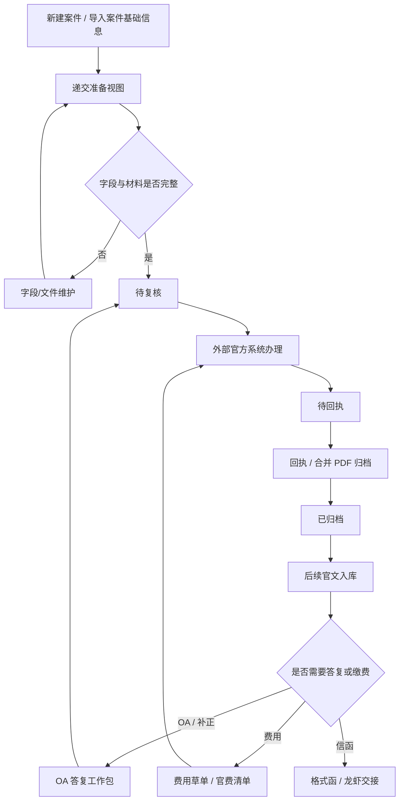

# P1 Functional Spec

任务编号：PD-ENH-P1-FSPEC-20260531-01

生成日期：2026-05-31

## 0. 依据与目标

本 Functional Spec 基于以下材料生成：

- `docs/postdemo/相关流程操作-20260526.docx`
- `docs/postdemo/OA答复流程.docx`
- `docs/postdemo/信函生成操作.docx`
- `docs/postdemo/postdemo_enhancement_analysis_20260530.md`
- `artifacts/PD-ENH-ANALYSIS-20260530-01/extracted/*.txt`
- `artifacts/PD-ENH-REVIEW-20260530-01/analysis/review_findings.md`
- `artifacts/PD-ENH-FINAL-REVIEW-20260530-01/analysis/final_review_ledger.md`
- 当前代码库中 cases / documents / tasks / fees / templates / frontend / docs/product / docs/superpowers/specs 相关实现

P1 目标不是在现有流程之后再加一个“提交前补录包”，也不是替代官方系统。P1 是对现有 FPMS 案件、文书、任务、费用、模板、附件和信函流程做 enhancement，使新建案件、递交准备、OA 答复、回执归档、费用联动、信函交接真正对齐客户在 `相关流程操作-20260526.docx` 和 `OA答复流程.docx` 中描述的工作方式。

客户已经明确要求、且应由系统长期维护的信息，必须进入现有 UI / API / 数据模型 enhancement 设计。例如申请人国籍、证件类型/号码、官方邮编，发明人国籍、中国籍发明人身份证号，代理人资格证号来源、客户总委号等，不应长期依赖提交前人工补录。`待补录` 只用于官方系统临时输入项、客户尚未确认归属的字段，或 P2/P3 CPC integration 才需要的数据。

## 1. P1 Scope

### 1.1 P1 范围

P1 覆盖以下能力：

1. 统一“官方提交准备工作流”，覆盖新建案件后的递交准备、后续官文/OA 答复、外部回执归档、费用联动和信函交接。
2. 增强现有新建案件、案件编辑、申请人/发明人、附件和文书流程，使客户明确要求的官方字段和文件 gate 在系统内有稳定维护位置。
3. 为新申请递交生成“递交准备视图”，包括系统字段完整性、文件清单、官方页面操作 checklist、XML 压缩包占位/关联、提交后合并 PDF/回执归档入口。
4. 为 OA 答复生成“OA 答复工作包”，嵌入现有 `OA_IN` / `OA_OUT`、`reply_to`、任务、附件和回执归档流程，包括申请号、申请人、官文、期限、意见陈述、PDF 保真附件、修改文件、附加文件、官方页面操作 checklist、回执归档入口。
5. 从案件、申请人、发明人、代理人、官文、任务、费用、附件和模板中自动带出可确定信息；对系统中应长期维护但当前缺失的字段，定义 UI / API / 数据模型 enhancement，而不是只写提交前补录。
6. 形成 integration-ready 的 manifest：字段来源、维护对象、文件角色、文件哈希、外部页面上传位置、状态、人工复核记录和回执记录。
7. 为格式函/信函生成建立官文到格式函映射、命名规则、客户联系人抬头规则和龙虾邮件系统交接清单。
8. 本文档只修改 Functional Spec；具体后端、前端、数据库实现需后续拆成独立 atomic implementation tasks。

### 1.2 P1 Non-scope

P1 明确不实现以下内容：

- 不实现 CPC / 专利业务办理系统 direct submit。
- 不实现网页自动登录、自动签名、扫码签名、自动点击提交或 RPA。
- 不实现官方系统回执自动下载。
- 不实现自动支付官费。
- 不替换龙虾邮件发送系统。
- 不承诺所有 Word 公式、符号、表格、图片可无损复制到官方网页富文本字段。
- 不把现有 `fee_reduction` 语义重新解释为客户旧系统费减值，除非客户确认。
- 不在本轮文档任务中实现后端、前端、数据库、迁移或权限改造；但这些可以是 P1 后续 implementation tasks 的内容。

## 2. 用户角色与主要场景

| 角色 | 主要目标 | P1 交互重点 |
| --- | --- | --- |
| 流程/案件管理员 | 建案、维护字段、整理递交材料 | 看到缺失字段的维护入口、材料 gate、官方提交包 checklist |
| 代理人/撰稿人 | 完成权利要求书、意见陈述、修改文件 | 上传或确认 Word 正本、PDF 保真附件、修改文件 |
| 代理助理/流程人员 | 在官方系统中粘贴、上传、预览、签名提交 | 使用系统生成的工作包，减少跨页面查找和重复录入 |
| 财务/费用人员 | 生成费用草单、官费清单、登记缴费 | 使用费用联动状态，不把内部 xlsx 误认为官方模板 |
| 客户联系人维护人员 | 维护信函抬头和邮件交接信息 | 确认联系人来源、称谓和龙虾交接格式 |
| 管理/审核人员 | 保留人工复核和责任边界 | 审核工作包、确认 override 原因、查看归档证据 |

主要场景：

1. 新申请递交准备：在新建案件和案件维护阶段完成官方字段、技术交底书、委托指示、递交文件的维护；从案件进入递交准备视图时，系统主要做检查和复核，而不是让工作人员重复补录稳定信息。
2. OA 答复准备：从 OA 来文进入 OA 答复工作包，系统带出申请号、申请人、官文、期限和待答复文件。
3. OA 外部办理：工作人员按 checklist 在专利业务办理系统完成云端二次下载、意见陈述/补正、保存、预览、签名、提交、确认。
4. 回执归档：工作人员上传电子申请回执或提交合并 PDF，系统才允许关闭工作包。
5. 费用联动：受理、申请费、授权、年费和中间费用进入费用草单/官费清单状态，但官网模板和支付仍由人工处理。
6. 信函交接：官文入库后按映射生成格式函 Word 和龙虾交接数据，不替换邮件发送。

## 3. 统一工作流程

### 3.1 流程主线

### 3.2 新建案件

工作人员录入或确认：

- 内部案号、申请人案号、发明名称、专利类型、申请方向。
- 申请人名称、国籍、地址、证件类型/号码、邮政编码、法人或自然人。
- 发明人姓名、国籍；中国籍发明人身份证号。
- 技术交底书。
- 委托指示（如有）。
- 代理人、撰稿人、代理助理、费减比例、页数/项数/幅数。

系统行为：

- 已有字段从 `Case`、`T_CaseApplicant`、`T_CaseInventor`、客户地址/联系人和附件中带出。
- 对客户明确要求、且现有模型没有稳定承载的官方字段，P1 应定义为现有系统 enhancement：在申请人/发明人主数据、案件申请人/发明人行，或案件官方提交信息中新增维护字段，并通过新建/编辑案件 UI 与 API 暴露。
- 技术交底书是新建案件阶段的必备文件 gate；委托指示是“如有则上传”的条件 gate。P1 不应把这两个 gate 混同于后续官方提交包中的请求书、权利要求书、说明书等递交文件。
- 对费减比例、总委号、代理人资格证号等已有客户提及但归属未确认的字段，FS 必须先定义候选维护位置和校验规则，并标记待客户确认最终归属。

### 3.3 递交准备

递交准备视图对齐客户现有路径，但它不是补录主入口；它应复核新建案件、申请文件管理、文书附件和费用字段已经在各自业务位置维护完毕。

1. 通过案号进入案件。
2. 检查新建案件阶段已上传技术交底书；如案件存在客户委托指示，则检查委托指示附件。
3. 检查申请文件管理中完整 Word 递交文件。
4. 检查摘要、权利要求书、说明书、说明书附图、序列表文件角色。
5. 检查发明名称、代理人、撰稿人、代理助理、页数、权利要求项数、附图幅数、费减比例。
6. 生成官方页面操作 checklist：接收类表格导入、国家申请/发明专利、请求书保存、上传 XML 压缩包、预览/提交、扫码提交、合并 PDF 归档。
7. checklist 需按截图中的官方页面分段组织：内部编号、发明名称、发明人、申请人、联系人、专利代理机构、分案申请、序列表、遗传资源、优先权声明、不丧失新颖性宽限、同日申请、提前公布、实质审查请求、摘要附图、援引加入声明、向外国申请专利保密审查、附加文件、关联业务、证明文件备案。
8. 记录 Word 转 XML 压缩包和合并 PDF 的文件角色、来源、哈希和归档状态。

P1 不生成真实可提交 XML 数据包；但必须定义字段与文件 manifest，并明确这些字段在现有 FPMS 的维护对象、UI 和 API enhancement 方向，使 P2 可以基于同一数据结构生成请求类表格 XML 或客户端导入包。

### 3.4 OA 答复

OA 答复作为统一工作流中的“致函官方出站包”，对齐客户现有页面：

1. 通知书办理 -> 云端二次下载：确认需答复官文已在官方系统可办理，并记录目标官文选择、下载状态和官方页面近 90 天查询限制。
2. 意见陈述/补正 -> 答复审查意见：按申请号查询未答复官文，并核对发文序列号、发文日期、期限届满日期和答复状态。
3. 业务办理：系统提供申请人或专利权人、陈述事项、陈述的意见、补交实验数据勾选提示和附加文件清单。
4. 保存 -> 预览 -> 签名 -> 提交 -> 确认提交：系统只提供 checklist 和人工复核记录，checklist 需拆分预览 tab 核对、确认提交、签名/提交状态。
5. 未确认列表 -> 批量接收确认：系统记录回执待确认，外部扫码/获取签名仍由人工完成。
6. 已确认列表 -> 电子申请回执：工作人员上传回执 PDF，并记录可见接收案件编号、提交人、接收时间和收到文件清单后，工作包进入已归档。

OA 答复工作包必须包含：

- 来源 OA / 补正官文。
- 内部答复文书。
- 申请号、申请人或专利权人显示名、官文代码、官文名称、发文序列号、发文日期、官方期限、内部期限、官方答复状态。
- 意见陈述 Word 正本。
- 可复制纯文本意见。
- PDF 保真附件。
- 修改后的权利要求书、说明书修改页、修改对照页、其他证明文件。
- “补交了实验数据”条件标志。
- 官方页面操作 checklist。
- 回执 PDF、提交/确认时间、接收案件编号和收到文件清单。

### 3.5 回执归档

回执归档是 P1 状态闭环的硬条件，默认规则：

- 新申请递交：合并 PDF 或电子递交文件归档后，递交准备包可关闭。
- OA 答复：电子申请回执 PDF 上传，且回执可见元数据/收到文件清单已记录或标记不适用后，OA 答复工作包可关闭。
- 如果回执暂时无法下载，工作包保持“待回执”。
- 如需人工 override，必须记录 override 人、时间、原因和后续补归档责任。

### 3.6 费用联动

费用联动目标是把客户费用流程纳入同一工作流提示，不自动付款：

- 受理通知书、缴纳申请费通知书、授权通知书、年费缴费通知等触发费用提醒或费用草单检查。
- 系统可复用 `FeeDraft`、`FeeItem`、`FeeRate`、`PayList`、`GovPayment` 能力。
- 官网“补充缴费信息模板”和“批量号单上传”需要客户提供样例后再确认字段兼容性。
- P1 不声明现有“官费清单导出”就是官网可上传模板。

### 3.7 信函交接

信函交接目标是标准化上游文档，不替换龙虾邮件系统：

- 以最新官方通知为来源选择格式函。
- 按映射生成 Word 格式函。
- 文件命名规则：`{内部案号}-给{申请人名称}的邮件.docx`。
- 默认抬头为“尊敬的：您好”。
- 若客户确认联系人规则，则按联系人姓名和称谓生成抬头。
- 输出给龙虾系统的交接数据：邮件标题、正文草稿、Word 文件路径、附件清单、客户联系人。

## 4. 避免重复填写的信息来源

| 信息 | 优先来源 | P1 行为 | GAP / 待确认 |
| --- | --- | --- | --- |
| 内部案号、申请号、发明名称 | `Case.case_no`、`app_no`、`title_cn` | 自动带出 | 申请号尚未产生时显示为“未受理/未填写”，不阻塞新建案件 |
| 专利类型、申请方向 | `Case.patent_category`、`flow_dir` | 自动带出 | 需确认客户旧系统分类映射 |
| 申请人名称/地址 | `T_CaseApplicant`、`Applicant`、客户地址 | 自动带出可用项 | 申请人国籍、证件类型、证件号、官方邮编应作为 P1 主数据或案件申请人行 enhancement |
| 发明人姓名 | `T_CaseInventor` | 自动带出 | 发明人国籍、中国籍身份证号应作为 P1 案件发明人行 enhancement |
| 代理人/撰稿人 | `primary_agent_id`、`second_agent_id`、`draftor_id` | 自动带出 | 代理助理、代理资格证号来源需确定；确定后进入代理人/员工档案或案件分工 enhancement |
| 页数、项数、幅数 | `spec_pages`、`draw_pages`、`claim_count`、`claim_pages` | 自动带出并校验非空 | 序列表页数/文件角色待确认 |
| 费减比例 | `fee_reduction`、`discount_rate` | 显示并标记语义 | `0 / 0.7 / 0.85` 是减免比例还是缴纳比例待确认 |
| 官文名称/代码 | `DocTemplate`、`Document` | 用于工作包和格式函映射 | 客户官文代码清单是否作为种子待确认 |
| 官方期限 | `Document.extra_data.OfficialDueDate`、任务期限 | 自动带出 | 官方期限字段来源和 override 规则待确认 |
| 答复链 | `reply_to_id`、`need_reply`、`reply_date` | 建立来源官文到答复包 | 不能仅用 `reply_date` 表示官方已提交 |
| 技术交底书 | `DocAttachment` 或案件附件扩展 | 新建案件阶段必备 gate | P1 需新增/确认附件角色，不应只在递交前补录 |
| 委托指示 | `DocAttachment` 或案件附件扩展 | 条件 gate：如有则上传 | P1 需新增/确认附件角色和“如有”判定 |
| 附件 | `DocAttachment` | 作为工作包文件来源 | 缺文件角色、哈希、官方上传位置 |
| 模板 | `DocTemplate`、`Template` | 用于格式函和文书生成 | 模板源路径和真实文件落盘需校验 |
| 费用 | `FeeDraft`、`FeeItem`、`FeeRate`、`PayList`、`GovPayment` | 费用状态联动 | 官网 Excel 模板字段待确认 |

## 5. 字段清单

### 5.1 已有可复用字段

| 字段组 | 字段 | 证据 |
| --- | --- | --- |
| 案件基础 | `case_no`、`case_type`、`patent_category`、`flow_dir`、`title_cn`、`app_no`、`filing_date` | `backend/app/modules/cases/models.py` |
| 规格/费减 | `spec_pages`、`draw_pages`、`claim_count`、`claim_pages`、`has_exam_request`、`fee_reduction`、`discount_rate` | `Case` model；`PRODUCT-A-CASE-SPEC-FEE-DISCOUNT-CONTRACT-01.md` |
| PCT/优先权 | `intl_app_no`、`intl_app_date`、`intl_pub_no`、`intl_pub_date`、`pct_national_entry_date`、`T_Priority` | `Case` model |
| 代理分工 | `primary_agent_id`、`second_agent_id`、`draftor_id` | `Case` model |
| 文书/OA | `DocTemplate.code`、`need_reply`、`reply_to_template_code`、`Document.reply_to_id`、`reply_date`、`extra_data` | `backend/app/modules/documents/models.py` |
| 任务期限 | `OfficialDueDate`、任务 due date / internal due date | `PRODUCT-B-OA-WIZARD-CONTRACT-01.md` |
| 费用 | `FeeRate`、`FeeDraft`、`FeeItem`、`PayList`、`GovPayment` | fees / annuity modules |
| 模板/信函 | `Template.file_path`、`LetterHead`、`DocDispatch`、`DocDispatchLine`、`ClientContact` | templates / documents / clients modules |

### 5.2 应进入 P1 enhancement 的缺失字段

| 字段 | 用途 | P1 处理 |
| --- | --- | --- |
| 申请人国籍 | 官方请求书 / CPC 数据包 | 新增到申请人主数据或案件申请人行；新建/编辑案件 UI 和 API 可维护 |
| 申请人证件类型/号码 | 官方请求书 | 新增到申请人主数据或案件申请人行；法人统一社会信用代码、自然人身份证等类型需字典化 |
| 申请人官方邮编 | 官方请求书 | 不直接等同客户邮寄地址邮编；新增官方提交邮编或建立明确映射规则 |
| 发明人国籍 | 官方请求书 | 新增到案件发明人行；可后续沉淀为发明人主数据 |
| 中国籍发明人身份证号 | 官方请求书 | 新增到案件发明人行，按国籍为中国时必填校验 |
| 代理助理 | 内部分工 / 可能影响信函抄送 | 待确认归属；确认后进入案件分工 UI/API enhancement |
| 代理人资格证号 | 官方请求书 | 待确认来源；优先作为代理人/员工档案字段，案件提交时引用 |
| 客户总委号 | 官方请求书 | 待确认层级；确认后作为客户/申请人/案件字段，不作为长期提交前补录 |
| 技术交底书附件角色 | 新建案件 gate | P1 新增或确认案件附件角色，作为新建案件必检项 |
| 委托指示附件角色 | 新建案件 gate | P1 新增或确认条件附件角色，作为“如有则上传”的 gate |
| 香港申请 / 分案申请等旧系统勾选项 | 新申请外部页面 checklist | 作为外部页面 checklist / manifest 字段；客户确认规则后再决定是否进入案件递交配置 |
| 证明文件备案编号 | 证明文件备案 / 总委号候选 | 与客户总委号关系待确认；确认后作为客户/申请人/案件字段之一 |
| 官方请求书勾选项 | 导入后仍需手动选择 | P1 checklist 字段；若客户确认固定规则，再进入案件递交配置 |
| XML 压缩包路径/哈希 | 后续 CPC integration readiness | manifest 字段，关联附件角色和哈希 |
| 官方页面上传位置 | 附件角色匹配 | manifest 字段 |
| OA 发文序列号 / 发文日期 / 答复状态 | OA 答复查询列表 | 工作包字段，来自 OA_IN 或人工核对官方列表 |
| OA 补交实验数据标志 | 答复审查意见业务办理页 | checklist / 工作包字段；规则待客户确认 |
| 电子申请回执状态 | 关闭工作包 | 工作包状态字段 |
| 电子申请回执元数据和收到文件清单 | 回执归档 | P1 至少支持记录/展示；自动提取方式待确认 |
| PDF 附件类别 | OA 答复官方页面 | 待客户确认 |
| 格式函联系人来源 | 信函抬头 | 待客户确认 |

### 5.3 仍可保留为待确认 / 待补录的内容

- 费减比例 `0 / 0.7 / 0.85` 的业务语义。
- 客户总委号的层级：客户级、申请人级、案件级或其他。
- 代理人资格证号维护来源。
- 代理助理是否影响官方提交、内部任务或信函抄送。
- 官文代码和致函官方清单是否作为新系统初始化字典。
- 最新官方通知判定规则。
- 官方页面中“导入后仍需手动选择”的勾选项，客户未确认前保留为 checklist 待确认。
- OA 答复 PDF 附件在官方页面中的具体附加文件类别和引用话术。
- OA 答复中“补交了实验数据”勾选项的适用规则。
- 回执 PDF 元数据和收到文件清单是否需要人工录入、OCR 提取，还是仅在上传后人工查看。

## 6. 文件清单

| 文件类型 | 角色 | 来源 | P1 行为 |
| --- | --- | --- | --- |
| Word 完整递交文件 | 新申请递交正本 | 代理人准备后上传 | 记录来源、版本、文件角色 |
| Word 权利要求书 | 修改文件 / 递交文件 | 申请文件管理或 OA 答复附件 | 标记官方上传角色 |
| 修改对照页 | OA 答复附件 | 代理人准备后上传 | 标记为官方页面“修改对照页”角色 |
| Word 意见陈述 | OA 答复正本 | 代理人上传 | 转纯文本和 PDF 的来源 |
| PDF 意见陈述 | 格式保真附件 | Word 转 PDF 或人工上传 | 作为其他证明文件候选 |
| 其他证明文件 | OA 答复附件 / PDF 保真承载 | 人工上传或系统生成 | 标记官方页面类别、文件说明和上传位置 |
| PDF 合并递交文件 | 新申请提交归档 | 官方系统提交后下载/保存 | 作为递交准备包关闭证据 |
| PDF 电子申请回执 | OA / 递交回执 | 官方系统下载 | 作为回执归档关闭证据 |
| 电子申请回执收到文件清单 | 回执元数据 | 回执 PDF 可见内容或人工录入 | 用于核对意见陈述书、权利要求书、修改对照页、其他证明文件是否被官方接收 |
| XML 请求类表格 | P2/P3 导入候选 | P1 只保留字段和 manifest | 不在 P1 生成 |
| XML 压缩包 | Word 转 XML 后的申请文件包 | 外部工具或人工上传 | P1 记录路径、哈希、文件角色 |
| 旧系统申请文件管理候选角色 | 申请文件归档 / 后续官方文件 | 截图中的文件类型下拉 | 作为种子清单和别名映射候选；不能直接等同稳定官方提交角色 |
| 附加文件 | OA 答复证明文件 | 人工上传或系统生成 | 标记官方页面类别、文件说明和上传位置 |
| 格式函 Word | 客户信函 | 模板生成 | 归档并输出给龙虾交接 |
| 官方缴费 Excel | 官网批量号单上传 | 官方模板 | P1 需客户样例，不声明已兼容 |

## 7. 状态模型

| 状态 | 说明 | 进入条件 | 退出条件 |
| --- | --- | --- | --- |
| 准备中 | 工作包已创建，信息尚未检查完成 | 新建递交准备包或 OA 答复包 | 系统完成字段/文件检查 |
| 待维护 | 缺少应在现有 FPMS 主数据、案件、文书、附件中维护的稳定字段或文件 | 字段/文件检查失败，且字段归属明确 | 工作人员回到对应 UI 维护并重新检查 |
| 待补录 | 仅用于官方页面临时项、客户未确认归属字段或 P2/P3 integration-only 数据 | checklist 发现临时项或待确认项 | 工作人员补录或客户确认后转入系统字段 |
| 待复核 | 字段和文件已满足 P1 检查 | 检查通过 | 审核人确认 |
| 待外部提交 | 已复核，可去官方系统办理 | 审核通过 | 人工在官方系统完成保存/预览/签名/提交 |
| 已提交 | 人工声明已在官方系统提交 | 外部提交记录完成 | 未确认列表批量接收确认 |
| 待接收确认 | 提交完成但未完成官方接收确认 | 已提交但无接收确认记录 | 人工完成扫码/获取签名和接收确认 |
| 待回执 | 接收确认完成但回执未归档 | 已接收确认但无回执附件 | 上传回执或人工 override |
| 已归档 | 回执或合并 PDF 已归档 | 回执附件存在，且可见回执元数据/收到文件清单已记录或标记不适用 | 工作包关闭 |
| 异常 | 官方页面失败、文件不匹配、期限风险 | 人工标记或校验失败 | 修复后回到待维护/待补录/待复核 |
| 人工 override | 未满足默认关闭条件但经负责人批准 | 负责人填写原因 | 后续补归档或审计 |

状态设计约束：

- 稳定业务字段不能长期停留在 `待补录`；一旦字段归属明确，应转为现有 UI / API / 数据模型 enhancement。
- `reply_date` 和 `AUTO_WRITEOFF` 只能代表内部答复链，不等于官方已提交。
- OA 答复默认必须到“电子申请回执 PDF 已上传”才进入已归档。
- 新申请递交默认必须到“合并 PDF 或电子递交文件已归档”才进入已归档。
- 任何 override 必须可审计。

## 8. CPC / 专利业务办理系统 Integration Readiness

P1 只做 integration readiness，不做 direct submit。

### 8.1 P1 要准备的内容

| 准备项 | P1 输出 | 后续用途 |
| --- | --- | --- |
| 字段 manifest | 字段名、来源、值、缺失原因、待确认标记 | 生成请求类表格 XML 或客户端导入包 |
| 文件 manifest | 文件角色、路径、哈希、来源、官方上传位置 | 生成 XML 压缩包关联或导入包 |
| 状态 manifest | 工作包状态、复核人、提交人、提交时间、回执状态 | 客户端导入/人工提交后的闭环 |
| 页面 checklist | 外部页面路径、应填字段、应上传文件、应下载回执 | 人工操作或后续半自动辅助 |
| 错误/缺失清单 | 缺字段、缺文件、模板缺失、费减语义不清 | 阻止错误数据进入后续 integration |

字段 manifest 必须区分两类缺口：

- `system_enhancement_required`：客户已明确需要，且应由 FPMS 长期维护的字段或文件角色，例如申请人/发明人官方字段、技术交底书、委托指示、代理人资格证号、总委号。
- `external_or_pending_confirmation`：官方页面临时项、客户尚未确认归属项，或仅 P2/P3 direct integration 才需要的数据。

### 8.2 P1 不做的内容

- 不生成真实可导入官方客户端的数据包，除非后续任务拿到官方样例并验证。
- 不写入专利业务办理系统客户端数据库或批量接口。
- 不调用官方网页登录接口。
- 不自动选择官文、自动上传、自动签名、自动确认提交。
- 不绕过人工核对义务。

### 8.3 后续集成前置条件

- 客户确认实际使用终端：网页版、专利业务办理系统客户端，还是旧 CPC 口径。
- 客户提供新申请、OA 答复、补正、费用缴费的成功样例。
- 客户提供 Word 转 XML 压缩包样例和官方客户端导入结果。
- 客户确认批量接口覆盖哪些业务表格。
- 客户确认 IT 和合规是否允许系统生成客户端导入文件。

## 9. 页面/操作流

### 9.1 工作人员入口

P1 建议增加统一入口概念：“官方提交准备”，但该入口主要负责复核、组织和归档，不承担所有字段补录。稳定信息仍应在其业务归属页面维护。

入口来源：

- 新建案件 / 编辑案件 -> 维护申请人、发明人、代理分工、官方字段、技术交底书和委托指示。
- 案件详情 -> 递交准备。
- 官文详情 -> 生成 OA 答复工作包。
- 任务列表 -> 打开待答复/待缴费/待回执工作包。
- 费用清单 -> 打开官费缴费 checklist。
- 文书/官文 -> 生成格式函交接。

### 9.2 递交准备页面

页面应展示：

- 案件基础信息和专利类型。
- 申请人/发明人官方提交字段，并显示这些字段来自申请人主数据、案件申请人行、案件发明人行还是案件官方提交信息。
- 代理人、撰稿人、代理助理、代理资格证号、总委号，并显示字段维护入口。
- 页数、项数、幅数、费减比例。
- 新建案件 gate：技术交底书必传；委托指示如有则上传。
- 申请文件 gate：完整 Word 递交文件、摘要、权利要求书、说明书、附图、序列表。
- 官方提交包 gate：请求书勾选项、XML 压缩包、预览/提交、合并 PDF、回执。
- 操作 checklist 和归档按钮。

### 9.3 OA 答复工作包页面

页面应展示：

- 来源官文、官文代码、官文名称、申请号、申请人、官方期限、内部期限。
- 云端二次下载前置确认、目标官文选择、官方查询限制提示。
- 发文序列号、发文日期、期限届满日期、官方答复状态。
- 业务办理页信息：申请人或专利权人、陈述事项、补交实验数据勾选项。
- 意见陈述 Word、纯文本意见、PDF 保真附件。
- 修改后的权利要求书、说明书修改页、修改对照页、其他证明文件、其他附加文件。
- 官方页面 checklist：意见陈述/补正、答复审查意见、业务办理、保存、预览 tab 核对、签名、提交、确认提交、未确认列表、批量接收确认、电子申请回执。
- 回执上传、回执元数据/收到文件清单记录和关闭工作包按钮。

### 9.4 费用联动页面

页面应展示：

- 费用草单来源。
- 费用草单关键投影：案件编号、申请号、发明名称、申请日、草单类型、币种、折扣前金额、折扣率、草单金额、服务费、杂费、官费、开立人/日期。
- 官费清单状态。
- 官费清单/pay-list 关键投影：清单编号、缴费类型、缴费方式、申请方向、预缴日期、制作日期、制作人、发票号范围、状态、金额合计、备注、收据号核查。
- 当前系统 xlsx 导出状态。
- 官网“补充缴费信息模板”兼容性状态：至少核对申请号/专利号/国际申请号/海牙转交编号、业务类型、票据抬头、统一社会信用代码、费用种类、金额和行数上限。
- 年费入口：年费时限检索、客户指令、全部指示缴费、生成费用草单。
- 中间费用入口：中间文件、设置为修改模式、开立费用草单、提取费用、人工调整金额。
- 缴费人信息、预览、订单管理、待支付/去支付仍为人工处理。

### 9.5 信函交接页面

页面应展示：

- 最新官方通知及格式函匹配结果。
- 文件命名预览。
- 抬头预览。
- Word 生成结果。
- 龙虾交接数据：标题、正文草稿、附件、联系人。

## 10. 验收标准

| 编号 | 验收项 |
| --- | --- |
| AC-01 | 新建/编辑案件或相关主数据维护界面应覆盖客户明确要求的申请人/发明人官方字段，缺字段时指向对应维护入口，不把稳定字段长期放在递交准备包补录。 |
| AC-02 | 新建案件 gate 对齐客户反馈：技术交底书必传；委托指示为条件 gate（如有则上传）。 |
| AC-03 | 从案件进入递交准备视图时，系统能列出已有字段、需回到现有 UI 维护的字段、待客户确认字段和文件缺失项。 |
| AC-04 | 递交准备视图能生成对齐客户外部路径的 checklist：接收类表格导入、国家申请、请求书保存、XML 包上传、预览/提交、扫码提交、合并 PDF 归档。 |
| AC-05 | 从 OA 来文进入 OA 答复工作包时，系统能带出申请号、申请人、官文、期限、reply_to 来源和待答复任务。 |
| AC-06 | OA 答复工作包能组织 Word 意见陈述、纯文本意见、PDF 保真附件、修改文件、附加文件和官方页面 checklist。 |
| AC-07 | 内部任务不能仅因创建 OA_OUT 文书就被视为官方流程完成；默认必须等待回执归档。 |
| AC-08 | 费用联动能区分内部官费清单 xlsx 与官网“补充缴费信息模板”，未验证前显示为待确认。 |
| AC-09 | 信函交接能按官文名称/代码匹配格式函、生成文件名和抬头预览，并输出龙虾交接清单。 |
| AC-10 | 所有工作包都有状态、人工复核记录、外部提交记录、回执/合并 PDF 归档记录和 override 审计字段。 |
| AC-11 | P1 文档和后续任务不得承诺 direct submit、自动签名、自动扫码、自动付款或替换龙虾。 |
| AC-12 | 文件清单能区分官方递交必备角色、OA 答复附加角色、旧系统申请文件管理候选角色和归档证明文件；截图中旧系统可改名的文件类型不得直接当成稳定官方字段。 |
| AC-13 | 费用联动能区分费用草单、官费缴费清单、年费客户指令、中间费用提取和 cponline 批量号单上传；当前 `PayList/GovPayment` 不被声明为旧系统官费缴费管理完整等价实现。 |
| AC-14 | 官费标准费率清单在源 DOCX 中以 EMF 图片存在但本轮不可机读；P1 不据此生成 `FeeRate` 种子数据，必须等待客户提供可读费率来源。 |
| AC-15 | OA 答复工作包 checklist 覆盖云端二次下载、答复审查意见查询结果字段、业务办理页申请人/陈述事项/补交实验数据、附件上传、预览 tab、签名、确认提交、批量接收确认和回执下载。 |
| AC-16 | OA 回执归档不仅保存 PDF，还能记录或展示接收案件编号、提交人、接收时间和收到文件清单；自动提取方式未确认前可由人工录入或标记待确认。 |

## 11. 需要客户澄清的问题

### 11.1 流程

1. 新申请递交流程中，客户 2026 年后是否仍使用“接收类表格导入 -> 国家申请 -> 发明专利”作为主路径？
2. “导入后仍需手动选择”的文件勾选项具体有哪些？是否随专利类型、是否同时提实审、是否费减变化？
3. 官方提交完成后，合并 PDF 和电子申请回执是否都必须回传内部系统，还是不同场景只需要其中之一？
4. OA 答复中“云端二次下载”是否所有需答复官文都必须先做，还是只在部分通知书场景需要？
5. 多个官文同日入库时，“最新官方通知”的判定规则是什么？

### 11.2 字段

1. 客户总委号是客户级、申请人级、案件级，还是同一客户下可有多个？
2. 代理人资格证号当前维护在哪个对象上？新系统应从用户、员工、代理人档案还是案件字段读取？
3. 代理助理是否影响官方提交文件，还是只影响内部任务和信函抄送？
4. 申请人国籍、证件类型、证件号、官方邮编应维护在申请人主数据、案件申请人行，还是单独的案件官方提交信息表？
5. 发明人国籍和中国籍身份证号应维护在案件发明人行，还是需要建立可复用的发明人主数据？

### 11.3 文件 / 模板

1. 客户能否提供新申请 Word、Word 转 XML 压缩包、提交合并 PDF 的成功样例？
2. 客户能否提供 OA 意见陈述 Word、PDF 保真附件、附加文件上传后的成功样例？
3. PDF 保真附件在官方页面中应选择哪个附加文件类别？
4. `DocTemplate -> Template` 的真实模板文件是否已在部署环境落盘？
5. 格式函 DOCX 模板是否可提供样例，是否每种官文对应一个固定模板？
6. 旧系统申请文件管理下拉中的 PCT 公开文本、补正后说明书、递交电子申请文件、客户提供原始文件等类型，哪些应作为新系统稳定文件角色，哪些只作为历史归档别名？

### 11.4 fee / rate

1. 客户旧系统中的费减比例 `0 / 0.7 / 0.85` 表示减免比例还是实际缴纳比例？
2. 官费标准费率以官方费率、旧系统费率还是新系统 `FeeRate` 为准？源 DOCX 中该清单是 4 张 EMF/WMF 图片，本轮无法读取具体表格，客户能否提供 Excel、可复制 Word 表格或清晰 PDF？
3. 官网“补充缴费信息模板”能否提供空表、成功上传样例和字段说明？至少需确认申请号/专利号/国际申请号/海牙转交编号、业务类型、票据抬头、统一社会信用代码、费用种类、金额和 500 行建议上限。
4. 费用减缴是否允许人工覆盖金额？覆盖时需要哪些审批或审计信息？
5. P1 是否只提示费用和生成清单，还是需要覆盖授权费、年费和中间费用的全部联动？
6. 官费缴费清单中的清单编号、缴费类型、缴费方式、申请方向、预缴日期、制作日期、制作人、发票号范围、状态、金额合计、备注、收据号核查，哪些必须进入新系统字段，哪些只是旧系统展示字段？

### 11.5 OA 答复

1. OA 答复页面是否接受 XML 文件，还是只能使用页面字段 + 附加 PDF / Word？
2. “陈述的意见”栏引用 PDF 附件的标准话术是否有客户模板？
3. 回执 PDF 是否必须作为关闭 OA 答复工作包的硬门禁？
4. 如果回执暂时不能下载，是否允许人工 override？谁有权限？
5. 一通、二通、N 通、复审意见陈述、补正答复是否使用同一工作包结构？
6. “补交了实验数据”勾选项在客户业务中是否高频，是否需要作为稳定字段、默认否，还是仅作为 checklist 提醒？
7. 云端二次下载是否总是需要按近 90 天查询限制操作，超过 90 天时客户当前如何定位历史官文？
8. 电子申请回执中的接收案件编号、提交人、接收时间和收到文件清单是否需要结构化归档，还是只要求保存 PDF？
9. 回执收到文件清单应如何用于内部核对：只做人工查看，还是必须校验意见陈述书、权利要求书、修改对照页、其他证明文件均已接收？

### 11.6 CPC / 专利业务办理系统

1. 客户当前所谓 CPC 是旧 CPC 客户端、专利业务办理系统客户端，还是网页版习惯叫法？
2. 批量接口是否覆盖客户希望 P1/P2 优先支持的新申请、OA 答复、补正场景？
3. 客户 IT 环境是否允许系统生成或写入客户端可导入文件？
4. 客户是否有官方授权的第三方接口或合作接入方式？
5. 如果后续进入 P2，优先验证新申请请求类 XML，还是 OA 答复/补正 XML？

### 11.7 信函 / 邮件交接

1. 天下先“标为客户”的联系人与新系统 `ClientContact.is_primary` 是否等同？
2. 抬头称谓如何生成：先生、女士、老师、职务，还是固定文本？
3. 无联系人时是否统一使用“尊敬的：您好”？
4. 龙虾系统需要接收 Word 文件、邮件正文、附件路径、Excel 清单还是 API？
5. 信函生成后是否需要内部审核状态，还是生成即交接？

### 11.8 合规 / 责任边界

1. 客户是否明确禁止网页自动化、RPA 或第三方插件？
2. 最终签名、扫码、提交是否必须由人工完成？
3. 自动生成的纯文本意见和 PDF 附件是否需要代理人二次确认？
4. 工作包 override 需要哪些角色、原因和审计留痕？
5. 如果官方系统提交失败，内部状态应如何回滚或保持待处理？

## 12. 风险与合规边界

| 风险 | 影响 | P1 控制 |
| --- | --- | --- |
| 官方提交责任 | 提交错误可能产生法律后果 | 人工复核、签名、提交保留在官方系统 |
| 服务协议风险 | 未授权自动化可能违规 | P1 不做 direct submit 和 RPA |
| 格式保真风险 | 公式/表格/图片无法复制 | Word 正本 + 纯文本 + PDF 保真附件 |
| 字段语义风险 | 费减、总委号、代理证号错误会影响提交或费用 | 先确认维护归属和转换规则，再进入 UI / API / 数据模型 enhancement |
| 回执漏归档 | 内部任务误关闭 | 回执作为默认关闭门禁 |
| 模板源风险 | `DocTemplate` 有配置但无真实文件 | P1 要求模板源检查 |
| 官网 Excel 风险 | 内部 xlsx 与官方模板不兼容 | 需客户样例逐列验证 |

## 13. 后续 P2/P3 候选能力

### P2 候选

- 生成新申请请求类表格 XML 数据包。
- 生成 OA / 补正工作包的 XML 候选文件。
- 基于 manifest 打包文件并在客户端人工导入。
- 浏览器侧辅助复制/打开目录/定位文件，但不自动提交。
- 官方缴费 Excel 模板逐列兼容后导出官网可上传文件。

### P3 候选

- 客户确认合规后研究客户端批量接口写入。
- 客户取得官方授权后研究直连接口。
- 更高保真 Word -> HTML / MathML / 图片化公式转换。
- 与龙虾邮件系统 API 或导入格式对接。
- 回执下载半自动化，但仍保留人工确认和审计。

## 14. 现有系统 GAP 证据摘录

| GAP | 证据 |
| --- | --- |
| 申请人/发明人官方字段不完整 | `T_CaseApplicant` 只有中英文名称/地址；`T_CaseInventor` 只有中英文姓名。P1 enhancement 应补齐官方提交字段的维护对象、UI/API 和校验规则，而不是长期依赖提交前补录。 |
| 新建案件 gate 与客户反馈不完全一致 | 客户提取文本 P0008/P0009 明确为“上传技术交底书”“上传委托指示（如有）”。P1 enhancement 应把这两个 gate 前移到新建/维护案件阶段，并与后续申请文件 gate 分开。 |
| 批件 material gate 不是官方提交包 gate | `document_gate_service.py` 检查申请请求书、说明书、权利要求书、摘要、委托书等材料，但不生成请求书字段、XML 包或官方页面 checklist。 |
| 内部答复链不是官方提交状态 | `Document.reply_to_id`、`need_reply`、`reply_date` 和 `AUTO_WRITEOFF` 可关闭内部任务，但没有外部提交/回执状态。 |
| 附件缺少官方提交角色 | `DocAttachment` 只有文件名、路径、MIME、大小。 |
| OA 答复官方页面字段宽于当前工作包描述 | `OA答复流程.docx` 截图显示答复审查意见结果字段、申请人或专利权人、陈述事项、补交实验数据、证明文件备案、预览 tab、批量接收确认和回执收到文件清单；P1 工作包必须覆盖这些为 checklist/manifest/回执字段。 |
| 旧系统申请文件管理类型不能直接等同官方文件角色 | `相关流程操作-20260526.docx` 截图 `image31.png` 的下拉包含 PCT 公开文本、补正后的说明书、递交电子申请文件、客户提供原始文件等多类历史归档/递交文件；客户文本 P0066 还说明旧系统列表没有可选项时可随意选择后改名。P1 应建立文件角色/别名映射，而不是把截图下拉值直接作为稳定官方提交枚举。 |
| 文书向导附件输出有限 | 当前附件最终行只支持 `DOC_TEMPLATE` 和 `DOCX`，不等于 PDF 保真或 XML 出站包。 |
| 模板源需要校验 | 产品文档指出 `DocTemplate` 没有模板文件路径字段，`Template` 有 `file_path`，映射需明确。 |
| 官费导出未证明兼容官网模板 | `build_pay_list_export_xlsx` 生成“官费清单导出”，不是已验证的“补充缴费信息模板”。 |
| 旧系统费用/pay-list 截图字段宽于现有模型 | 费用草单截图包含折扣前金额、折扣率、服务费、杂费、官费、开立人/日期；官费缴费管理截图包含缴费类型、缴费方式、申请方向、预缴日期、制作日期、制作人、发票号范围、收据号核查等。现有 `FeeDraft`、`PayList`、`GovPayment` 只覆盖部分承载字段。 |
| 官费标准费率清单不可机读 | `相关流程操作-20260526.docx` 内 `image91.emf` 至 `image94.emf` 是 `③官费标准费率` 图片；本轮因缺 `soffice` / WMF loader 无法渲染具体内容。P1 只能要求客户提供可读费率来源，不能据此生成 `FeeRate` 种子。 |
| 信函抬头规则不完整 | `ClientContact.is_primary` 和信封预览不能证明等同于旧系统“标为客户”的正文抬头。 |

## 15. Alignment Review 修正记录

本轮 review 将 FS 的 P1 方向从“提交准备包补录兜底”修正为“现有 FPMS workflow enhancement”：

- 申请人/发明人官方字段：从“提交包补录字段”改为 P1 UI / API / 数据模型 enhancement 候选，维护位置待客户确认。
- 新建案件文件 gate：按客户反馈明确为技术交底书必传、委托指示如有则上传；与后续官方递交文件 gate 分开。
- 代理人资格证号、客户总委号、代理助理：不再默认归入提交前补录，先定义候选维护对象和确认问题。
- `待补录` 状态：限制为官方页面临时项、客户未确认归属项或 P2/P3 integration-only 数据；稳定业务字段进入 `待维护`。
- OA 答复：保持作为现有文书、任务、附件、回执归档流程的 enhancement，不作为脱离 FPMS 的独立外部提交清单。

## 16. Flow / Fee / File Screenshot Review 补充

本轮复核直接检查了 `相关流程操作-20260526.docx` 的 94 个嵌入 media：90 个 PNG 截图已按分组检查，最后 4 个 `③官费标准费率` 为 EMF/WMF 图片，当前环境无法可靠渲染。

P1 增强需吸收以下截图证据：

- 外部新申请页面不是单一表单：官方页面包含发明人、申请人、联系人、代理机构、分案、序列表、优先权、提前公布、实审请求、摘要附图、附加文件、关联业务、证明文件备案等分段。P1 递交准备视图应按分段列 checklist 和 manifest 来源。
- `证明文件备案编号` 是截图中的官方字段入口，需与“客户总委号”关系一并确认。
- `启动word转xml工具` 是截图中的人工/外部工具动作；P1 只记录 XML 压缩包来源、哈希、转换状态和上传位置，不承诺自动转换或自动提交。
- 后续官方文件归档包含两条旧系统路径：`中间文件 -> 新建 -> 致函官方 -> 导入文件 -> 保存`，以及 `案卷维护 -> 申请文件管理 -> 添加 -> 导入word文件`。P1 应把致函官方文书、申请文件归档和回执归档分开。
- 费用流程需区分费用草单、官费缴费清单、年费客户指令、中间费用提取、官方 Excel 上传和订单支付；现有 `FeeDraft`、`PayList`、`GovPayment` 只是底座，不完整等价旧系统截图中的全部字段和动作。
- 官网批量号单上传要求票据抬头、统一社会信用代码、费用种类等字段，并提示建议上传 500 条以内 Excel 数据；这些应进入官方 Excel 兼容性验收和客户澄清问题。

## 17. OA Screenshot Review 补充

本轮复核直接检查了 `OA答复流程.docx` 的 25 个嵌入 media：21 个 PNG 截图可检查，4 个 EMF 为小型标记图；整页 DOCX 渲染因当前环境缺少 `soffice` 失败，因此以 OOXML 提取图片和已提取文本为证据。

P1 增强需吸收以下 OA 截图证据：

- 云端二次下载页包含多条件查询和近 90 天查询限制，结果列表可能含多类通知。OA 工作包应记录目标官文选择和下载确认，不应只按申请号泛化。
- 答复审查意见查询结果包含发文序列号、发文日期、期限届满日期、答复状态和“业务办理”动作；这些字段应进入工作包或 checklist 核对项。
- 业务办理页包含申请人或专利权人、陈述事项、补交实验数据、富文本意见、附加文件上传/撰写、证明文件备案等分区。P1 不自动填写官方页面，但应把这些作为工作包字段、manifest 字段或待确认 checklist。
- OA 附加文件角色在截图中至少包括权利要求书、修改对照页、其他证明文件。PDF 保真意见作为“其他证明文件”是候选做法，最终类别和引用话术仍需客户确认。
- 预览页按权利要求书、意见陈述书、修改对照页、其他证明文件分 tab 核对，提交前有确认弹窗。checklist 需要拆分预览核对、签名、确认提交和提交完成证据。
- 提交后还要经过未确认列表的批量接收确认、扫码/获取签名和已确认列表下载电子申请回执。工作包状态应区分已提交、待接收确认、待回执、已归档。
- 电子申请回执 PDF 可见接收案件编号、申请号、提交人、接收时间和收到文件清单。P1 回执归档应至少支持记录或展示这些元数据，自动提取方式留待确认。
