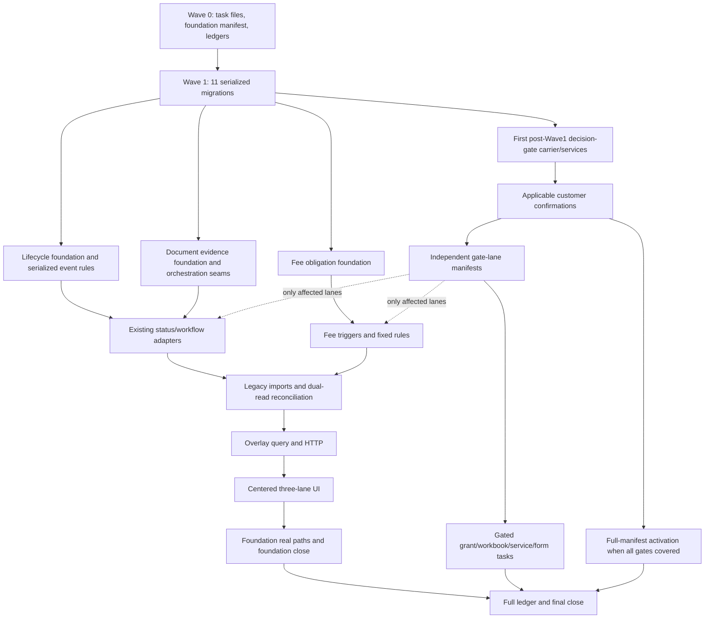

# FPMS Post-demo V8 Mitigation Comprehensive Implementation Plan

> **For agentic workers:** REQUIRED SUB-SKILL: Use `superpowers:subagent-driven-development` (recommended) or `superpowers:executing-plans` to implement this plan task-by-task. Steps use checkbox (`- [ ]`) syntax for tracking.

**Goal:** Implement the approved V8 evidence-driven lifecycle so a case shows a centered business/official/legal lifecycle with document evidence and fee-obligation lanes, while preserving accepted Tasks 01–70 and failing closed on unresolved customer policy.

**Architecture:** Keep the four V8 deep modules inside their existing owning packages: lifecycle under `cases`, document evidence under `documents`, fee obligation under `fees`, and the read-only overlay under `cases`. All lane writes append to one case activity ledger; only confirmed lifecycle activities may change the three central projections, and legacy `Case.status` is a one-way compatibility projection. Existing workflow, document, grant, annuity and UI code becomes an adapter to these seams rather than a second state machine.

**Tech Stack:** Python 3.11, FastAPI, SQLAlchemy 2, Alembic, SQLite, Pydantic 2, Vue 3, TypeScript, Element Plus, pytest, Ruff, ESLint, vue-tsc and Playwright.

---

- Plan task: `PD-POSTDEMO-V8-MITIGATION-IMPLEMENTATION-PLAN-20260712-01`
- Program ID: `FPMS-POSTDEMO-V8-MITIGATION-20260712-01`
- Authoritative design: `docs/superpowers/specs/2026-07-12-fpms-postdemo-three-lane-mitigation-design.md`
- Initial executable foundation manifest: `tasks/batches/FPMS-POSTDEMO-V8-FOUNDATION-20260712-01.md`
- Gate-confirmed full-program manifest: `tasks/batches/FPMS-POSTDEMO-V8-MITIGATION-20260712-01.md`
- Future task directory: `tasks/postdemo/v8/`
- Frozen catalog cardinality: 283 unique planned task paths. The foundation manifest contains 197 non-gated paths and excludes 86 customer-dependent/full-only paths: 31 gated product/E2E paths, 22 per-form OUT paths, 29 independent gate-lane manifest activations and 4 full-only activation/QA paths.
- Plan status: `READY — Round 11 targeted correction independently Approved`

## 1. Authority, assumptions and fixed scope

1. The V8 design is authoritative when it conflicts with V7 business semantics. V6/V7 remain historical demo evidence and are not rewritten.
2. Accepted Additional-GAP Tasks 01–70 are inherited. V8 tasks may adapt them to the new seams and rerun their targeted tests, but may not reschedule their already closed behavior as new implementation.
3. The current dirty worktree is preserved. Every task captures its own baseline and subtracts it from the scoped diff.
4. This plan deliberately uses the current workspace rather than a new worktree because the approved V8 design and inherited implementation are uncommitted workspace state. No plan step authorizes commit, push, reset, clean, stash, checkout or discard.
5. The plan is comprehensive, but execution remains atomic. This document lists planned exact task paths; the follow-up manifest-materialization task must create each selected task file before product execution.
6. Customer-gated tasks are planned but excluded from the foundation manifest until the corresponding persisted gate evidence is recorded. An unresolved gate stops only that lane.
7. No generic lifecycle-write endpoint will be created. Business adapters call `apply_lifecycle_event()` inside their existing transaction.
8. No repository-wide Ruff, backend pytest, frontend build, full Playwright or release gate runs before the full-program final-close task unless a listed atomic task explicitly requires its own narrow form. The foundation close is evidence/coverage-only and is not a release close.

## 2. Story Shape Classification

- `shared_file_density`: high; lifecycle, document, fee, migration, seed, API types and `CaseDetail.vue` have shared ownership.
- `prereq_dependency_density`: high; projection columns and one shared activity ledger precede every adapter and overlay slice.
- `be_fe_coupling`: high; the centered UI consumes one frozen backend overlay and must not reproduce lifecycle or fee logic.
- `evidence_cost`: high; migrations, legal-state transitions, lineage, fee calculations, macro workbooks and long-history pagination require direct evidence.
- `chosen_runbook`: `P0-prereq-heavy-story`

The classification is identical to the approved V8 design. Execution must return to planning if a new shared prerequisite, shared-file conflict or unreachable state appears.

## 3. Closed-work subtraction

### 3.1 Immutable inherited baseline

The required 70-row inheritance index is frozen before this plan proceeds at `artifacts/PD-POSTDEMO-V8-MITIGATION-IMPLEMENTATION-PLAN-20260712-01/analysis/tasks01_70_inheritance_index.md`. It contains every Task01–70 canonical ID, accepted closure, task file, direct PASS evidence and V8 targeted-regression/adaptation group. It was generated only from the accepted 47-task manifest and accepted supplemental close appendix; all 70 task files and all 210 referenced `summary.md`/`results.jsonl`/`git/diff.patch` files exist. The manifest-materialization task copies this index into its machine-readable ledger without recreating, reclassifying or rescheduling an inherited closure.

Human-readable group summary:

| Inherited capability | Accepted tasks/evidence | V8 treatment |
| --- | --- | --- |
| Wizard request bound and real reachability | Task01, Tasks45–47, Task68 | Regression only; no pagination redesign. |
| Document atomic create and semantic resolver | Tasks02–04 | Adapt resolver output from direct status effect to lifecycle event type; keep rollback and resolver tests. |
| Filing/OA package identity and reachable UI | Tasks05–12 | Reuse resolve keys/services/pages; add evidence-version links without recreating packages. |
| OA_OUT stays open and receipt closes exactly one task | Tasks13–17, Tasks48/51/53/56/65–67/70 | Preserve existing observable closure; add prepared/submitted/receipt activities and correct compatibility projection. |
| 60-item notice catalog and narrow OA/acceptance/grant activation | Tasks18–21, 33–34, 38, Tasks48/50/51/53/55 | Do not activate all 60; only add separately approved V8 event adapters. |
| Structured official deadline and fail-closed generation | Tasks22–32, Tasks48/51/53/54/56/64–68/70 | Consume confirmed source and due date; never reintroduce fallback dates. |
| Grant source/deadline/replacement lineage and UI gates | Tasks35–44, Tasks49/50/52/53/55/57–62/64/69 | Remove only the two illegal `GRANTED` side effects; retain lineage and mutation gates. |
| Evidence hygiene, real path and final close | Tasks45–47, Task63 | Reuse gate pattern, not the old 47-task cardinality; V8 needs its own manifest and final ledger. |

If a V8 semantic change makes an inherited test assertion obsolete, create one test-contract-alignment task for that exact test. Do not change an inherited test inside a product task unless the product task's explicit closure is that adapter contract.

### 3.2 Initial V8 item-to-slice ledger

This initial ledger satisfies the V8 design prerequisite before task materialization. `§` references resolve to the exact canonical task rows in this plan; inherited IDs resolve through the frozen 70-row index above. Wave 0 copies these rows into the machine-readable ledger and expands the cited sections to their exact task IDs without changing the interpretation.

| Item | Required V8 slices | Inherited Tasks01–70 evidence | Planned exact catalog set | Gate / manifest classification | Initial residual / decision |
| --- | --- | --- | --- | --- | --- |
| `P0-01` | Three projections, immutable activity/evidence, one-way legacy projection, controlled event entrypoints and direct-write removal. | Tasks03–04, 13–17, 35–44 and relevant supplemental regressions. | §§8–10; §11.2 lifecycle/status adapters; §15 direct-write/static cutover. | Foundation, except grant-source/review adapters use their own gate lanes. | Planned; not covered until every cited slice is PASS. |
| `P0-02` | OA_OUT/package atomic preparation, prepared/submitted/receipt activities, receipt-only formal closure and `reply_date` correction. | Tasks10–17, 48, 51, 53, 56, 65–67, 70. | §11.1.1 OA preparation/finalization seams; §11.2 OA adapters and policies. | Foundation; no customer decision gate. | Planned; not covered. |
| `P0-03` | Remove attachment/task shortcuts, confirm announcement evidence, register verification/conflict and specific post-grant events. | Tasks35–44, 49–50, 52–53, 55, 57–62, 64, 69. | §§10, 11.2 and 14.3 grant task families. | Foundation for shortcut removal/rules; `DG-GRANT-EVIDENCE-SOURCE` and `DG-GRANT-MANUAL-REVIEW` for controlled dispatch. | Planned; grant automation remains gated. |
| `P0-04` | Evidence versions/derivations/current/review, full-Word/XML/final/receipt lineage and versioned manifests. | Tasks02, 05–17 and their targeted regressions. | §§11.1–11.2 plus §15 document import/reconciliation. | Foundation; old-form official readiness separately uses per-form `DG-LEGACY-FORM-CLASS`. | Planned; not covered. |
| `P0-05` | Explicit canonical reduction input, approval scope/evidence, migration and fail-closed calculations. | Tasks22–32 supply source/deadline regressions; no inherited task is rescheduled as the reduction carrier. | §§8 F5, 12.1, 12.3 and 15 fee-reduction tasks. | Foundation; no global policy gate. | Planned; not covered. |
| `P0-06` | Estimate/obligation separation, real notice lines, instruction, draft/payment links, source/rate/identity and activities. | Tasks22–32 and 35–44 supply notice/deadline/grant-source regressions. | §§8 F1–F4 and 12.2–12.3. | Foundation for obligation truth; three draft-policy gates affect only automatic draft lanes. | Planned; not covered. |
| `P0-07` | Internal list, official workbook artifact, official acceptance, payment and ticket evidence remain distinct. | Tasks45–47 provide gate/evidence patterns; no existing payment-file closure is rescheduled. | §§13 and 14.3 payment-workbook family; §17 real path. | Foundation internal-list boundary; `DG-PAYMENT-WORKBOOK` for official workbook lane. | Planned; official workbook remains gated. |
| `P0-08` | One revisioned overlay with centered three states, left document lane, right fee lane and complete cursor. | Tasks45–47, especially Task46 real-path pattern. | §§16–17 overlay/API/FE/UI/E2E. | Foundation. | Planned; not covered. |
| `P1-01` | Per-form OUT classification, cumulative positive activation and negative reference-only proof without cross-form mutation. | Tasks18–21, 33–34, 38, 48, 50–51, 53, 55. | §§14.2 per-form classification-lane manifests and 14.4 OUT rows. | Twenty-two independent `DG-LEGACY-FORM-CLASS` form manifests. | Each form independently gated; full close requires one completed positive or negative classification task per scope. |
| `P1-02` | Eight real format-letter templates, context, render, version/hash and archive. | No Tasks01–70 template-render closure; inherited document evidence patterns only. | §11.3 format-letter family. | Foundation; not blocked by legacy-form gate. | Planned; not covered. |
| `P1-03` | Copyable/noncopyable OA attachment policy and PDF-to-appendix derivation. | Tasks10–17, 48, 51, 53, 56, 65–67, 70. | §§11.1.1 and 11.2 OA policy/seam/adapter rows. | Foundation. | Planned; not covered. |
| `P1-04` | Approved official-rate source, category corrections, late fees, layout/PCT/special fee rules and obligation triggers. | Tasks22–32 and grant Tasks35–44 provide source/deadline trigger regressions. | §§12.3 and 12.4 official-fee rule families. | Foundation; source activation remains fail-closed, not customer policy. | Planned; not covered. |
| `P1-05` | Versioned service price items, approval, currency/tax/discount/scope, activation and service receivable. | No Tasks01–70 service-price closure. | §14.3 service-rate family. | `DG-SERVICE-RATE-VERSION`. | Customer-gated; not covered. |
| `P1-06` | Grant-year/future annuity obligations, first-ten-year reduction, payable/late fee, instruction and draft policies. | Tasks35–44, 49–50, 52–53, 55, 57–62, 64, 69. | §§12.2–12.3 annuity/grant families and §14.3 draft-policy rows. | Foundation obligations/instructions; grant-year and future-annuity automatic draft lanes gated independently. | Planned with gated automation residuals. |
| `P1-07` | Stable keyset/revision pagination and >100-activity real-path proof. | Tasks45–47 real-path/evidence patterns. | §§16.1, 16.2 and 17 overlay cursor/live-fixture/E2E rows. | Foundation. | Planned; not covered. |

No row becomes `covered` from a representative E2E alone. The materialized ledger must additionally retain migration/backfill requirements, exact targeted regressions, evidence paths and residual close decisions for each expanded task set.

## 4. Deep-module and file ownership map

| Deep module | External seam | New focused implementation files | Existing adapters/carriers |
| --- | --- | --- | --- |
| Lifecycle | `apply_lifecycle_event(command, transaction)` | `backend/app/modules/cases/lifecycle_contracts.py`, `lifecycle_activity_service.py`, `lifecycle_projection.py`, `lifecycle_rules.py`, `lifecycle_service.py` | `cases/models.py`, `cases/service.py`, `documents/service.py`, `official_workflows/service.py`, `grant_fees/service.py` |
| Document evidence | `register_evidence_version()`, `register_evidence_derivation()`, `prepare_oa_reply()`, `finalize_external_submission()`, `render_customer_letter()` | `backend/app/modules/documents/evidence_contracts.py`, `evidence_service.py`, `evidence_workflow_service.py`, `evidence_policy.py`, `letter_context.py`, `letter_render_service.py` | `documents/models.py`, `official_workflows/models.py/service.py`, `templates/models.py`, `seed_dev.py` |
| Fee obligation | `preview_estimate()`, `recognize_obligation()`, `record_client_instruction()`, `prepare_draft()`, `record_payment_evidence()` | `backend/app/modules/fees/obligation_contracts.py`, `obligation_service.py`, `fee_reduction.py`, `late_fee.py`, `pct_policy.py`, `official_rate_book.py`, `service_price_book.py` | `fees/models.py/service.py`, `annuity/models.py/service.py`, `grant_fees/service.py` |
| Lifecycle overlay | `read_lifecycle_overlay(case_id, after_sequence, limit, as_of_revision)` | `backend/app/modules/cases/lifecycle_overlay_schemas.py`, `lifecycle_overlay_service.py` | `cases/api.py`, dedicated frontend adapter and case components |

Cross-cutting gate persistence is intentionally smaller than a fifth deep business module: `backend/app/modules/system/models.py` and `decision_gate_service.py` store/read only the eight frozen V8 decisions. Grant-source ingestion/review uses focused `documents/grant_evidence_ingestion_service.py` and `grant_evidence_review_service.py`; neither may bypass lifecycle rules.

Frontend ownership is intentionally separated from the already large `cases.ts` files:

- `frontend/src/api/lifecycleOverlay.ts`
- `frontend/src/api/lifecycleOverlay.types.ts`
- `frontend/src/modules/cases/components/CaseLifecycleOverlay.vue`
- `frontend/src/modules/cases/components/LifecycleCenterLane.vue`
- `frontend/src/modules/cases/components/DocumentEvidenceLane.vue`
- `frontend/src/modules/cases/components/FeeObligationLane.vue`

The existing backend cases router and frontend case routes are already wired. V8 must not edit `backend/app/api/router.py` or `frontend/src/router/index.ts` for overlay.

## 5. Schema contracts frozen for task materialization

### 5.1 Lifecycle carriers

- `t_case`: nullable `business_stage`, `official_procedure_stage`, `legal_status`, `lifecycle_revision`, `lifecycle_verification_status`.
- `t_case_activity_event`: application UUID `String(36)` PK; `case_id`; case-local `sequence`; `lane`; `activity_type`; nullable `source_activity_id`; occurred/effective/recorded timestamps; confirmation status; conditional old/new three projections; actor/reviewer; idempotency key; superseded activity; Text JSON payload; `CURRENT_TIMESTAMP` audit defaults.
- Unique constraints: `(case_id, sequence)`, `(case_id, idempotency_key)` and composite parent key `(case_id, id)` for SQLite composite-FK enforcement. Nullable `(case_id, source_activity_id)` has a composite self-FK to `(case_id, id)`, so a source activity is absent or belongs to the same case; service validation is additive.
- `t_case_activity_event_evidence`: application UUID PK; case/activity IDs; evidence kind; object type/id; content hash; captured time; composite FK `(case_id, activity_id) → t_case_activity_event(case_id, id)` and uniqueness `(case_id, activity_id, evidence_kind, object_type, object_id)`. This is the database-level same-case constraint; service validation is additive.

### 5.2 Document evidence carriers

- `t_document_evidence_version`: case/document/attachment IDs, lineage key, role, version number, state, creator, review state/reviewer/time, final-submitted time, content hash and nullable unique `current_identity_key = case_id|lineage_key` (non-null only on the current version). Creator and reviewer are distinct for an approved/rejected transition.
- `t_document_evidence_derivation`: parent and child evidence-version IDs, derivation type, actor/time and source snapshot; both versions must belong to the same case.
- `t_official_work_package_manifest.evidence_version_id`: nullable compatibility link; `attachment_id` remains during migration.

### 5.3 Fee carriers

- `t_fee_obligation`: case, source activity/document, fee domain, obligation type/status, due date, currency, source status, client-instruction/draft/payment/official-evidence states and supersede metadata. One header may retain multiple itemized lines.
- `t_fee_obligation_line`: obligation, denormalized same-case/source activity, fee code/name, normalized `fee_year_key` (`0` for non-annual items), official full amount, reduction ratio, payable amount, source amount/date, difference-review state and nullable `current_identity_key`. `current_identity_key = sha256(case_id|source_activity_id|fee_code|fee_year_key)` is non-null only on the effective line and has a database unique constraint; superseded lines set it to NULL. This enforces one effective source-event + fee-code + year identity while retaining history under SQLite.
- Separate draft-item and payment-evidence links.
- `t_fee_reduction_approval`: `scope_type=CASE|APPLICANT_SET`; exactly one of `case_id` or non-null `applicant_set_key`; ratio, fee/year/effective scope, source evidence and confirmation state. `applicant_set_key` is the SHA-256 of sorted distinct applicant IDs plus a versioned eligibility-attribute snapshot hash; the snapshot is retained as Text JSON. SQLite CHECK constraints enforce scope exclusivity, and a unique source/scope/ratio/interval identity prevents duplicate approvals. Case creation must recompute the same canonical key from the submitted applicant composition.
- Later independent carriers: official rate book, service price book and PayList export artifact. `t_service_price_book` stores a version header plus immutable Text-JSON item snapshot; every item has stable item code/name, decimal-string unit price, currency, tax-inclusive flag/rate, discount policy, scope and effective interval, and the version stores source hash/approval. The PayList artifact must be able to retain generated identity and separately linked official-site acceptance evidence without reusing payment/ticket status.

### 5.4 Customer decision carrier

- `t_customer_decision_gate`: application UUID PK; one of the eight frozen gate codes; non-null auditable scope key; decision value/status; source reference/version; confirmer; effective/recorded times; optional superseded record; Text JSON snapshot; idempotency identity; nullable `current_identity_key = gate_code|scope_key` with a unique constraint.
- Gate records are append-only decisions. In one caller-owned transaction, a superseding confirmation/revocation clears the former current key and creates the new current record; a same idempotency key with different payload is 409. A revocation is itself the current record. Read service accepts exactly one current, effective `CONFIRMED` row and returns unresolved/conflict for absence, revocation, future effectiveness, scope mismatch or corrupt multiplicity.
- `DG-LEGACY-FORM-CLASS` accepts exactly `CURRENT_OFFICIAL`, `HISTORICAL` or `INTERNAL_ONLY` per `form-NNN` scope. A source-backed `ALL-22` record must retain an explicit value for each of the 22 scopes; it cannot silently apply one blanket value. Only `CURRENT_OFFICIAL` permits executable activation; either negative value is a completed classification whose row stays reference-only.
- This carrier is deliberately not added to the eleven-task Wave 1 spine: it is the first globally serialized post-Wave1 migration so customer confirmations can be persisted while unrelated lifecycle/document/fee work proceeds. It does not become a generic rules engine.

Every migration is forward-only and SQLite-safe. The future task file must inspect the unique Alembic head at execution time; this plan does not freeze a current untracked revision as a future `down_revision`.

## 6. Verification vocabulary and common task runbook

Command abbreviations in the catalog:

- `PYTEST <file>`: `cd backend && .venv/bin/pytest -q <file>`.
- `RUFF <files>`: from `backend`, run `.venv/bin/ruff check --fix <files>`, `.venv/bin/ruff format <files>`, then `.venv/bin/ruff check <files>`.
- `FE-LINT <files>`: from `frontend`, run `npx eslint <files> --max-warnings 0`.
- `FE-TYPE`: `cd frontend && npm run typecheck`; only tasks explicitly listing it may run it.
- `PW <file>`: from `FPMS_Automation_Skeleton_Pack/playwright_ts`, run `npx playwright test <file> --workers=1`.
- Every task also runs `git diff --check -- <exact allowlist>` and `./scripts/task_validate.sh <TASK-ID>`.

Every future task file must expand this checklist:

- [ ] Capture `git status --short`, task baseline and external dirty files.
- [ ] Run the exact public-interface RED and preserve its failing evidence.
- [ ] Implement only the task's single closure slice.
- [ ] Run the exact GREEN and affected inherited regressions.
- [ ] Run task-scoped format/lint/type checks; never repo-wide write-format by default.
- [ ] Serialize every SQLite-writing test and every shared-file check.
- [ ] Produce `results.jsonl`, `summary.md`, dirty-baseline files and a baseline-subtracted scoped `git/diff.patch`.
- [ ] Obtain independent review; the implementer cannot approve its own task.
- [ ] Run the atomic evidence validator and repository task gate.

No checklist includes a git commit. Evidence-backed task closure is the checkpoint mechanism in this dirty worktree.

### 6.1 Mechanical task-file profiles

The manifest-materialization task must copy the matching profile below verbatim into every task file. This is not optional prose generation.

| Profile | Applied catalog sections | Explicit non-closure copied to each task | RED expectation | GREEN expectation |
| --- | --- | --- | --- | --- |
| `TC-SCHEMA` | Wave1 carriers and later carrier migrations | No backfill, service, endpoint, seed, UI or second table/carrier. | Exact schema test fails because the named table/column/index is absent. | Exact schema test, task-scoped Ruff, unique-head check and clean temporary SQLite `upgrade head` pass. |
| `TC-INTERFACE` | lifecycle/document/fee/overlay contracts | No persistence, business adapter, endpoint or UI. | Exact contract test fails because the named type/enum/interface is absent. | Exact contract test and task-scoped Ruff pass. |
| `TC-RULE` | lifecycle event, reduction, late-fee, PCT and official-rate rules | No second event/rate/policy, persistence adapter, endpoint, seed or UI. | Exact public rule test fails on the named transition/calculation. | Exact rule test passes every named success/boundary/fail-closed case. |
| `TC-SERVICE` | append/version/obligation/render/backfill/seed-dataset services | No endpoint/UI/schema and no adjacent service rule or second dataset beyond the row's observable behavior. | Exact service/dataset test fails on missing behavior, data or prohibited side effect. | Exact service/dataset test and named inherited regressions pass with caller-owned transaction semantics where writes are transactional. |
| `TC-ADAPTER` | existing case/document/workflow/grant/annuity adapter rows | No change to the underlying deep-module rule, no second entrypoint and no unrelated refactor. | Exact adapter test proves the old direct write/missing activity/premature state. | Exact adapter test plus listed inherited regressions pass; only the named entrypoint changes. |
| `TC-API` | one HTTP endpoint rows | No second endpoint, router rewiring, business-rule duplication or frontend work. | Exact API test fails with route/shape/permission/status mismatch. | Exact API test passes named 200/201/400/401/403/404/409/422 semantics and response envelope. |
| `TC-FE-ADAPTER` | TypeScript adapter rows | No page behavior, server-state inference or backend change. | The row's exact `frontend/src/api/contracts/v8_*.contract.ts` import/shape probe makes serialized `FE-TYPE` fail before the named export/type exists. | Contract probe, exact-file ESLint and serialized `FE-TYPE` pass without status/amount inference. |
| `TC-UI` | one page/component capability rows | No backend change, second page capability or frontend business-state calculation. | Targeted Playwright fails on the named visible behavior. | Targeted Playwright, exact-file ESLint and explicitly required `FE-TYPE` pass. |
| `TC-QA` | audit, ledger, test fixture, E2E and close tasks | No product fix, schema change or test-assertion weakening. | Contract/gate test fails on missing evidence or coverage. | Exact audit/E2E/gate commands pass and any failure becomes a new task. |

Every materialized task sets `Remaining Follow-Up Task IDs: None`. Downstream dependencies in this plan are sequencing consumers, not unfinished behavior inside the task's exact closure. If implementation exposes a genuine residual inside that closure, the task must stop and replace `None` with a newly created follow-up task ID before proceeding.

Profile resolution is total and mechanical. The materializer writes an explicit `Task Contract Profile: <ID>` into every task file and copies that profile's non-closure and RED/GREEN text verbatim. It then substitutes the row's named observable closure, exact test and inherited regressions; therefore no worker invents acceptance language. Apply the following precedence:

1. migration/carrier row → `TC-SCHEMA`;
2. contracts/schema-only interface row → `TC-INTERFACE`;
3. backend endpoint row (`API` or `HTTP`) → `TC-API`;
4. frontend adapter row → `TC-FE-ADAPTER`;
5. visible page/component capability row → `TC-UI`;
6. existing business-entrypoint row or task name containing `ADAPTER` → `TC-ADAPTER`;
7. pure validator/rule/policy/calculation row → `TC-RULE`;
8. remaining named service, append, render, import, backfill, seed dataset, data correction, activation or read-model row → `TC-SERVICE`;
9. ledger, catalog/manifest work, static audit, live test fixture, real-path E2E, foundation close or final close → `TC-QA`.

The only naming exceptions are fixed here: case create/update status input gates are `TC-ADAPTER`; filing/OA evidence gates that edit an existing workflow entrypoint are `TC-ADAPTER`; `DE-CURRENT-VERSION-RULE`, `DE-FINALIZE-EXTERNAL-SUBMISSION-SEAM`, `DE-PREPARE-OA-REPLY-SEAM`, `FORMAT-LETTER-REAL-TEMPLATE-SET` and `OFFICIAL-FEE-CATEGORY-CORRECTION` are `TC-SERVICE`; every `FPMS-V8-OUT-*` row is `TC-ADAPTER`; every `*-MANIFEST-ACTIVATION`, the direct-status static gate, manifest gates, catalog-coverage gate and live fixture are `TC-QA`; `OVERLAY-CONTRACTS` is `TC-INTERFACE`. These exceptions override the general precedence list. Every FE-adapter row must name one dedicated contract probe in its allowlist. If a future row cannot be assigned exactly one profile by these rules, manifest materialization fails rather than choosing by judgment.

### 6.2 Frozen FE contract probes

Each contract file contains compile-time assignments/imports for the exact exports below. RED is missing export/property/signature; GREEN is successful `vue-tsc --noEmit`. The materializer must copy these names and minimum shapes without renaming.

| Task ID | Exact exports | Minimum shape asserted by the named contract probe |
| --- | --- | --- |
| `FPMS-V8-DE-REVIEW-FE-ADAPTER` | `AttachmentEvidenceProjection`, `DocumentEvidenceReviewPayload`, `reviewDocumentEvidence` | Projection has string `evidence_version_id/creator_id`, nullable `reviewer_id`, `review_state`, `is_current`, `is_final`; function `(documentId, evidenceVersionId, payload) → Promise<AttachmentEvidenceProjection>`; decision is `APPROVE|REJECT`. |
| `FPMS-V8-FO-PREVIEW-FE-ADAPTER` | `OfficialFeeEstimateContext`, `OfficialFeeEstimateResult`, existing `previewOfficialFeeCandidates` | Context contains explicit `trigger`; result has literal `estimate_status: 'ESTIMATE'`, decimal-string amounts and source metadata; no obligation ID is synthesized. |
| `FPMS-V8-FO-INSTRUCTION-FE-ADAPTER` | `FeeObligationInstructionPayload`, `FeeObligationInstructionResult`, `recordFeeObligationInstruction` | Payload instruction is `PAY|HOLD|ABANDON`; result retains string obligation/activity IDs and server status; function returns the result promise. |
| `FPMS-V8-FO-OBLIGATION-DETAIL-FE-ADAPTER` | `FeeObligationDetail`, `getFeeObligation` | Detail includes obligation/source IDs, `client_instruction_status`, decimal-string lines and seven separated fee states; function `(id) → Promise<FeeObligationDetail>`. |
| `FPMS-V8-GENERIC-FEE-DRAFT-OBLIGATION-FE-ADAPTER` | existing `FeeDraftCreatePayload`, existing `createFeeDraft` | Payload has optional nullable string `obligation_id`; create function still returns `Promise<FeeDraftDetail>` and does not accept inferred amount/source fields. |
| `FPMS-V8-PAYLIST-BOUNDARY-FE-ADAPTER` | existing `PayListDetailResult`, existing `getPayListDetail` | Result separately exposes `internal_artifacts`, `official_workbook`, `payment`, `official_evidence`; no mapping from header status. |
| `FPMS-V8-GRANT-EVIDENCE-REVIEW-FE-ADAPTER` | `GrantEvidenceCandidate`, `GrantEvidenceReviewPayload`, `listGrantEvidenceCandidates`, `reviewGrantEvidence` | Candidate has proposer/reviewer/source/conflict/review state; review decision is `APPROVE|REJECT`; no legal-status field is client-derived. |
| `FPMS-V8-OFFICIAL-PAYMENT-WORKBOOK-FE-ADAPTER` | `OfficialWorkbookArtifact`, `generateOfficialPaymentWorkbook` | Artifact has ID/hash/template version and `generated_status`; generation returns artifact/blob identity and has no accepted/paid/ticket implication. |
| `FPMS-V8-OFFICIAL-WORKBOOK-ACCEPTANCE-FE-ADAPTER` | `OfficialWorkbookAcceptancePayload`, `OfficialWorkbookAcceptance`, `recordOfficialWorkbookAcceptance` | Payload carries acceptance evidence reference/hash; result has accepted time/actor only, separate from payment/ticket. |
| `FPMS-V8-OVERLAY-FE-ADAPTER` | `LifecycleOverlayQuery`, `LifecycleOverlay`, `getLifecycleOverlay` | Query has `after_sequence/limit/as_of_revision`; result has three-axis snapshot, milestones, decision gates, warnings, `next_cursor/has_more`; decimal strings remain strings. |

### 6.3 Frozen dependency resolution

The materializer must emit only canonical task IDs in every generated task file and manifest. It resolves a short dependency label only when the table below gives an explicit ordered set or when an unlisted label maps to exactly one canonical catalog row by a unique task-ID suffix; zero or multiple unlisted matches fail materialization. References to inherited Tasks01–70 are targeted regression inputs from the frozen inheritance index, not V8 execution dependencies.

| Dependency label used in catalog | Exact expansion |
| --- | --- |
| `L1–L3`, `D1–D3`, `F1–F5` | The same-numbered `FPMS-V8-W1-*` carrier task IDs in §8, inclusive and in table order. |
| `Wave 0 manifest exists` | External `PD-POSTDEMO-V8-MITIGATION-TASK-MANIFEST-20260712-01` PASS and its foundation-manifest/catalog/gate-register artifacts exist; no V8 catalog task is included, preventing a parser self-cycle. |
| `Wave 0` | The `Wave 0 manifest exists` expansion, then `FPMS-V8-MANIFEST-RELEASE-GATE` and `FPMS-V8-CATALOG-MANIFEST-COVERAGE-GATE` PASS. |
| `machine-readable catalog, gate register, manifest parser` | External materialization task/catalog/gate-register artifacts plus `FPMS-V8-MANIFEST-RELEASE-GATE` PASS; never the coverage task itself. |
| `deadline carrier` | Accepted inherited Task22 `FPMS-ADDGAP-DOCUMENT-DEADLINE-CARRIER-20260710-01` PASS evidence; this is a targeted inherited prerequisite, not a rescheduled V8 task. |
| `all three deep-module contracts` | `FPMS-V8-LC-CONTRACTS`, `FPMS-V8-DE-CONTRACTS`, `FPMS-V8-FO-CONTRACTS`. |
| `append` / `append seam` / `projection` | `FPMS-V8-LC-ACTIVITY-APPEND` / `FPMS-V8-LC-ACTIVITY-APPEND` / `FPMS-V8-LC-LEGACY-PROJECTION`, respectively. |
| `lifecycle seam` | `FPMS-V8-LC-APPLY-EVENT-SEAM`. Every §10 event-rule row has this default dependency. |
| `event rules` | All 24 §10 event tasks, in strict table order. |
| `preparation rule` / `external-submission rule` / consumer-specific `filing receipt rule` / consumer-specific `OA receipt rule` | `FPMS-V8-LC-FILING-PREPARATION-STARTED` / `LC-FILING-EXTERNAL-SUBMISSION-RECORDED` / `LC-FILING-RECEIPT-ARCHIVED` / `LC-OA-RECEIPT-ARCHIVED`. |
| `grant-registration rule` / `announcement rule` / `register rule` | `FPMS-V8-LC-GRANT-REGISTRATION-NOTICE-RECORDED` / `LC-GRANT-ANNOUNCEMENT-CONFIRMED` / `LC-PATENT-REGISTER-STATUS-CONFIRMED`. |
| `preliminary-start rule` / `preliminary-pass rule` / `rectification rule` / `publication rule` / `substantive-start rule` | `FPMS-V8-LC-PRELIMINARY-EXAMINATION-STARTED` / `LC-PRELIMINARY-EXAMINATION-PASSED` / `LC-RECTIFICATION-NOTICE-RECORDED` / `LC-PUBLICATION-NOTICE-RECORDED` / `LC-SUBSTANTIVE-EXAMINATION-STARTED`. |
| `reexamination rule` / `rejection rule` / `withdrawal rule` / `abandonment rule` / `application-restoration rule` | `FPMS-V8-LC-REEXAMINATION-STARTED` / `LC-APPLICATION-REJECTION-CONFIRMED` / `LC-APPLICATION-WITHDRAWAL-CONFIRMED` / `LC-APPLICATION-ABANDONMENT-CONFIRMED` / `LC-APPLICATION-RIGHT-RESTORATION-CONFIRMED`. |
| `current-version/review/derivation services` | `FPMS-V8-DE-CURRENT-VERSION-RULE`, `DE-REVIEW-SERVICE`, `DE-REGISTER-DERIVATION`. |
| `evidence version` / `evidence versions` / `evidence version service` | `FPMS-V8-DE-REGISTER-VERSION`; archive consumers may additionally name current/review requirements explicitly. |
| `evidence derivation` | `FPMS-V8-DE-REGISTER-DERIVATION`. |
| `evidence review/read` | `FPMS-V8-DE-REVIEW-SERVICE`, `DE-REVIEW-API`, `DE-ATTACHMENT-EVIDENCE-READ-PROJECTION`. |
| `evidence review API` | `FPMS-V8-DE-REVIEW-API`. |
| `OA copyable and noncopyable policy tasks` | `FPMS-V8-OA-COPYABLE-ATTACHMENT-POLICY`, `FPMS-V8-OA-NONCOPYABLE-APPENDIX-POLICY`. |
| `D3, attachment/generated evidence adapters` | `FPMS-V8-W1-D3-WORK-PACKAGE-EVIDENCE-LINK-CARRIER`, `DE-ATTACHMENT-EVIDENCE-ATOMIC-ADAPTER`, `DE-GENERATED-ATTACHMENT-EVIDENCE-ADAPTER`. |
| `attachment adapter` / `generated adapter` | `FPMS-V8-DE-ATTACHMENT-EVIDENCE-ATOMIC-ADAPTER` / `FPMS-V8-DE-GENERATED-ATTACHMENT-EVIDENCE-ADAPTER`. |
| `document review service` / `document review API` / `document review FE adapter` | `FPMS-V8-DE-REVIEW-SERVICE` / `DE-REVIEW-API` / `DE-REVIEW-FE-ADAPTER`. A bare `review service/API/FE adapter` in §11 resolves to this family. |
| `read projection` / `review FE adapter` | `FPMS-V8-DE-ATTACHMENT-EVIDENCE-READ-PROJECTION` / `FPMS-V8-DE-REVIEW-FE-ADAPTER`. |
| `attachment API` | `FPMS-V8-DE-ATTACHMENT-EVIDENCE-ATOMIC-ADAPTER`, which owns the existing attachment POST integration. |
| `manifest version` | `FPMS-V8-WORK-PACKAGE-MANIFEST-EVIDENCE-VERSION`. |
| `filing policy` | `FPMS-V8-FILING-FULL-WORD-READINESS-GATE` and `FPMS-V8-FILING-XML-DERIVATION-GATE`. |
| `OA atomic link` / `OA receipt adapter` | `FPMS-V8-OA-OUT-PACKAGE-ATOMIC-LINK` / `FPMS-V8-OA-RECEIPT-LIFECYCLE-ADAPTER`. |
| `create status API gate` / `update status API gate` | `FPMS-V8-CASE-CREATE-STATUS-INPUT-GATE` / `FPMS-V8-CASE-UPDATE-STATUS-INPUT-GATE`. |
| `archive API behavior` | `FPMS-V8-FORMAT-LETTER-ARCHIVE` plus accepted task `PD-P1-BE-LETTER-HANDOFF-API-01` PASS evidence and targeted regression `backend/tests/test_pd_p1_letter_handoff_api.py`; the accepted task/test is an external regression input, not a V8 execution dependency, and no new endpoint task is inferred. |
| `evidence core` / `document core` | `FPMS-V8-DE-CONTRACTS`, `DE-REGISTER-VERSION`, `DE-REGISTER-DERIVATION`, `DE-CURRENT-VERSION-RULE`, `DE-REVIEW-SERVICE`, `DE-ATTACHMENT-EVIDENCE-ATOMIC-ADAPTER`, `DE-ATTACHMENT-EVIDENCE-READ-PROJECTION`; document joins additionally require `WORK-PACKAGE-MANIFEST-EVIDENCE-VERSION`. |
| `fee core` | `FPMS-V8-FO-CONTRACTS`, `FO-RECOGNIZE-OBLIGATION`, `FO-CLIENT-INSTRUCTION`, `FO-OBLIGATION-DETAIL-READ`, `FO-PREPARE-DRAFT`, `FO-PAYMENT-EVIDENCE`. |
| `obligation core` | The `fee core` expansion plus `FPMS-V8-FO-OBLIGATION-DETAIL-HTTP`; no estimate row. |
| `recognize` | `FPMS-V8-FO-RECOGNIZE-OBLIGATION`. |
| `instruction` for `FO-PREPARE-DRAFT` / `client instruction` | `FPMS-V8-FO-CLIENT-INSTRUCTION`. |
| `preview service` / `preview HTTP` / `preview FE adapter` | `FPMS-V8-FO-PREVIEW-ESTIMATE` / `FO-PREVIEW-HTTP-ADAPTER` / `FO-PREVIEW-FE-ADAPTER`. |
| `approval service` / `validator` | `FPMS-V8-FEE-REDUCTION-APPROVAL-RECORD-SERVICE` / `FPMS-V8-FEE-REDUCTION-VALIDATOR`. |
| `contracts` in §12.3 fee-rule rows | `FPMS-V8-FO-CONTRACTS`. |
| `generic draft service adapter` / `generic draft API adapter` / `generic draft FE adapter` | `FPMS-V8-GENERIC-FEE-DRAFT-ACTIVITY-ADAPTER` / `GENERIC-FEE-DRAFT-OBLIGATION-API-ADAPTER` / `GENERIC-FEE-DRAFT-OBLIGATION-FE-ADAPTER`. |
| `obligation-detail FE adapter` | `FPMS-V8-FO-OBLIGATION-DETAIL-FE-ADAPTER`. |
| `grant instruction` / `annuity instruction` | `FPMS-V8-GRANT-INSTRUCTION-OBLIGATION-ADAPTER` / `FPMS-V8-ANNUITY-INSTRUCTION-OBLIGATION-ADAPTER`. |
| `payment evidence` / `GovPayment adapter` | `FPMS-V8-FO-PAYMENT-EVIDENCE` / `FPMS-V8-GOV-PAYMENT-FEE-ACTIVITY-ADAPTER`. |
| `first-ten-year scope` / `annuity payable amount` | `FPMS-V8-ANNUITY-FIRST-TEN-YEAR-REDUCTION-SCOPE` / `FPMS-V8-ANNUITY-PAYABLE-AMOUNT-RULE`. |
| `obligation draft links` | `FPMS-V8-W1-F3-OBLIGATION-DRAFT-LINK-CARRIER` and `FPMS-V8-FO-PREPARE-DRAFT`. |
| `patent-register status-change rules` | `FPMS-V8-LC-PATENT-TERMINATION-CONFIRMED`, `LC-PATENT-EXPIRY-CONFIRMED`, `LC-PATENT-INVALIDATION-CONFIRMED`, `LC-PATENT-RIGHT-RESTORATION-CONFIRMED`. These are the only specific patent-status events the register adapter may dispatch after accepted review. |
| `source-lane tasks and grant lifecycle rules` | `FPMS-V8-GRANT-EVIDENCE-INGESTION-SERVICE`, `GRANT-EVIDENCE-INGESTION-API`, `GRANT-EVIDENCE-CANDIDATE-READ-SERVICE`, `GRANT-EVIDENCE-CANDIDATE-LIST-API`, `LC-GRANT-ANNOUNCEMENT-CONFIRMED`, `LC-PATENT-REGISTER-STATUS-CONFIRMED`, plus the complete `patent-register status-change rules` expansion. |
| `application obligation and prepare-draft` | `FPMS-V8-APPLICATION-FEE-NOTICE-OBLIGATION`, `FPMS-V8-FO-PREPARE-DRAFT`. |
| `grant-year obligation and prepare-draft` | `FPMS-V8-GRANT-YEAR-ANNUITY-OBLIGATION`, `FPMS-V8-FO-PREPARE-DRAFT`. |
| `future obligation and prepare-draft` | `FPMS-V8-FUTURE-ANNUITY-OBLIGATION`, `FPMS-V8-FO-PREPARE-DRAFT`. |
| `PayList artifact/read/boundary UI` | `FPMS-V8-PAYLIST-EXPORT-ARTIFACT-CARRIER`, `PAYLIST-EXPORT-ARTIFACT-READ`, `PAYLIST-BOUNDARY-FE-ADAPTER`, `PAYLIST-INTERNAL-OFFICIAL-BOUNDARY-UI`. |
| `notice catalog/seed predecessor PASS` | Accepted inherited Tasks18–21, Task33 and Task38 PASS evidence from the frozen inheritance index; these are not rescheduled. |
| `application-fee notice activation` / `fee-reduction approval notice activation` | `FPMS-V8-APPLICATION-FEE-NOTICE-ACTIVATION` / `FPMS-V8-FEE-REDUCTION-APPROVAL-NOTICE-ACTIVATION`. |
| `both evidence adapters` | `FPMS-V8-GRANT-ANNOUNCEMENT-EVIDENCE-ADAPTER`, `FPMS-V8-PATENT-REGISTER-EVIDENCE-ADAPTER`. |
| `grant adapter` | `FPMS-V8-GRANT-NOTICE-LIFECYCLE-ADAPTER`. |
| `document semantics event adapter` | `FPMS-V8-DOCUMENT-SEMANTICS-EVENT-ADAPTER`. |
| `grant ingestion service` / `candidate read service` / `accepted dispatch` | `FPMS-V8-GRANT-EVIDENCE-INGESTION-SERVICE` / `GRANT-EVIDENCE-CANDIDATE-READ-SERVICE` / `GRANT-EVIDENCE-ACCEPTED-DISPATCH-ADAPTER`. A bare ingestion/read/dispatch label in §14.3 resolves to this family. |
| grant `review service` / `candidate-list API` / `review API` / `grant review FE adapter` | `FPMS-V8-GRANT-EVIDENCE-REVIEW-SERVICE` / `GRANT-EVIDENCE-CANDIDATE-LIST-API` / `GRANT-EVIDENCE-REVIEW-API` / `GRANT-EVIDENCE-REVIEW-FE-ADAPTER`. A bare review label in §14.3 resolves to this family, not §11's document-review family. |
| `decision read` / `decision-gate read service` | `FPMS-V8-DECISION-GATE-READ-SERVICE`. |
| `list/create APIs` in §12.1 | `FPMS-V8-FEE-REDUCTION-APPROVAL-CREATE-API`, `FPMS-V8-FEE-REDUCTION-APPROVAL-LIST-API`. |
| `create API` in §12.1 | For consumer `FEE-REDUCTION-APPROVAL-LIST-API`, resolve to `FEE-REDUCTION-APPROVAL-CREATE-API`; for `CASE-UPDATE-FEE-REDUCTION-API` or either case fee-reduction UI row, resolve to `CASE-CREATE-FEE-REDUCTION-API`. Any other consumer is an error. |
| `update API` in §12.1 | `FPMS-V8-CASE-UPDATE-FEE-REDUCTION-API`. |
| `previous rule; serialized` | The immediately preceding catalog row in the same §12.3 official-rate rule table; the first rule must instead name `rate book`. |
| `previous special-fee adapter` | The immediately preceding catalog row in §12.3.1's fixed adapter table; the first adapter instead names all of its exact prerequisites. |
| `all imports` | `FPMS-V8-LEGACY-LIFECYCLE-IMPORT`, `LEGACY-DOCUMENT-EVIDENCE-IMPORT`, `LEGACY-FEE-REDUCTION-IMPORT`, `LEGACY-FEE-TRUTH-LINK`. |
| `all status adapters` | The foundation-only set `FPMS-V8-CASE-CREATE-STATUS-INPUT-GATE`, `CASE-UPDATE-STATUS-INPUT-GATE`, `CASE-BATCH-FILING-EVENT-ADAPTER`, `DOCUMENT-SEMANTICS-EVENT-ADAPTER`, `FILING-PREPARATION-STARTED-ADAPTER`, `FILING-EXTERNAL-SUBMISSION-ADAPTER`, `FILING-RECEIPT-LIFECYCLE-ADAPTER`, `OA-RECEIPT-LIFECYCLE-ADAPTER`, `GRANT-NOTICE-LIFECYCLE-ADAPTER`, `GRANT-ATTACHMENT-NO-GRANTED`, `GRANT-FEE-DONE-NO-GRANTED`, plus the ten controlled lifecycle evidence adapters in §11.2.1. It excludes later customer-gated grant evidence adapters, which depend on and rerun the static gate. |
| `lifecycle rules/adapters` | All 24 §10 event tasks plus the complete `all status adapters` expansion. |
| `direct-status static gate` | `FPMS-V8-DIRECT-STATUS-WRITE-STATIC-GATE`. |
| `overlay UI` | `FPMS-V8-OVERLAY-FE-ADAPTER`, `OVERLAY-CENTER-LANE-UI`, `OVERLAY-DOCUMENT-LANE-UI`, `OVERLAY-FEE-LANE-UI`, `CASEDETAIL-THREE-LANE-LAYOUT`, `CASEDETAIL-GATES-WARNINGS-UI`, `CASEDETAIL-OVERLAY-CURSOR-UI`. |
| `Wave5 adapter` / `Wave5 UI` | Adapter means `FPMS-V8-PAYLIST-BOUNDARY-FE-ADAPTER`; UI means that adapter plus `FPMS-V8-PAYLIST-INTERNAL-OFFICIAL-BOUNDARY-UI`. |
| `rate book` | `FPMS-V8-OFFICIAL-RATE-BOOK-SOURCE-ACTIVATION` PASS; its carrier dependency remains transitive and separately serialized. |
| `source activation` | `FPMS-V8-OFFICIAL-RATE-BOOK-SOURCE-ACTIVATION`. |
| `artifact carrier` / `internal export` / `decouple` / `read` in §13 | `FPMS-V8-PAYLIST-EXPORT-ARTIFACT-CARRIER` / `PAYLIST-INTERNAL-EXPORT-SERVICE` / `PAYLIST-PAYMENT-EXPORT-DECOUPLE` / `PAYLIST-EXPORT-ARTIFACT-READ`. |
| bare `carrier` | Resolve only by consumer: official-rate source → `OFFICIAL-RATE-BOOK-CARRIER`; decision-gate record → `DECISION-GATE-CARRIER`; service-price import → `SERVICE-PRICE-BOOK-CARRIER`. Any other bare-carrier consumer fails. |
| decision-gate `record service` / `read service` | `FPMS-V8-DECISION-GATE-RECORD-SERVICE` / `DECISION-GATE-READ-SERVICE`. |
| official-workbook `workbook adapter` / `generation service` / `acceptance service` / `acceptance API` / `acceptance FE adapter` / `workbook UI` | The same-named `FPMS-V8-OFFICIAL-PAYMENT-WORKBOOK-*` or `FPMS-V8-OFFICIAL-WORKBOOK-ACCEPTANCE-*` canonical row in §14.3; each label has exactly one listed match. |
| service-price `import service` / `activation service` / `activation API` / `receivable service` | The same-named `FPMS-V8-SERVICE-PRICE-BOOK-*` or `FPMS-V8-SERVICE-RECEIVABLE-*` canonical row in §14.3; each label has exactly one listed match. |
| service-price bare `activation` | `FPMS-V8-SERVICE-PRICE-BOOK-ACTIVATION`, never the activation API. |
| bare `HTTP` / `FE adapter` | Resolve by consumer family only: overlay FE → `OVERLAY-HTTP`; overlay lane UI → `OVERLAY-FE-ADAPTER`; PayList boundary UI → `PAYLIST-BOUNDARY-FE-ADAPTER`; official-workbook FE/UI → its matching official-workbook HTTP/FE row. Any other bare label fails. |
| `global Alembic lock immediately after W1-F5` | For `FPMS-V8-DECISION-GATE-CARRIER`, exact predecessor `FPMS-V8-W1-F5-FEE-REDUCTION-APPROVAL-CARRIER`. |
| `decision-gate carrier complete` | `FPMS-V8-DECISION-GATE-CARRIER` PASS. |
| `global Alembic lock` on official-rate carrier | Exact predecessor `FPMS-V8-DECISION-GATE-CARRIER`. |
| `global Alembic lock after rate book` | For `FPMS-V8-PAYLIST-EXPORT-ARTIFACT-CARRIER`, exact predecessor `FPMS-V8-OFFICIAL-RATE-BOOK-CARRIER`. |
| `global Alembic predecessor PASS` / `global Alembic lock` on service-price carrier | Exact predecessor `FPMS-V8-PAYLIST-EXPORT-ARTIFACT-CARRIER`; service-rate gate activation remains an additional dependency. |
| `all non-gated product tasks` | Every catalog row classified `expected_manifest_phase=foundation` whose profile is not `TC-QA`; no activation, E2E, audit, matrix or close row. |
| `all catalog product tasks` / `all catalog product-task gates` | Every catalog row whose profile is not `TC-QA`; for the gate form, require each corresponding task gate PASS. |
| `all other foundation task gates` | Every `expected_manifest_phase=foundation` row except `FPMS-V8-FOUNDATION-CLOSE`, including QA prerequisites; require PASS evidence/task gate. |
| `every other catalog task` | All 283 canonical rows except `FPMS-V8-FINAL-CLOSE`; require PASS, with every customer-gated row already executed through its exact lane manifest. A negatively classified legacy-form task passes by proving its row remains reference-only, not by activating it. |
| `catalog coverage gate` | `FPMS-V8-CATALOG-MANIFEST-COVERAGE-GATE`. |
| `coverage gate` | `FPMS-V8-CATALOG-MANIFEST-COVERAGE-GATE`. |
| `form-NNN manifest` | The same-numbered `FPMS-V8-LEGACY-FORM-NNN-MANIFEST-ACTIVATION`; exactly one form activation may match. |
| `payment-workbook manifest activation` | `FPMS-V8-PAYMENT-WORKBOOK-MANIFEST-ACTIVATION`. |
| `official workbook acceptance UI` | `FPMS-V8-OFFICIAL-WORKBOOK-ACCEPTANCE-EVIDENCE-UI`. |
| `full manifest activation` | `FPMS-V8-FULL-MANIFEST-ACTIVATION`. |
| `full ledger` | `FPMS-V8-FINAL-ITEM-SLICE-LEDGER`. |
| `three lane components` | `FPMS-V8-OVERLAY-CENTER-LANE-UI`, `OVERLAY-DOCUMENT-LANE-UI`, `OVERLAY-FEE-LANE-UI`. |
| overlay `contracts` / `dual-read` / `center` / `document join` / `fee join` / `decision-gate join` / `keyset` | `FPMS-V8-OVERLAY-CONTRACTS` / `DUAL-READ-RECONCILIATION` / `OVERLAY-CENTER-QUERY` / `OVERLAY-DOCUMENT-JOIN` / `OVERLAY-FEE-JOIN` / `OVERLAY-DECISION-GATE-JOIN` / `OVERLAY-KEYSET-REVISION`. |
| overlay `layout` / `warnings` / `live fixture` | `FPMS-V8-CASEDETAIL-THREE-LANE-LAYOUT` / `CASEDETAIL-GATES-WARNINGS-UI` / `LIVE-FIXTURE`. |
| `instruction FE adapter` / `estimate/obligation UI` / `overlay FE adapter` | `FPMS-V8-FO-INSTRUCTION-FE-ADAPTER` / `CASE-FEES-ESTIMATE-OBLIGATION-UI-ADAPTER` / `OVERLAY-FE-ADAPTER`. |

Dependency-cell fragments matching `TasksNN`/ranges, `existing … tests`, `… regressions`, `… ownership tests`, or `… resolve regressions` are inherited verification requirements resolved through the frozen Tasks01–70 index, not V8 task IDs. `serialized` fragments resolve only through §19's shared-file chain. Gate/scope fragments (`*-gate`, `form scope NNN confirmed`, `complete applicable gate coverage`) resolve through the persisted gate register and matching lane-manifest activation defined in §14; they never invent a product dependency.

All remaining dependency fragments use a local shorthand resolved only inside the current numbered subsection: normalize the label and canonical task-ID tokens, select the single matching row, and require it to precede the consumer unless the dependency cell explicitly names a later row. If zero or multiple rows match, the materializer fails and this plan must add an explicit alias; it must not choose by proximity or judgment. The materializer records the resolved canonical ID and source cell, then runs a closure check requiring every resolved ID to exist exactly once and forbidding a self-cycle. Broad free text not covered by these rules is a materialization error, not an invitation to infer.

## 7. Wave 0 — materialization and planning gates

Before product execution, `PD-POSTDEMO-V8-MITIGATION-TASK-MANIFEST-20260712-01` must create:

1. all exact future task files from this catalog, including clearly marked customer-gated task files;
2. the executable `tasks/batches/FPMS-POSTDEMO-V8-FOUNDATION-20260712-01.md`, containing every foundation-classified catalog row and excluding every customer-dependent/full-only row regardless of later confirmation timing;
3. the machine-readable copy/expansion of the frozen initial V8 item-to-slice ledger in §3.2;
4. the exact machine-readable copy of the frozen 70-task inheritance index, including supplemental Tasks48–70, with no closure or evidence reinterpretation;
5. customer-gate register mapping every omitted task to exact gate codes and a mutable status of unresolved, confirmed-pending, activated or prior-PASS;
6. exact shared-file serial map and SQLite lock policy;
7. a frozen machine-readable catalog index derived from this plan, with task path, profile, gate, dependency and expected manifest phase;
8. task-file shape checks and an independent Wave 0 review.

The foundation manifest always excludes customer-dependent/full-only rows rather than changing shape when a customer responds. It ends with `FPMS-V8-FOUNDATION-CLOSE`; it must not contain `FPMS-V8-FINAL-CLOSE` and cannot close the full V8 program. Confirmed lanes use their own manifests in parallel with foundation work. The full-program manifest is created later only after all eight gate codes have sufficient applicable confirmation coverage. `DG-LEGACY-FORM-CLASS` is scoped per form: each confirmed classification lane may execute independently while every unconfirmed form remains reference-only; only `CURRENT_OFFICIAL` activates, while either negative value completes by preserving reference-only. Full-program closure still requires all 22 form scopes (or one explicit source-backed `ALL-22` map with 22 values).

| Planned task file | Exact closure | Exact source/test allowlist | Dependency |
| --- | --- | --- | --- |
| `tasks/postdemo/v8/FPMS-V8-MANIFEST-RELEASE-GATE-20260712-01.md` | Extend manifest parsing to accept exact `tasks/postdemo/v8/*.md` declarations while preserving the accepted Additional-GAP path, duplicate detection and self-exclusion. It does not run the V8 release gate. | `scripts/release_gate.sh`; `backend/tests/test_v8_manifest_release_gate.py` | Wave 0 manifest exists |
| `tasks/postdemo/v8/FPMS-V8-CATALOG-MANIFEST-COVERAGE-GATE-20260712-01.md` | Phase-aware validation: foundation lists every non-gated row and may classify omitted gated rows as unresolved, confirmed-pending, activated or prior-PASS; a lane manifest validates only its exact activation/tasks, confirmed gate(s), declared prerequisite PASS evidence and catalog membership while unrelated rows may remain pending; full manifest lists every catalog row with zero omissions. Permit `SELF_PENDING` only for the exact manifest-activation or close task currently producing its own evidence; reject every other undeclared/duplicate/pending-self row. It does not run product tests or the release gate. | `scripts/v8_catalog_manifest_gate.py`; `backend/tests/test_v8_catalog_manifest_coverage_gate.py` | machine-readable catalog, gate register, manifest parser |

RED/GREEN: the parser task runs `PYTEST tests/test_v8_manifest_release_gate.py`; the coverage task runs `PYTEST tests/test_v8_catalog_manifest_coverage_gate.py`. Existing `test_addgap_manifest_release_gate.py` is a targeted parser regression. `release_gate.sh` is shared and owned only by the parser task until full-program final close; the catalog coverage script has its own owner.

## 8. Wave 1 — schema spine, globally serialized

Each row is one migration task and one migration closure. Run strictly top to bottom; no two Alembic-writing tasks run concurrently.

| Design segment / planned task file | Exact closure | Exact source allowlist | Exact test | Depends |
| --- | --- | --- | --- | --- |
| `W1-L1` — `tasks/postdemo/v8/FPMS-V8-W1-L1-CASE-LIFECYCLE-PROJECTION-CARRIER-20260712-01.md` | Add only five nullable lifecycle projection/revision/verification columns to `t_case`. | `backend/alembic/versions/v8_w1_l1_case_lifecycle_projection.py`; `backend/app/modules/cases/models.py` | `backend/tests/test_v8_w1_l1_case_lifecycle_projection.py` | Wave 0 |
| `W1-L2` — `tasks/postdemo/v8/FPMS-V8-W1-L2-CASE-ACTIVITY-EVENT-CARRIER-20260712-01.md` | Add only `t_case_activity_event`, sequence/idempotency uniqueness, composite parent key `(case_id,id)` and nullable same-case composite self-FK `(case_id,source_activity_id) → (case_id,id)`; SQLite test accepts NULL/same-case and rejects missing/cross-case sources. | `backend/alembic/versions/v8_w1_l2_case_activity_event.py`; `backend/app/modules/cases/models.py` | `backend/tests/test_v8_w1_l2_case_activity_event.py` | L1 |
| `W1-L3` — `tasks/postdemo/v8/FPMS-V8-W1-L3-CASE-ACTIVITY-EVIDENCE-CARRIER-20260712-01.md` | Add only `t_case_activity_event_evidence`, composite same-case FK and exact evidence-link uniqueness. | `backend/alembic/versions/v8_w1_l3_case_activity_evidence.py`; `backend/app/modules/cases/models.py` | `backend/tests/test_v8_w1_l3_case_activity_evidence.py` | L2 |
| `W1-D1` — `tasks/postdemo/v8/FPMS-V8-W1-D1-DOCUMENT-EVIDENCE-VERSION-CARRIER-20260712-01.md` | Add only document evidence versions, creator/reviewer fields and nullable unique current-identity key. | `backend/alembic/versions/v8_w1_d1_document_evidence_version.py`; `backend/app/modules/documents/models.py` | `backend/tests/test_v8_w1_d1_document_evidence_version.py` | L2 |
| `W1-D2` — `tasks/postdemo/v8/FPMS-V8-W1-D2-DOCUMENT-EVIDENCE-DERIVATION-CARRIER-20260712-01.md` | Add only parent-child evidence derivation rows. | `backend/alembic/versions/v8_w1_d2_document_evidence_derivation.py`; `backend/app/modules/documents/models.py` | `backend/tests/test_v8_w1_d2_document_evidence_derivation.py` | D1 |
| `W1-D3` — `tasks/postdemo/v8/FPMS-V8-W1-D3-WORK-PACKAGE-EVIDENCE-LINK-CARRIER-20260712-01.md` | Add only nullable manifest `evidence_version_id`, retaining `attachment_id`. | `backend/alembic/versions/v8_w1_d3_work_package_evidence_link.py`; `backend/app/modules/official_workflows/models.py` | `backend/tests/test_v8_w1_d3_work_package_evidence_link.py` | D1 |
| `W1-F1` — `tasks/postdemo/v8/FPMS-V8-W1-F1-FEE-OBLIGATION-CARRIER-20260712-01.md` | Add only itemized obligation headers and source/supersede fields; no line identity. | `backend/alembic/versions/v8_w1_f1_fee_obligation.py`; `backend/app/modules/fees/models.py` | `backend/tests/test_v8_w1_f1_fee_obligation.py` | L2 |
| `W1-F2` — `tasks/postdemo/v8/FPMS-V8-W1-F2-FEE-OBLIGATION-LINE-CARRIER-20260712-01.md` | Add only obligation lines, normalized year/source fields and nullable unique current identity key. | `backend/alembic/versions/v8_w1_f2_fee_obligation_line.py`; `backend/app/modules/fees/models.py` | `backend/tests/test_v8_w1_f2_fee_obligation_line.py` | F1 |
| `W1-F3` — `tasks/postdemo/v8/FPMS-V8-W1-F3-OBLIGATION-DRAFT-LINK-CARRIER-20260712-01.md` | Add only obligation-line to draft-item linkage. | `backend/alembic/versions/v8_w1_f3_obligation_draft_link.py`; `backend/app/modules/fees/models.py` | `backend/tests/test_v8_w1_f3_obligation_draft_link.py` | F2 |
| `W1-F4` — `tasks/postdemo/v8/FPMS-V8-W1-F4-OBLIGATION-PAYMENT-EVIDENCE-LINK-CARRIER-20260712-01.md` | Add only obligation-line to payment-evidence linkage. | `backend/alembic/versions/v8_w1_f4_obligation_payment_link.py`; `backend/app/modules/fees/models.py` | `backend/tests/test_v8_w1_f4_obligation_payment_link.py` | F2 |
| `W1-F5` — `tasks/postdemo/v8/FPMS-V8-W1-F5-FEE-REDUCTION-APPROVAL-CARRIER-20260712-01.md` | Add only deterministic CASE/APPLICANT_SET approval source/scope/snapshot/interval carrier and exclusivity/identity constraints. | `backend/alembic/versions/v8_w1_f5_fee_reduction_approval.py`; `backend/app/modules/fees/models.py` | `backend/tests/test_v8_w1_f5_fee_reduction_approval.py` | F1 |

Each migration task runs task-scoped Ruff, its exact test, `alembic heads`, and a clean temporary SQLite `upgrade head`. It must not use downgrade, PostgreSQL-only types/functions, `now()`, BigInteger autoincrement or correctness-dependent `RETURNING`.

## 9. Wave 2A — lifecycle foundation

| Planned task file | Exact closure | Exact source | Exact test | Depends |
| --- | --- | --- | --- | --- |
| `tasks/postdemo/v8/FPMS-V8-LC-CONTRACTS-20260712-01.md` | Define the three axes, lanes, confirmation states, command/result and evidence-reference interface only. | `backend/app/modules/cases/lifecycle_contracts.py` | `backend/tests/test_v8_lifecycle_contracts.py` | L1–L3 |
| `tasks/postdemo/v8/FPMS-V8-LC-ACTIVITY-APPEND-20260712-01.md` | `append_case_activity()` allocates sequence, enforces idempotency, rejects a missing/cross-case `source_activity_id`, enforces same-case evidence and increments revision in the caller transaction. | `backend/app/modules/cases/lifecycle_activity_service.py` | `backend/tests/test_v8_lifecycle_activity_append.py` | contracts, L1–L3 |
| `tasks/postdemo/v8/FPMS-V8-LC-LEGACY-PROJECTION-20260712-01.md` | Implement the approved one-way `LegacyCaseStatusProjection` precedence, including unverified/conflict retention. | `backend/app/modules/cases/lifecycle_projection.py` | `backend/tests/test_v8_lifecycle_legacy_projection.py` | contracts |
| `tasks/postdemo/v8/FPMS-V8-LC-APPLY-EVENT-SEAM-20260712-01.md` | Implement generic `apply_lifecycle_event()` orchestration without adding a generic HTTP endpoint or absorbing any event rule. | `backend/app/modules/cases/lifecycle_service.py` | `backend/tests/test_v8_lifecycle_apply_event.py` | append, projection |

All write tests in this section are SQLite-serialized. The service owns no commit; it validates, mutates, appends and flushes inside the outer transaction.

## 10. Wave 2B — one lifecycle event per task

Every row modifies only `backend/app/modules/cases/lifecycle_rules.py` plus its exact test, depends on `FPMS-V8-LC-APPLY-EVENT-SEAM`, and runs strictly in the table order below. Rows are serialized because they share the rule registry. The required evidence and transition are the closure; no row may add a second event.

| Planned task file | Event and exact transition closure | Exact test |
| --- | --- | --- |
| `tasks/postdemo/v8/FPMS-V8-LC-CASE-OPENED-20260712-01.md` | `CASE_OPENED`: initialize new case, not submitted, not established. | `backend/tests/test_v8_lifecycle_case_opened.py` |
| `tasks/postdemo/v8/FPMS-V8-LC-FILING-PREPARATION-STARTED-20260712-01.md` | `FILING_PREPARATION_STARTED`: business stage only. | `backend/tests/test_v8_lifecycle_filing_preparation_started.py` |
| `tasks/postdemo/v8/FPMS-V8-LC-FILING-EXTERNAL-SUBMISSION-RECORDED-20260712-01.md` | Final submission evidence moves business to waiting receipt and official to submitted/waiting receipt. | `backend/tests/test_v8_lifecycle_filing_external_submission.py` |
| `tasks/postdemo/v8/FPMS-V8-LC-FILING-RECEIPT-ARCHIVED-20260712-01.md` | Owned receipt moves to prosecution, submission confirmed/waiting acceptance and application pending. | `backend/tests/test_v8_lifecycle_filing_receipt_archived.py` |
| `tasks/postdemo/v8/FPMS-V8-LC-ACCEPTANCE-NOTICE-RECORDED-20260712-01.md` | Confirmed acceptance notice moves official stage to accepted only. | `backend/tests/test_v8_lifecycle_acceptance_notice.py` |
| `tasks/postdemo/v8/FPMS-V8-LC-PRELIMINARY-EXAMINATION-STARTED-20260712-01.md` | Enter preliminary examination. | `backend/tests/test_v8_lifecycle_preliminary_started.py` |
| `tasks/postdemo/v8/FPMS-V8-LC-PRELIMINARY-EXAMINATION-PASSED-20260712-01.md` | Record pass evidence while keeping official preliminary stage and projecting legacy `PRELIM_PASS`. | `backend/tests/test_v8_lifecycle_preliminary_passed.py` |
| `tasks/postdemo/v8/FPMS-V8-LC-RECTIFICATION-NOTICE-RECORDED-20260712-01.md` | Confirmed rectification notice enters rectification response without changing legal status. | `backend/tests/test_v8_lifecycle_rectification_notice.py` |
| `tasks/postdemo/v8/FPMS-V8-LC-PUBLICATION-NOTICE-RECORDED-20260712-01.md` | Confirmed publication evidence enters published; application remains pending. | `backend/tests/test_v8_lifecycle_publication_notice.py` |
| `tasks/postdemo/v8/FPMS-V8-LC-SUBSTANTIVE-EXAMINATION-STARTED-20260712-01.md` | Confirmed entry evidence enters substantive examination. | `backend/tests/test_v8_lifecycle_substantive_started.py` |
| `tasks/postdemo/v8/FPMS-V8-LC-OA-NOTICE-RECORDED-20260712-01.md` | OA notice enters OA response with `oa_sequence`; legal status unchanged. | `backend/tests/test_v8_lifecycle_oa_notice.py` |
| `tasks/postdemo/v8/FPMS-V8-LC-OA-RECEIPT-ARCHIVED-20260712-01.md` | Owned receipt returns official stage to substantive examination and business to prosecution. | `backend/tests/test_v8_lifecycle_oa_receipt.py` |
| `tasks/postdemo/v8/FPMS-V8-LC-REEXAMINATION-STARTED-20260712-01.md` | From rejected or pending, enter reexamination; rejected returns to application pending and legacy `REEXAM`. | `backend/tests/test_v8_lifecycle_reexamination_started.py` |
| `tasks/postdemo/v8/FPMS-V8-LC-GRANT-REGISTRATION-NOTICE-RECORDED-20260712-01.md` | Enter grant registration; legal status remains application pending. | `backend/tests/test_v8_lifecycle_grant_registration_notice.py` |
| `tasks/postdemo/v8/FPMS-V8-LC-GRANT-ANNOUNCEMENT-CONFIRMED-20260712-01.md` | Controlled announcement, effective on announcement date, enters patent in force. | `backend/tests/test_v8_lifecycle_grant_announcement.py` |
| `tasks/postdemo/v8/FPMS-V8-LC-PATENT-REGISTER-STATUS-CONFIRMED-20260712-01.md` | Record same-status verification only; a differing register status returns a typed conflict/requires-specific-event result with no central change and performs no dispatch. | `backend/tests/test_v8_lifecycle_register_status.py` |
| `tasks/postdemo/v8/FPMS-V8-LC-APPLICATION-REJECTION-CONFIRMED-20260712-01.md` | Pending application enters rejected and closed. | `backend/tests/test_v8_lifecycle_application_rejection.py` |
| `tasks/postdemo/v8/FPMS-V8-LC-APPLICATION-WITHDRAWAL-CONFIRMED-20260712-01.md` | Un-granted application enters withdrawn and closed. | `backend/tests/test_v8_lifecycle_application_withdrawal.py` |
| `tasks/postdemo/v8/FPMS-V8-LC-APPLICATION-ABANDONMENT-CONFIRMED-20260712-01.md` | Un-granted application enters abandoned and closed. | `backend/tests/test_v8_lifecycle_application_abandonment.py` |
| `tasks/postdemo/v8/FPMS-V8-LC-PATENT-TERMINATION-CONFIRMED-20260712-01.md` | Patent in force enters terminated and closed. | `backend/tests/test_v8_lifecycle_patent_termination.py` |
| `tasks/postdemo/v8/FPMS-V8-LC-PATENT-EXPIRY-CONFIRMED-20260712-01.md` | Patent in force enters expired and closed. | `backend/tests/test_v8_lifecycle_patent_expiry.py` |
| `tasks/postdemo/v8/FPMS-V8-LC-PATENT-INVALIDATION-CONFIRMED-20260712-01.md` | Patent in force enters invalidated and closed. | `backend/tests/test_v8_lifecycle_patent_invalidation.py` |
| `tasks/postdemo/v8/FPMS-V8-LC-APPLICATION-RIGHT-RESTORATION-CONFIRMED-20260712-01.md` | Abandoned application returns to pending at the confirmed restored procedure stage. | `backend/tests/test_v8_lifecycle_application_restoration.py` |
| `tasks/postdemo/v8/FPMS-V8-LC-PATENT-RIGHT-RESTORATION-CONFIRMED-20260712-01.md` | Terminated patent returns to in-force/post-grant state. | `backend/tests/test_v8_lifecycle_patent_restoration.py` |

## 11. Wave 2C/3 — document evidence and existing workflow adapters

### 11.1 Evidence module foundation

| Planned task file | Exact closure | Exact source | Exact test | Depends |
| --- | --- | --- | --- | --- |
| `tasks/postdemo/v8/FPMS-V8-DE-CONTRACTS-20260712-01.md` | Define evidence roles, states and version/derivation commands only. | `backend/app/modules/documents/evidence_contracts.py` | `backend/tests/test_v8_document_evidence_contracts.py` | D1–D3 |
| `tasks/postdemo/v8/FPMS-V8-DE-REGISTER-VERSION-20260712-01.md` | Register one immutable version and reject wrong-case attachment/document relations. | `backend/app/modules/documents/evidence_service.py` | `backend/tests/test_v8_document_evidence_register_version.py` | contracts |
| `tasks/postdemo/v8/FPMS-V8-DE-REGISTER-DERIVATION-20260712-01.md` | Register one same-case parent-child derivation. | `backend/app/modules/documents/evidence_service.py` | `backend/tests/test_v8_document_evidence_derivation.py` | register version |
| `tasks/postdemo/v8/FPMS-V8-DE-CURRENT-VERSION-RULE-20260712-01.md` | Switch current working version; final version linked to a receipt cannot be ordinarily replaced. | `backend/app/modules/documents/evidence_service.py` | `backend/tests/test_v8_document_evidence_current_version.py` | register version |
| `tasks/postdemo/v8/FPMS-V8-DE-REVIEW-SERVICE-20260712-01.md` | Approve/reject one evidence version, require reviewer != creator, preserve review history and reject final/current promotion of rejected evidence. | `backend/app/modules/documents/evidence_service.py` | `backend/tests/test_v8_document_evidence_review_service.py` | current-version rule; serialized |

The four service tasks share `evidence_service.py` and run serially. They append `DOCUMENT` activities with empty `center_changes`.

### 11.1.1 Frozen document-evidence orchestration seams

These two tasks implement the deep-module interfaces frozen by the V8 design. They share `evidence_workflow_service.py` and run serially; existing workflow entrypoints remain separate adapter tasks.

| Planned task file | Exact closure | Exact source/test allowlist | Depends |
| --- | --- | --- | --- |
| `tasks/postdemo/v8/FPMS-V8-DE-FINALIZE-EXTERNAL-SUBMISSION-SEAM-20260712-01.md` | Implement only `finalize_external_submission(command, transaction)`: validate same-case current independently reviewed final evidence, persist/reuse the exact external-submission evidence result and append its `DOCUMENT` activity with `center_changes={}`; no filing/OA lifecycle event, receipt handling or HTTP. | `backend/app/modules/documents/evidence_workflow_service.py`; `backend/tests/test_v8_finalize_external_submission_seam.py` | current-version/review/derivation services |
| `tasks/postdemo/v8/FPMS-V8-DE-PREPARE-OA-REPLY-SEAM-20260712-01.md` | Implement only `prepare_oa_reply(command, transaction)`: validate the same-case source OA notice/evidence and selected copyable/noncopyable attachment policy, then atomically create/reuse exactly one DRAFT OA_OUT evidence version and its unique OA reply package/link in the caller transaction. The newly prepared reply is not treated as independently reviewed; no HTTP, task close, external submission or lifecycle transition occurs. | `backend/app/modules/documents/evidence_workflow_service.py`; `backend/tests/test_v8_prepare_oa_reply_seam.py` | finalize-external-submission seam for shared-file serialization; OA copyable and noncopyable policy tasks |

### 11.2 Existing adapter closures

| Planned task file | Exact closure | Exact source/test allowlist | Depends / inherited regressions |
| --- | --- | --- | --- |
| `tasks/postdemo/v8/FPMS-V8-DE-ATTACHMENT-EVIDENCE-ATOMIC-ADAPTER-20260712-01.md` | Existing attachment POST records the authenticated creator and registers one evidence version in the same transaction; file/attachment/version all succeed or roll back together. | `backend/app/modules/documents/api.py`; `backend/app/modules/documents/service.py`; `backend/app/modules/documents/schemas.py`; `backend/tests/test_v8_attachment_evidence_atomic_adapter.py` | register version; existing attachment tests |
| `tasks/postdemo/v8/FPMS-V8-DE-GENERATED-ATTACHMENT-EVIDENCE-ADAPTER-20260712-01.md` | Existing generated-attachment service registers its evidence version in the same transaction, without changing template rendering behavior. | `backend/app/modules/documents/service.py`; `backend/tests/test_v8_generated_attachment_evidence_adapter.py` | attachment adapter; wizard/template regressions; serialized |
| `tasks/postdemo/v8/FPMS-V8-DE-REVIEW-API-20260712-01.md` | One POST approve/reject endpoint using `Doc.Edit`; 200 idempotent and 400/401/403/404/409/422 semantics with maker/reviewer separation. | `backend/app/modules/documents/evidence_review_schemas.py`; `backend/app/modules/documents/api.py`; `backend/tests/test_v8_document_evidence_review_api.py` | review service, attachment adapter; serialized after attachment API |
| `tasks/postdemo/v8/FPMS-V8-DE-ATTACHMENT-EVIDENCE-READ-PROJECTION-20260712-01.md` | Existing bodyless document-detail read returns each attachment's current evidence-version ID, role, creator and review/current/final state without inferring readiness. | `backend/app/modules/documents/api.py`; `backend/app/modules/documents/schemas.py`; `backend/app/modules/documents/service.py`; `backend/tests/test_v8_attachment_evidence_read_projection.py` | review API, generated adapter; serialized |
| `tasks/postdemo/v8/FPMS-V8-DE-REVIEW-FE-ADAPTER-20260712-01.md` | Type evidence-version projection and one review action/result without inferring review/current/final state. | `frontend/src/api/documents.ts`; `frontend/src/api/documents.types.ts`; `frontend/src/api/contracts/v8_document_evidence_review.contract.ts` | review API, read projection |
| `tasks/postdemo/v8/FPMS-V8-DE-REVIEW-UI-20260712-01.md` | Attachment list shows creator/reviewer/status and one approve/reject capability; the creator cannot self-review and errors are Simplified Chinese. | `frontend/src/modules/documents/components/AttachmentList.vue`; `FPMS_Automation_Skeleton_Pack/playwright_ts/src/tests/v8-document-evidence-review-ui.spec.ts` | review FE adapter |
| `tasks/postdemo/v8/FPMS-V8-CASE-CREATE-STATUS-INPUT-GATE-20260712-01.md` | Case POST no longer accepts arbitrary legacy status; it initializes through `CASE_OPENED`. | `backend/app/modules/cases/schemas.py`; `backend/app/modules/cases/service.py`; `backend/tests/test_v8_case_create_status_gate.py` | CASE_OPENED; existing case-create tests |
| `tasks/postdemo/v8/FPMS-V8-CASE-UPDATE-STATUS-INPUT-GATE-20260712-01.md` | Full case update cannot directly change legacy status once lifecycle is active; conflict is 409 with no partial update. | `backend/app/modules/cases/service.py`; `backend/tests/test_v8_case_update_status_gate.py` | projection; existing case-update tests |
| `tasks/postdemo/v8/FPMS-V8-CASE-CREATE-STATUS-UI-GATE-20260712-01.md` | Case create page cannot select/send arbitrary legacy status and explains lifecycle initialization in Chinese. | `frontend/src/api/cases.ts`; `frontend/src/api/cases.types.ts`; `frontend/src/modules/cases/pages/CaseCreate.vue`; `FPMS_Automation_Skeleton_Pack/playwright_ts/src/tests/v8-case-create-status-gate.spec.ts` | create status API gate |
| `tasks/postdemo/v8/FPMS-V8-CASE-EDIT-STATUS-UI-GATE-20260712-01.md` | Case edit page displays compatibility status read-only and never submits it. | `frontend/src/api/cases.ts`; `frontend/src/api/cases.types.ts`; `frontend/src/modules/cases/pages/CaseEdit.vue`; `FPMS_Automation_Skeleton_Pack/playwright_ts/src/tests/v8-case-edit-status-gate.spec.ts` | update status API gate; serialized after create UI |
| `tasks/postdemo/v8/FPMS-V8-FILING-PREPARATION-STARTED-ADAPTER-20260712-01.md` | Resolving/creating the filing preparation package records `FILING_PREPARATION_STARTED` exactly once. | `backend/app/modules/official_workflows/service.py`; `backend/tests/test_v8_filing_preparation_started_adapter.py` | preparation rule; Tasks05–09 regressions |
| `tasks/postdemo/v8/FPMS-V8-CASE-BATCH-FILING-EVENT-ADAPTER-20260712-01.md` | Batch filing calls external-submission lifecycle event instead of assigning `WAITING_RECEIPT`. | `backend/app/modules/cases/service.py`; `backend/tests/test_v8_batch_filing_lifecycle_adapter.py` | external-submission rule; Tasks08–09 regressions |
| `tasks/postdemo/v8/FPMS-V8-DOCUMENT-SEMANTICS-EVENT-ADAPTER-20260712-01.md` | Resolver emits `lifecycle_event_type`; document create stops direct `Case.status` writes and dispatches supported non-grant semantics exactly once. For `GRANT_NOTICE`, it passes the frozen resolved semantics/source to the grant adapter and appends no lifecycle event itself. | `backend/app/modules/documents/semantics.py`; `backend/app/modules/documents/service.py`; `backend/tests/test_v8_document_semantics_event_adapter.py` | event rules; Tasks02–04/33–34/38 regressions |
| `tasks/postdemo/v8/FPMS-V8-WORK-PACKAGE-MANIFEST-EVIDENCE-VERSION-20260712-01.md` | Manifest writes/reads evidence-version identity while retaining attachment compatibility. | `backend/app/modules/official_workflows/service.py`; `backend/tests/test_v8_work_package_manifest_evidence_version.py` | D3, attachment/generated evidence adapters; Tasks05–12 |
| `tasks/postdemo/v8/FPMS-V8-FILING-FULL-WORD-READINESS-GATE-20260712-01.md` | Filing readiness requires current independently reviewed `FILING_FULL_WORD`; arbitrary/unreviewed/self-reviewed Word attachment is insufficient. | `backend/app/modules/documents/evidence_policy.py`; `backend/app/modules/official_workflows/service.py`; `backend/tests/test_v8_filing_full_word_gate.py` | manifest version, evidence review API; filing resolve regressions |
| `tasks/postdemo/v8/FPMS-V8-FILING-XML-DERIVATION-GATE-20260712-01.md` | XML zip/final XML must derive from the current reviewed Word lineage; no real XML generation. | `backend/app/modules/documents/evidence_policy.py`; `backend/tests/test_v8_filing_xml_derivation_gate.py` | evidence derivation |
| `tasks/postdemo/v8/FPMS-V8-FILING-EXTERNAL-SUBMISSION-ADAPTER-20260712-01.md` | Existing filing entrypoint calls `finalize_external_submission()` and records the filing submission lifecycle event in the same transaction; it does not duplicate evidence validation. | `backend/app/modules/official_workflows/service.py`; `backend/tests/test_v8_filing_external_submission_adapter.py` | filing policy, finalize-external-submission seam, external-submission rule |
| `tasks/postdemo/v8/FPMS-V8-FILING-RECEIPT-LIFECYCLE-ADAPTER-20260712-01.md` | Valid filing receipt links to final submission and records receipt lifecycle event in the same transaction. | `backend/app/modules/official_workflows/service.py`; `backend/tests/test_v8_filing_receipt_lifecycle_adapter.py` | filing receipt rule; Tasks14–16 ownership tests |
| `tasks/postdemo/v8/FPMS-V8-OA-OUT-PACKAGE-ATOMIC-LINK-20260712-01.md` | Existing OA_OUT entrypoint calls `prepare_oa_reply()` so OA_OUT creation and its unique package reply link succeed or roll back together; task remains open and no seam logic is duplicated. | `backend/app/modules/documents/service.py`; `backend/app/modules/official_workflows/service.py`; `backend/tests/test_v8_oa_out_package_atomic_link.py` | prepare-OA-reply seam; Tasks10–13/70 |
| `tasks/postdemo/v8/FPMS-V8-OA-PREPARED-DOCUMENT-ACTIVITY-20260712-01.md` | OA_OUT/package preparation appends `OA_REPLY_PREPARED` DOCUMENT activity without central changes. | `backend/app/modules/official_workflows/service.py`; `backend/tests/test_v8_oa_prepared_activity.py` | OA atomic link, append seam |
| `tasks/postdemo/v8/FPMS-V8-OA-EXTERNAL-SUBMISSION-EVIDENCE-20260712-01.md` | Existing OA submission entrypoint calls `finalize_external_submission()` for the exact reviewed OA package/final evidence; it does not close the task or duplicate seam validation. | `backend/app/modules/official_workflows/service.py`; `backend/tests/test_v8_oa_external_submission_evidence.py` | finalize-external-submission seam, OA atomic link |
| `tasks/postdemo/v8/FPMS-V8-OA-RECEIPT-LIFECYCLE-ADAPTER-20260712-01.md` | Existing receipt transaction also calls `OA_RECEIPT_ARCHIVED`, preserving exactly-one task close and legacy SUB_EXAM. | `backend/app/modules/official_workflows/service.py`; `backend/tests/test_v8_oa_receipt_lifecycle_adapter.py` | OA receipt rule; Tasks14–17/56/70 |
| `tasks/postdemo/v8/FPMS-V8-OA-REPLY-DATE-RECEIPT-PROJECTION-20260712-01.md` | OA_OUT no longer writes source `reply_date`; the valid owned receipt transaction sets the formal reply projection exactly once. | `backend/app/modules/documents/service.py`; `backend/app/modules/official_workflows/service.py`; `backend/tests/test_v8_oa_reply_date_receipt_projection.py` | OA receipt adapter; Tasks13/17/56/70 |
| `tasks/postdemo/v8/FPMS-V8-OA-COPYABLE-ATTACHMENT-POLICY-20260712-01.md` | Copyable OA permits the frozen structured attachment combination only. | `backend/app/modules/documents/evidence_policy.py`; `backend/tests/test_v8_oa_copyable_attachment_policy.py` | evidence derivation |
| `tasks/postdemo/v8/FPMS-V8-OA-NONCOPYABLE-APPENDIX-POLICY-20260712-01.md` | Preserve full reply PDF → extracted appendix derivation; only appendix may be “其他证明文件”. | `backend/app/modules/documents/evidence_policy.py`; `backend/tests/test_v8_oa_noncopyable_appendix_policy.py` | evidence derivation |
| `tasks/postdemo/v8/FPMS-V8-GRANT-NOTICE-LIFECYCLE-ADAPTER-20260712-01.md` | Consume the resolver's frozen grant semantics and act as the sole dispatcher of the grant-registration event while retaining confirmed due/source lineage; prove exactly one activity/revision and no second append by the generic document adapter. | `backend/app/modules/documents/service.py`; `backend/app/modules/grant_fees/service.py`; `backend/tests/test_v8_grant_notice_lifecycle_adapter.py` | document semantics event adapter, grant-registration rule; Tasks35–44/49–62/69 |
| `tasks/postdemo/v8/FPMS-V8-GRANT-ATTACHMENT-NO-GRANTED-20260712-01.md` | Remove only document attachment → `GRANTED` side effect. | `backend/app/modules/documents/service.py`; `backend/tests/test_v8_grant_attachment_no_legal_effect.py` | grant adapter; grant regressions |
| `tasks/postdemo/v8/FPMS-V8-GRANT-FEE-DONE-NO-GRANTED-20260712-01.md` | Replace the grant-fee `mark_done` → `GRANTED` shortcut with exactly one idempotent `GRANT_FEE_TASK_DONE` FEE activity carrying `center_changes={}` in the same transaction; no legal-state change. | `backend/app/modules/grant_fees/service.py`; `backend/tests/test_v8_grant_fee_done_no_legal_effect.py` | append seam, grant adapter; grant state/mutation regressions |
| `tasks/postdemo/v8/FPMS-V8-CERTIFICATE-ARCHIVED-ACTIVITY-20260712-01.md` | Archive certificate as DOCUMENT activity/evidence without changing grant effective date. | `backend/app/modules/documents/service.py`; `backend/tests/test_v8_certificate_archived_activity.py` | evidence version, append seam |

### 11.2.1 Specific controlled lifecycle entrypoints

These are ten fixed business endpoints, not one generic lifecycle-write endpoint. Each accepts only the evidence fields named by its closure, requires an independently reviewed same-case evidence version, inherits `Doc.Edit`, invokes exactly one frozen lifecycle event in the caller transaction and exposes no `event_type` input. Shared `documents/api.py` and `lifecycle_evidence_adapters.py` ownership is serialized in table order.

| Planned task file | Exact endpoint closure | Exact source/test allowlist | Depends |
| --- | --- | --- | --- |
| `tasks/postdemo/v8/FPMS-V8-PRELIMINARY-STARTED-EVIDENCE-API-ADAPTER-20260712-01.md` | POST `/documents/{id}/lifecycle/preliminary-start`: confirmed preliminary-examination source invokes only `PRELIMINARY_EXAMINATION_STARTED`. | `backend/app/modules/documents/lifecycle_evidence_adapters.py`; `backend/app/modules/documents/api.py`; `backend/tests/test_v8_preliminary_started_evidence_api.py` | preliminary-start rule, evidence review/read |
| `tasks/postdemo/v8/FPMS-V8-PRELIMINARY-PASSED-EVIDENCE-API-ADAPTER-20260712-01.md` | POST `/documents/{id}/lifecycle/preliminary-pass`: confirmed preliminary-pass evidence invokes only `PRELIMINARY_EXAMINATION_PASSED`. | `backend/app/modules/documents/lifecycle_evidence_adapters.py`; `backend/app/modules/documents/api.py`; `backend/tests/test_v8_preliminary_passed_evidence_api.py` | preliminary-pass rule, evidence review/read |
| `tasks/postdemo/v8/FPMS-V8-RECTIFICATION-NOTICE-EVIDENCE-API-ADAPTER-20260712-01.md` | POST `/documents/{id}/lifecycle/rectification-notice`: executable rectification notice plus confirmed due date invokes only `RECTIFICATION_NOTICE_RECORDED`. | `backend/app/modules/documents/lifecycle_evidence_adapters.py`; `backend/app/modules/documents/api.py`; `backend/tests/test_v8_rectification_notice_evidence_api.py` | rectification rule, evidence review/read, deadline carrier |
| `tasks/postdemo/v8/FPMS-V8-PUBLICATION-NOTICE-EVIDENCE-API-ADAPTER-20260712-01.md` | POST `/documents/{id}/lifecycle/publication-notice`: controlled publication notice/date invokes only `PUBLICATION_NOTICE_RECORDED`. | `backend/app/modules/documents/lifecycle_evidence_adapters.py`; `backend/app/modules/documents/api.py`; `backend/tests/test_v8_publication_notice_evidence_api.py` | publication rule, evidence review/read |
| `tasks/postdemo/v8/FPMS-V8-SUBSTANTIVE-STARTED-EVIDENCE-API-ADAPTER-20260712-01.md` | POST `/documents/{id}/lifecycle/substantive-start`: confirmed entry-into-examination evidence invokes only `SUBSTANTIVE_EXAMINATION_STARTED`. | `backend/app/modules/documents/lifecycle_evidence_adapters.py`; `backend/app/modules/documents/api.py`; `backend/tests/test_v8_substantive_started_evidence_api.py` | substantive-start rule, evidence review/read |
| `tasks/postdemo/v8/FPMS-V8-REEXAMINATION-STARTED-EVIDENCE-API-ADAPTER-20260712-01.md` | POST `/documents/{id}/lifecycle/reexamination-start`: confirmed reexamination acceptance/executable source invokes only `REEXAMINATION_STARTED`. | `backend/app/modules/documents/lifecycle_evidence_adapters.py`; `backend/app/modules/documents/api.py`; `backend/tests/test_v8_reexamination_started_evidence_api.py` | reexamination rule, evidence review/read |
| `tasks/postdemo/v8/FPMS-V8-APPLICATION-REJECTION-EVIDENCE-API-ADAPTER-20260712-01.md` | POST `/documents/{id}/lifecycle/application-rejection`: effective rejection decision invokes only `APPLICATION_REJECTION_CONFIRMED`. | `backend/app/modules/documents/lifecycle_evidence_adapters.py`; `backend/app/modules/documents/api.py`; `backend/tests/test_v8_application_rejection_evidence_api.py` | rejection rule, evidence review/read |
| `tasks/postdemo/v8/FPMS-V8-APPLICATION-WITHDRAWAL-EVIDENCE-API-ADAPTER-20260712-01.md` | POST `/documents/{id}/lifecycle/application-withdrawal`: withdrawal request plus official confirmation/registration evidence invokes only `APPLICATION_WITHDRAWAL_CONFIRMED`. | `backend/app/modules/documents/lifecycle_evidence_adapters.py`; `backend/app/modules/documents/api.py`; `backend/tests/test_v8_application_withdrawal_evidence_api.py` | withdrawal rule, evidence review/read |
| `tasks/postdemo/v8/FPMS-V8-APPLICATION-ABANDONMENT-EVIDENCE-API-ADAPTER-20260712-01.md` | POST `/documents/{id}/lifecycle/application-abandonment`: effective deemed-abandonment/abandon-right evidence invokes only `APPLICATION_ABANDONMENT_CONFIRMED`. | `backend/app/modules/documents/lifecycle_evidence_adapters.py`; `backend/app/modules/documents/api.py`; `backend/tests/test_v8_application_abandonment_evidence_api.py` | abandonment rule, evidence review/read |
| `tasks/postdemo/v8/FPMS-V8-APPLICATION-RESTORATION-EVIDENCE-API-ADAPTER-20260712-01.md` | POST `/documents/{id}/lifecycle/application-restoration`: official restoration decision plus explicit restored procedure stage invokes only `APPLICATION_RIGHT_RESTORATION_CONFIRMED`. | `backend/app/modules/documents/lifecycle_evidence_adapters.py`; `backend/app/modules/documents/api.py`; `backend/tests/test_v8_application_restoration_evidence_api.py` | application-restoration rule, evidence review/read |

Each endpoint RED/GREEN test covers 200 success/idempotency, 400 wrong-case/evidence combination, 401/403, 404, 409 unreviewed/source/state/idempotency conflict and 422 input validation. A reference-only catalog row, arbitrary attachment or client-supplied event name cannot invoke these adapters.

The two grant evidence-source tasks below are customer-gated and belong to Wave 6, not this wave:

- `tasks/postdemo/v8/FPMS-V8-GRANT-ANNOUNCEMENT-EVIDENCE-ADAPTER-20260712-01.md`
- `tasks/postdemo/v8/FPMS-V8-PATENT-REGISTER-EVIDENCE-ADAPTER-20260712-01.md`

### 11.3 Real format letters

| Planned task file | Exact closure | Exact source/test allowlist | Depends |
| --- | --- | --- | --- |
| `tasks/postdemo/v8/FPMS-V8-FORMAT-LETTER-REAL-TEMPLATE-SET-20260712-01.md` | Replace generated placeholders with the frozen eight customer templates and exact mappings as one versioned seed dataset. | `backend/scripts/seed_dev.py`; eight exact `backend/storage/templates/format_letters/format_letter_001.docx` through `_008.docx`; `backend/tests/test_v8_format_letter_real_template_set.py` | evidence version; not blocked by legacy-form gate |
| `tasks/postdemo/v8/FPMS-V8-FORMAT-LETTER-CONTEXT-20260712-01.md` | Build source notice, case/applicant, selected contact, default/selected salutation, amount/deadline and template-variant context. | `backend/app/modules/documents/letter_context.py`; `backend/tests/test_v8_format_letter_context.py` | template set |
| `tasks/postdemo/v8/FPMS-V8-FORMAT-LETTER-RENDER-20260712-01.md` | Render a real readable Word with the required output name and content hash; no email send. | `backend/app/modules/documents/letter_render_service.py`; `backend/tests/test_v8_format_letter_render.py` | context |
| `tasks/postdemo/v8/FPMS-V8-FORMAT-LETTER-ARCHIVE-20260712-01.md` | Archive rendered Word as a new evidence version linked to latest IN source and handoff. | `backend/app/modules/official_workflows/service.py`; `backend/tests/test_v8_format_letter_archive.py` | render, evidence version |
| `tasks/postdemo/v8/FPMS-V8-FORMAT-LETTER-IN-SOURCE-UI-20260712-01.md` | Existing handoff panel exposes the Chinese format-letter action on eligible IN source, not arbitrary OUT, and displays the actual archived version/hash. | `frontend/src/modules/officialWorkflows/components/LetterHandoffPanel.vue`; `FPMS_Automation_Skeleton_Pack/playwright_ts/src/tests/v8-format-letter-in-source-ui.spec.ts` | archive API behavior |

The real-template-set task's eight exact binary allowlist paths are:

- `backend/storage/templates/format_letters/format_letter_001.docx`
- `backend/storage/templates/format_letters/format_letter_002.docx`
- `backend/storage/templates/format_letters/format_letter_003.docx`
- `backend/storage/templates/format_letters/format_letter_004.docx`
- `backend/storage/templates/format_letters/format_letter_005.docx`
- `backend/storage/templates/format_letters/format_letter_006.docx`
- `backend/storage/templates/format_letters/format_letter_007.docx`
- `backend/storage/templates/format_letters/format_letter_008.docx`

## 12. Wave 4 — fee-obligation module and fixed rules

### 12.1 Canonical fee reduction input

| Planned task file | Exact closure | Exact source/test allowlist | Depends |
| --- | --- | --- | --- |
| `tasks/postdemo/v8/FPMS-V8-FEE-REDUCTION-VALIDATOR-20260712-01.md` | Pure rule accepts explicit `0`; requires confirmed scoped approval for `0.7/0.85`; rejects missing/illegal/ambiguous values. | `backend/app/modules/fees/fee_reduction.py`; `backend/tests/test_v8_fee_reduction_validator.py` | F5 |
| `tasks/postdemo/v8/FPMS-V8-FEE-REDUCTION-APPROVAL-RECORD-SERVICE-20260712-01.md` | Record/reuse one confirmed CASE or canonical APPLICANT_SET approval with source/snapshot evidence, ratio, fee/year scope and interval; reject mixed scope and hash/snapshot conflicts. | `backend/app/modules/fees/fee_reduction_approval_service.py`; `backend/tests/test_v8_fee_reduction_approval_record.py` | F5, evidence versions |
| `tasks/postdemo/v8/FPMS-V8-FEE-REDUCTION-APPROVAL-CREATE-API-20260712-01.md` | POST one approval and return its identifier; permission `Fee.Edit`; 201 create/200 idempotent/400 wrong case/409 conflict. | `backend/app/modules/fees/fee_reduction_approval_schemas.py`; `backend/app/modules/fees/api.py`; `backend/tests/test_v8_fee_reduction_approval_create_api.py` | approval service |
| `tasks/postdemo/v8/FPMS-V8-FEE-REDUCTION-APPROVAL-LIST-API-20260712-01.md` | Bodyless GET lists confirmed/current approvals for one case without inferring a ratio. | `backend/app/modules/fees/fee_reduction_approval_schemas.py`; `backend/app/modules/fees/api.py`; `backend/tests/test_v8_fee_reduction_approval_list_api.py` | create API; serialized |
| `tasks/postdemo/v8/FPMS-V8-FEE-REDUCTION-APPROVAL-CASEEDIT-UI-20260712-01.md` | Case edit records/selects approval evidence before enabling `0.7/0.85`, and shows source/scope in Chinese. | `frontend/src/api/fees.ts`; `frontend/src/api/fees.types.ts`; `frontend/src/modules/cases/pages/CaseEdit.vue`; `FPMS_Automation_Skeleton_Pack/playwright_ts/src/tests/v8-fee-reduction-approval-case-edit.spec.ts` | list/create APIs |
| `tasks/postdemo/v8/FPMS-V8-CASE-CREATE-FEE-REDUCTION-API-20260712-01.md` | Case POST rejects a missing/ambiguous reduction value; persists canonical `0` only when the request explicitly selects no reduction; `0.7/0.85` requires an existing applicant-scoped approval matching the submitted applicant composition and otherwise returns 409. | `backend/app/modules/cases/schemas.py`; `backend/app/modules/cases/service.py`; `backend/tests/test_v8_case_create_fee_reduction.py` | validator, approval service |
| `tasks/postdemo/v8/FPMS-V8-CASE-UPDATE-FEE-REDUCTION-API-20260712-01.md` | Case PUT rejects missing/ambiguous input, persists `0` only from an explicit no-reduction replacement with actor/time audit, and requires a matching confirmed approval for `0.7/0.85`; it never coerces unknown legacy data. | `backend/app/modules/cases/schemas.py`; `backend/app/modules/cases/service.py`; `backend/tests/test_v8_case_update_fee_reduction.py` | create API |
| `tasks/postdemo/v8/FPMS-V8-CASE-CREATE-FEE-REDUCTION-UI-20260712-01.md` | Create page starts unset and requires an explicit selection; it sends `0` only after the user selects no reduction, never sends `NONE/PARTIAL/FULL`, and explains that reduced ratios require recorded approval. | `frontend/src/api/cases.ts`; `frontend/src/api/cases.types.ts`; `frontend/src/modules/cases/pages/CaseCreate.vue`; `FPMS_Automation_Skeleton_Pack/playwright_ts/src/tests/v8-case-create-fee-reduction.spec.ts` | create API |
| `tasks/postdemo/v8/FPMS-V8-CASE-EDIT-FEE-REDUCTION-UI-20260712-01.md` | Edit page preserves unknown/unset legacy input as a blocking warning, displays/sends only an explicit canonical selection, and never coerces missing data to `0`. | `frontend/src/api/cases.ts`; `frontend/src/api/cases.types.ts`; `frontend/src/modules/cases/pages/CaseEdit.vue`; `FPMS_Automation_Skeleton_Pack/playwright_ts/src/tests/v8-case-edit-fee-reduction.spec.ts` | update API; serialized after create UI |

### 12.2 Obligation seam and downstream facts

| Planned task file | Exact closure | Exact source/test allowlist | Depends |
| --- | --- | --- | --- |
| `tasks/postdemo/v8/FPMS-V8-FO-CONTRACTS-20260712-01.md` | Define obligation/line/status/source and command/result interface only. | `backend/app/modules/fees/obligation_contracts.py`; `backend/tests/test_v8_fee_obligation_contracts.py` | F1–F5 |
| `tasks/postdemo/v8/FPMS-V8-FO-RECOGNIZE-OBLIGATION-20260712-01.md` | Create/reuse/supersede one effective line by the frozen current identity key and append/reuse exactly one `FEE_OBLIGATION_RECOGNIZED` activity with `center_changes={}` in the same transaction; on SQLite uniqueness conflict reread the same source-event/fee-code/year identity; real notice wins over estimate. | `backend/app/modules/fees/obligation_service.py`; `backend/tests/test_v8_fee_obligation_recognize.py` | contracts, append seam |
| `tasks/postdemo/v8/FPMS-V8-FO-PREVIEW-ESTIMATE-20260712-01.md` | Read-only estimate returns candidates and creates no obligation/draft/activity. | `backend/app/modules/fees/obligation_service.py`; `backend/tests/test_v8_fee_estimate_read_only.py` | contracts |
| `tasks/postdemo/v8/FPMS-V8-FO-PREVIEW-HTTP-ADAPTER-20260712-01.md` | Existing official-fee preview endpoint accepts an explicit estimate context, labels the result ESTIMATE and never recognizes an obligation. | `backend/app/modules/fees/schemas.py`; `backend/app/modules/fees/api.py`; `backend/tests/test_v8_fee_estimate_preview_api.py` | preview service |
| `tasks/postdemo/v8/FPMS-V8-FO-PREVIEW-FE-ADAPTER-20260712-01.md` | Type the explicit estimate context/result and preserve the server's ESTIMATE label, decimal strings and source metadata without creating a frontend obligation. | `frontend/src/api/fees.ts`; `frontend/src/api/fees.types.ts`; `frontend/src/api/contracts/v8_fee_estimate_preview.contract.ts` | preview HTTP |
| `tasks/postdemo/v8/FPMS-V8-FO-CLIENT-INSTRUCTION-20260712-01.md` | Record `PAY/HOLD/ABANDON` as a distinct fact/activity; no draft is implied. | `backend/app/modules/fees/obligation_service.py`; `backend/tests/test_v8_fee_obligation_instruction.py` | recognize |
| `tasks/postdemo/v8/FPMS-V8-FO-INSTRUCTION-HTTP-20260712-01.md` | One POST obligation-instruction endpoint using `Fee.Edit`; 200 idempotent, 409 non-actionable/conflicting instruction and no draft side effect. | `backend/app/modules/fees/obligation_schemas.py`; `backend/app/modules/fees/api.py`; `backend/tests/test_v8_fee_obligation_instruction_api.py` | client instruction |
| `tasks/postdemo/v8/FPMS-V8-FO-INSTRUCTION-FE-ADAPTER-20260712-01.md` | Type the PAY/HOLD/ABANDON action/result and preserve server obligation/status identity. | `frontend/src/api/fees.ts`; `frontend/src/api/fees.types.ts`; `frontend/src/api/contracts/v8_fee_obligation_instruction.contract.ts` | instruction HTTP |
| `tasks/postdemo/v8/FPMS-V8-FO-OBLIGATION-DETAIL-READ-20260712-01.md` | Read one obligation with source, item lines and seven separated states; no status/amount inference or write. | `backend/app/modules/fees/obligation_service.py`; `backend/tests/test_v8_fee_obligation_detail_read.py` | client instruction; serialized |
| `tasks/postdemo/v8/FPMS-V8-FO-OBLIGATION-DETAIL-HTTP-20260712-01.md` | One bodyless GET obligation-detail endpoint using `Fee.Read`; 200/401/403/404/409/422 semantics and no request body. | `backend/app/modules/fees/obligation_schemas.py`; `backend/app/modules/fees/api.py`; `backend/tests/test_v8_fee_obligation_detail_api.py` | detail read; serialized after instruction HTTP |
| `tasks/postdemo/v8/FPMS-V8-FO-OBLIGATION-DETAIL-FE-ADAPTER-20260712-01.md` | Type/fetch one obligation detail, preserving decimal strings and separated states. | `frontend/src/api/fees.ts`; `frontend/src/api/fees.types.ts`; `frontend/src/api/contracts/v8_fee_obligation_detail.contract.ts` | detail HTTP; serialized after instruction FE adapter |
| `tasks/postdemo/v8/FPMS-V8-FO-PREPARE-DRAFT-20260712-01.md` | Create/reuse downstream FeeDraft/FeeItem links only from an actionable obligation and policy, and append/reuse exactly one `FEE_DRAFT_CREATED` FEE activity with `center_changes={}` in the same transaction. | `backend/app/modules/fees/obligation_service.py`; `backend/tests/test_v8_fee_obligation_prepare_draft.py` | instruction, F3, append seam |
| `tasks/postdemo/v8/FPMS-V8-FO-PAYMENT-EVIDENCE-20260712-01.md` | Link valid same-case payment evidence; payment and official evidence remain separate states. | `backend/app/modules/fees/obligation_service.py`; `backend/tests/test_v8_fee_obligation_payment_evidence.py` | F4 |

These tasks share `obligation_service.py` and run serially. Existing `FeeDraft`, `FeeItem`, `PayList`, `GovPayment`, grant tasks and annuity tasks remain adapters, not obligation truth.

### 12.2.1 Existing financial-action adapters

Each backend write-adapter row below closes one existing write entrypoint. Activity ownership is stated by its exact row or delegated to the called fee-obligation seam: `FO-PREPARE-DRAFT` alone appends/reuses `FEE_DRAFT_CREATED`, and its callers must not append a second activity. API, FE-adapter and UI rows only transport or expose the server result and append no activity. Rows sharing a source file are serialized.

| Planned task file | Exact closure | Exact source/test allowlist | Depends |
| --- | --- | --- | --- |
| `tasks/postdemo/v8/FPMS-V8-GENERIC-FEE-DRAFT-ACTIVITY-ADAPTER-20260712-01.md` | Generic FeeDraft service accepts an explicit obligation ID and calls `prepare_draft` only for actionable PAY instruction; it reuses the returned link/activity identity and never appends a second draft activity. Legacy unlinked draft stays historical. | `backend/app/modules/fees/service.py`; `backend/tests/test_v8_generic_fee_draft_activity_adapter.py` | prepare draft |
| `tasks/postdemo/v8/FPMS-V8-GENERIC-FEE-DRAFT-OBLIGATION-API-ADAPTER-20260712-01.md` | Existing FeeDraft POST accepts/passes one optional `obligation_id`; 409 on missing/non-actionable/mismatched linkage and no partial draft. | `backend/app/modules/fees/schemas.py`; `backend/app/modules/fees/api.py`; `backend/tests/test_v8_generic_fee_draft_obligation_api.py` | generic draft service adapter |
| `tasks/postdemo/v8/FPMS-V8-GENERIC-FEE-DRAFT-OBLIGATION-FE-ADAPTER-20260712-01.md` | Type the optional obligation linkage on generic draft creation without deriving source or amount. | `frontend/src/api/fees.ts`; `frontend/src/api/fees.types.ts`; `frontend/src/api/contracts/v8_fee_draft_obligation.contract.ts` | generic draft API adapter |
| `tasks/postdemo/v8/FPMS-V8-FEE-DRAFT-OBLIGATION-UI-ADAPTER-20260712-01.md` | FeeDraft create page reads explicit `obligation_id` from `/fees/drafts/new?obligation_id=...`, fetches source/instruction detail, and blocks manual draft unless status is PAY; it never guesses an obligation. | `frontend/src/modules/fees/pages/FeeDraftCreate.vue`; `FPMS_Automation_Skeleton_Pack/playwright_ts/src/tests/v8-fee-draft-obligation.spec.ts` | generic draft FE adapter, obligation-detail FE adapter |
| `tasks/postdemo/v8/FPMS-V8-GRANT-INSTRUCTION-OBLIGATION-ADAPTER-20260712-01.md` | Existing grant instruction action records instruction on the exact sourced grant-year obligation. | `backend/app/modules/grant_fees/service.py`; `backend/tests/test_v8_grant_instruction_obligation_adapter.py` | client instruction, grant-year annuity obligation |
| `tasks/postdemo/v8/FPMS-V8-GRANT-DRAFT-OBLIGATION-ADAPTER-20260712-01.md` | Existing manual grant draft action calls `prepare_draft`, reuses its returned link/activity identity and never appends a second draft activity. | `backend/app/modules/grant_fees/service.py`; `backend/tests/test_v8_grant_draft_obligation_adapter.py` | grant instruction; serialized |
| `tasks/postdemo/v8/FPMS-V8-ANNUITY-INSTRUCTION-OBLIGATION-ADAPTER-20260712-01.md` | Existing annuity instruction action records instruction on the exact yearly obligation. | `backend/app/modules/annuity/service.py`; `backend/tests/test_v8_annuity_instruction_obligation_adapter.py` | client instruction |
| `tasks/postdemo/v8/FPMS-V8-ANNUITY-DRAFT-OBLIGATION-ADAPTER-20260712-01.md` | Existing annuity draft generation calls `prepare_draft` per selected obligation, reuses each returned link/activity identity and never appends a second draft activity. | `backend/app/modules/annuity/service.py`; `backend/tests/test_v8_annuity_draft_obligation_adapter.py` | annuity instruction; serialized |
| `tasks/postdemo/v8/FPMS-V8-PAYLIST-CREATE-FEE-ACTIVITY-ADAPTER-20260712-01.md` | Existing PayList creation appends one list activity linked to included obligation lines. | `backend/app/modules/annuity/service.py`; `backend/tests/test_v8_pay_list_create_activity_adapter.py` | obligation draft links; serialized |
| `tasks/postdemo/v8/FPMS-V8-GOV-PAYMENT-FEE-ACTIVITY-ADAPTER-20260712-01.md` | GovPayment registration links payment evidence and appends one payment activity. | `backend/app/modules/annuity/service.py`; `backend/tests/test_v8_gov_payment_activity_adapter.py` | payment evidence; serialized |
| `tasks/postdemo/v8/FPMS-V8-OFFICIAL-PAYMENT-EVIDENCE-ACTIVITY-ADAPTER-20260712-01.md` | Official receipt/ticket verification changes only official-evidence state and appends its own activity. | `backend/app/modules/annuity/service.py`; `backend/tests/test_v8_official_payment_evidence_activity_adapter.py` | GovPayment adapter; serialized |

### 12.3 Trigger and calculation rules

| Planned task file | Exact closure | Exact source/test allowlist | Depends |
| --- | --- | --- | --- |
| `tasks/postdemo/v8/FPMS-V8-APPLICATION-FEE-NOTICE-OBLIGATION-20260712-01.md` | Freeze resolver semantic `APPLICATION_FEE_NOTICE`; a reviewed confirmed notice with exact due/source/item lines creates/reuses the application-fee obligation, while preview difference enters review. For a PCT case it applies exemptions only from confirmed RO/search/report evidence through the pure PCT policy, never from `case_type` alone. It does not activate the catalog row or create a draft. | `backend/app/modules/documents/semantics.py`; `backend/app/modules/documents/fee_linking_service.py`; `backend/tests/test_v8_application_fee_notice_obligation.py` | recognize, `FPMS-V8-PCT-FEE-POLICY`; Tasks22–29 |
| `tasks/postdemo/v8/FPMS-V8-FEE-REDUCTION-APPROVAL-NOTICE-ADAPTER-20260712-01.md` | Freeze resolver semantic `FEE_REDUCTION_APPROVAL_NOTICE`; a reviewed confirmed notice records/reuses scoped approval evidence, while reference-only/unknown notices do nothing. It does not activate the catalog row, create an obligation/draft or change lifecycle state. | `backend/app/modules/documents/semantics.py`; `backend/app/modules/documents/fee_linking_service.py`; `backend/tests/test_v8_fee_reduction_approval_notice_adapter.py` | approval service; notice catalog/seed predecessor PASS; serialized after application-fee notice obligation |
| `tasks/postdemo/v8/FPMS-V8-APPLICATION-FEE-NOTICE-ACTIVATION-20260712-01.md` | Activate only `OFFICIAL_NOTICE_034 / 缴纳申请费通知书 / 200103` as executable `APPLICATION_FEE_NOTICE` with explicit-official-due policy; preserve the existing seven executable rows, leave every other IN row reference-only, seed idempotently, and prove the reviewed real create path reaches exactly one obligation. No status, task, reply or draft side effect. | `backend/app/modules/documents/official_notice_catalog.py`; `backend/scripts/seed_dev.py`; `backend/tests/test_v8_application_fee_notice_activation.py` | application-fee notice obligation; notice catalog/seed predecessor PASS |
| `tasks/postdemo/v8/FPMS-V8-FEE-REDUCTION-APPROVAL-NOTICE-ACTIVATION-20260712-01.md` | Activate only `OFFICIAL_NOTICE_031 / 费用减缓审批通知书 / 200021` as executable `FEE_REDUCTION_APPROVAL_NOTICE`; preserve all earlier executable rows, leave every other IN row reference-only, seed idempotently, and prove reviewed source/scope/ratio evidence reaches exactly one approval. No deadline task, reply, obligation, draft or lifecycle side effect. | `backend/app/modules/documents/official_notice_catalog.py`; `backend/scripts/seed_dev.py`; `backend/tests/test_v8_fee_reduction_approval_notice_activation.py` | fee-reduction approval notice adapter, application-fee notice activation; notice catalog/seed predecessor PASS |
| `tasks/postdemo/v8/FPMS-V8-GRANT-YEAR-ANNUITY-OBLIGATION-20260712-01.md` | Registration notice creates only listed grant-year annuity lines, year, amount and due; no fixed combined fee code. | `backend/app/modules/grant_fees/service.py`; `backend/tests/test_v8_grant_year_annuity_obligation.py` | recognize; grant lineage regressions |
| `tasks/postdemo/v8/FPMS-V8-ANNUITY-FIRST-TEN-YEAR-REDUCTION-SCOPE-20260712-01.md` | A confirmed approval applies only from grant year through the tenth annual-fee year and only within its effective scope. | `backend/app/modules/fees/fee_reduction.py`; `backend/tests/test_v8_annuity_first_ten_year_reduction_scope.py` | validator, approval service |
| `tasks/postdemo/v8/FPMS-V8-ANNUITY-PAYABLE-AMOUNT-RULE-20260712-01.md` | Calculate each yearly payable amount from full annual fee and eligible ratio; do not reduce late-fee base. | `backend/app/modules/fees/obligation_service.py`; `backend/tests/test_v8_annuity_payable_amount.py` | first-ten-year scope |
| `tasks/postdemo/v8/FPMS-V8-FUTURE-ANNUITY-OBLIGATION-20260712-01.md` | Annuity task becomes a sourced yearly obligation with type/year/due, scoped reduction/payable amount and instruction state. | `backend/app/modules/annuity/service.py`; `backend/tests/test_v8_future_annuity_obligation.py` | recognize, annuity payable amount |
| `tasks/postdemo/v8/FPMS-V8-ANNUITY-LATE-FEE-RULE-20260712-01.md` | Calculate 0 then 5/10/15/20/25 percent from full annual fee, max six months, notification bands strongest. | `backend/app/modules/fees/late_fee.py`; `backend/tests/test_v8_annuity_late_fee.py` | contracts |
| `tasks/postdemo/v8/FPMS-V8-PCT-FEE-POLICY-20260712-01.md` | Implement the frozen CNIPA RO/search/report national-stage exemptions and per-fee domestic reduction; no whole-PCT flag. | `backend/app/modules/fees/pct_policy.py`; `backend/tests/test_v8_pct_fee_policy.py` | rate book |
| `tasks/postdemo/v8/FPMS-V8-LAYOUT-REGISTRATION-FEE-RULE-20260712-01.md` | Layout-design registration fee is 1000 yuan. | `backend/app/modules/fees/official_rate_book.py`; `backend/tests/test_v8_layout_registration_fee_rule.py` | rate book |
| `tasks/postdemo/v8/FPMS-V8-LAYOUT-REEXAMINATION-FEE-RULE-20260712-01.md` | Layout-design registration reexamination request fee is 1000 yuan. | `backend/app/modules/fees/official_rate_book.py`; `backend/tests/test_v8_layout_reexamination_fee_rule.py` | previous rule; serialized |
| `tasks/postdemo/v8/FPMS-V8-LAYOUT-RESTORATION-FEE-RULE-20260712-01.md` | Layout-design right-restoration request fee is 500 yuan. | `backend/app/modules/fees/official_rate_book.py`; `backend/tests/test_v8_layout_restoration_fee_rule.py` | previous rule; serialized |
| `tasks/postdemo/v8/FPMS-V8-LAYOUT-BIBLIOGRAPHIC-CHANGE-FEE-RULE-20260712-01.md` | Layout-design bibliographic-change fee is 50 yuan. | `backend/app/modules/fees/official_rate_book.py`; `backend/tests/test_v8_layout_bibliographic_change_fee_rule.py` | previous rule; serialized |
| `tasks/postdemo/v8/FPMS-V8-LAYOUT-EXTENSION-FEE-RULE-20260712-01.md` | Layout-design extension request fee is 150 yuan. | `backend/app/modules/fees/official_rate_book.py`; `backend/tests/test_v8_layout_extension_fee_rule.py` | previous rule; serialized |
| `tasks/postdemo/v8/FPMS-V8-LAYOUT-NONVOLUNTARY-LICENSE-FEE-RULE-20260712-01.md` | Nonvoluntary layout-design license request fee is 150 yuan. | `backend/app/modules/fees/official_rate_book.py`; `backend/tests/test_v8_layout_nonvoluntary_license_fee_rule.py` | previous rule; serialized |
| `tasks/postdemo/v8/FPMS-V8-LAYOUT-REMUNERATION-ADJUDICATION-FEE-RULE-20260712-01.md` | Layout-design remuneration adjudication fee is 150 yuan. | `backend/app/modules/fees/official_rate_book.py`; `backend/tests/test_v8_layout_remuneration_adjudication_fee_rule.py` | previous rule; serialized |
| `tasks/postdemo/v8/FPMS-V8-PATENT-TERM-COMPENSATION-REQUEST-FEE-RULE-20260712-01.md` | Patent-term compensation request fee is 200 yuan per case. | `backend/app/modules/fees/official_rate_book.py`; `backend/tests/test_v8_term_compensation_request_fee_rule.py` | previous rule; serialized |
| `tasks/postdemo/v8/FPMS-V8-COMPENSATION-PERIOD-ANNUITY-FEE-RULE-20260712-01.md` | Compensation-period annuity is 8000 yuan per full year and no charge for a partial year. | `backend/app/modules/fees/official_rate_book.py`; `backend/tests/test_v8_compensation_period_annuity_rule.py` | previous rule; serialized |
| `tasks/postdemo/v8/FPMS-V8-OPEN-LICENSE-ANNUITY-REDUCTION-RULE-20260712-01.md` | Open-license implementation-period annuity reduction is 15%; choose the best benefit and never stack reductions. | `backend/app/modules/fees/official_rate_book.py`; `backend/tests/test_v8_open_license_annuity_reduction_rule.py` | previous rule; serialized |

### 12.3.1 Special-fee evidence-to-obligation adapters

The ten rate/policy rows above remain pure calculations and never create an obligation by themselves. The following ten adapters close the exact missing source-event path. Request fees accept only same-case, current, independently reviewed final evidence whose external submission already produced a `DOCUMENT` activity; drafts, uploads, customer intent and approaching deadlines do nothing. Notification-driven rows accept only independently reviewed IN official evidence with a structured source snapshot. Every adapter calls `FO-RECOGNIZE-OBLIGATION`, which alone owns `FEE_OBLIGATION_RECOGNIZED`; adapters append no duplicate FEE activity, never create drafts/PayLists/payments, expose no generic event input or new API/UI/CaseType, and never change a central lifecycle projection. Wrong-case/role/evidence, missing required fields and same-source conflicts are 409/no write; exact replay is idempotent.

PCT remains a pure policy consumed by preview and reviewed application-fee notices. V8 does not infer a PCT obligation from `case_type` or arbitrary case fields and does not expand into full PCT automation.

| Planned task file | Exact fixed source event and closure | Exact source/test allowlist | Depends |
| --- | --- | --- | --- |
| `tasks/postdemo/v8/FPMS-V8-IC-LAYOUT-REGISTRATION-FILED-OBLIGATION-20260712-01.md` | `IC_LAYOUT_REGISTRATION_FILED`: reviewed final layout-registration submission evidence forms/reuses only `IC_LAYOUT_REGISTRATION_FEE` with `fee_year_key=0`. | `backend/app/modules/documents/evidence_workflow_service.py`; `backend/app/modules/documents/fee_linking_service.py`; `backend/tests/test_v8_ic_layout_registration_filed_obligation.py` | `FPMS-V8-DE-FINALIZE-EXTERNAL-SUBMISSION-SEAM`, `FPMS-V8-DE-REVIEW-SERVICE`, `FPMS-V8-FO-RECOGNIZE-OBLIGATION`, `FPMS-V8-OFFICIAL-RATE-BOOK-SOURCE-ACTIVATION`, `FPMS-V8-LAYOUT-REGISTRATION-FEE-RULE` |
| `tasks/postdemo/v8/FPMS-V8-IC-LAYOUT-REEXAM-REQUEST-OBLIGATION-20260712-01.md` | `IC_LAYOUT_REEXAM_REQUESTED`: reviewed final request submission forms/reuses only `IC_LAYOUT_REEXAM_REQUEST_FEE`; rejection or possible reexamination does not trigger it. | `backend/app/modules/documents/evidence_workflow_service.py`; `backend/app/modules/documents/fee_linking_service.py`; `backend/tests/test_v8_ic_layout_reexamination_request_obligation.py` | previous special-fee adapter; `FPMS-V8-LAYOUT-REEXAMINATION-FEE-RULE` |
| `tasks/postdemo/v8/FPMS-V8-IC-LAYOUT-RIGHT-RESTORATION-REQUEST-OBLIGATION-20260712-01.md` | `IC_LAYOUT_RESTORE_RIGHT_REQUESTED`: reviewed final restoration request forms/reuses only `IC_LAYOUT_RESTORE_RIGHT_FEE`; a loss-of-right notice alone does not trigger it. | `backend/app/modules/documents/evidence_workflow_service.py`; `backend/app/modules/documents/fee_linking_service.py`; `backend/tests/test_v8_ic_layout_right_restoration_request_obligation.py` | previous special-fee adapter; `FPMS-V8-LAYOUT-RESTORATION-FEE-RULE` |
| `tasks/postdemo/v8/FPMS-V8-IC-LAYOUT-BIBLIOGRAPHIC-CHANGE-SUBMISSION-OBLIGATION-20260712-01.md` | `IC_LAYOUT_BIBLIO_CHANGE_SUBMITTED`: each reviewed final submission source forms/reuses only its own `IC_LAYOUT_BIBLIO_CHANGE_FEE`. | `backend/app/modules/documents/evidence_workflow_service.py`; `backend/app/modules/documents/fee_linking_service.py`; `backend/tests/test_v8_ic_layout_bibliographic_change_submission_obligation.py` | previous special-fee adapter; `FPMS-V8-LAYOUT-BIBLIOGRAPHIC-CHANGE-FEE-RULE` |
| `tasks/postdemo/v8/FPMS-V8-IC-LAYOUT-EXTENSION-REQUEST-OBLIGATION-20260712-01.md` | `IC_LAYOUT_EXTENSION_REQUESTED`: reviewed final extension request forms/reuses only `IC_LAYOUT_EXTENSION_REQUEST_FEE`; an approaching deadline does not trigger it. | `backend/app/modules/documents/evidence_workflow_service.py`; `backend/app/modules/documents/fee_linking_service.py`; `backend/tests/test_v8_ic_layout_extension_request_obligation.py` | previous special-fee adapter; `FPMS-V8-LAYOUT-EXTENSION-FEE-RULE` |
| `tasks/postdemo/v8/FPMS-V8-IC-LAYOUT-NONVOLUNTARY-LICENSE-REQUEST-OBLIGATION-20260712-01.md` | `IC_LAYOUT_NONVOLUNTARY_LICENSE_REQUESTED`: reviewed final request forms/reuses only `IC_LAYOUT_NONVOLUNTARY_LICENSE_REQUEST_FEE`. | `backend/app/modules/documents/evidence_workflow_service.py`; `backend/app/modules/documents/fee_linking_service.py`; `backend/tests/test_v8_ic_layout_nonvoluntary_license_request_obligation.py` | previous special-fee adapter; `FPMS-V8-LAYOUT-NONVOLUNTARY-LICENSE-FEE-RULE` |
| `tasks/postdemo/v8/FPMS-V8-IC-LAYOUT-REMUNERATION-ADJUDICATION-REQUEST-OBLIGATION-20260712-01.md` | `IC_LAYOUT_REMUNERATION_ADJUDICATION_REQUESTED`: reviewed final request forms/reuses only `IC_LAYOUT_NONVOLUNTARY_LICENSE_REMUNERATION_ADJUDICATION_FEE`. | `backend/app/modules/documents/evidence_workflow_service.py`; `backend/app/modules/documents/fee_linking_service.py`; `backend/tests/test_v8_ic_layout_remuneration_adjudication_request_obligation.py` | previous special-fee adapter; `FPMS-V8-LAYOUT-REMUNERATION-ADJUDICATION-FEE-RULE` |
| `tasks/postdemo/v8/FPMS-V8-PATENT-TERM-COMPENSATION-REQUEST-OBLIGATION-20260712-01.md` | `TERM_COMPENSATION_REQUESTED`: reviewed final compensation request forms/reuses only `CN_PATENT_TERM_COMPENSATION_REQUEST_FEE`; request date is the source date and an absent official due remains review-blocked rather than guessed. | `backend/app/modules/documents/evidence_workflow_service.py`; `backend/app/modules/documents/fee_linking_service.py`; `backend/tests/test_v8_patent_term_compensation_request_obligation.py` | previous special-fee adapter; `FPMS-V8-PATENT-TERM-COMPENSATION-REQUEST-FEE-RULE` |
| `tasks/postdemo/v8/FPMS-V8-COMPENSATION-PERIOD-ANNUITY-OBLIGATION-20260712-01.md` | `TERM_COMPENSATION_GRANTED`: reviewed official decision with explicit compensation period forms/reuses one obligation with one `CN_COMPENSATION_PERIOD_ANNUITY_FEE` line per complete year; no line for a partial year and 409 when the period/full-year facts are missing. | `backend/app/modules/documents/evidence_service.py`; `backend/app/modules/documents/fee_linking_service.py`; `backend/tests/test_v8_compensation_period_annuity_obligation.py` | previous special-fee adapter; `FPMS-V8-DE-REVIEW-SERVICE`, `FPMS-V8-FO-RECOGNIZE-OBLIGATION`, `FPMS-V8-COMPENSATION-PERIOD-ANNUITY-FEE-RULE` |
| `tasks/postdemo/v8/FPMS-V8-OPEN-LICENSE-ANNUITY-OBLIGATION-ADAPTER-20260712-01.md` | `OPEN_LICENSE_IMPLEMENTATION_PERIOD_CONFIRMED`: reviewed official evidence applies best-benefit non-stacked 15% treatment only to an existing ordinary annuity obligation inside the confirmed period, using recognize/supersede to replace effective lines; it never creates an annuity obligation. | `backend/app/modules/documents/evidence_service.py`; `backend/app/modules/documents/fee_linking_service.py`; `backend/tests/test_v8_open_license_annuity_obligation_adapter.py` | previous special-fee adapter; `FPMS-V8-FUTURE-ANNUITY-OBLIGATION`, `FPMS-V8-FO-RECOGNIZE-OBLIGATION`, `FPMS-V8-OPEN-LICENSE-ANNUITY-REDUCTION-RULE` |

### 12.4 Official rate book, independent migration lane

| Planned task file | Exact closure | Exact source/test allowlist | Depends |
| --- | --- | --- | --- |
| `tasks/postdemo/v8/FPMS-V8-OFFICIAL-RATE-BOOK-CARRIER-20260712-01.md` | Add only versioned official rate-book carrier and FeeRate compatibility link. | `backend/alembic/versions/v8_w4_official_rate_book.py`; `backend/app/modules/fees/models.py`; `backend/tests/test_v8_official_rate_book_schema.py` | decision-gate carrier complete; global Alembic lock |
| `tasks/postdemo/v8/FPMS-V8-OFFICIAL-RATE-BOOK-SOURCE-ACTIVATION-20260712-01.md` | Activate a version only with CNIPA source snapshot, approval, effective interval and non-overlap; customer sheets never activate it. | `backend/app/modules/fees/official_rate_book.py`; `backend/scripts/seed_dev.py`; `backend/tests/test_v8_official_rate_book_activation.py` | carrier |
| `tasks/postdemo/v8/FPMS-V8-OFFICIAL-FEE-CATEGORY-CORRECTION-20260712-01.md` | Correct only misclassified publication-print fee while preserving fee code/history. | `backend/scripts/seed_dev.py`; `backend/tests/test_v8_official_fee_category_correction.py` | source activation |

## 13. Wave 5 — PayList internal/official/payment boundary

Run all `annuity/service.py` tasks serially.

| Planned task file | Exact closure | Exact source/test allowlist | Depends |
| --- | --- | --- | --- |
| `tasks/postdemo/v8/FPMS-V8-PAYLIST-EXPORT-ARTIFACT-CARRIER-20260712-01.md` | Add only `t_pay_list_export_artifact` with kind/status/hash/template version/path, generated identity and nullable official-site acceptance evidence/time; no payment or ticket state. | `backend/alembic/versions/v8_w5_pay_list_export_artifact.py`; `backend/app/modules/annuity/models.py`; `backend/tests/test_v8_pay_list_export_artifact_schema.py` | global Alembic lock after rate book |
| `tasks/postdemo/v8/FPMS-V8-PAYLIST-INTERNAL-EXPORT-SERVICE-20260712-01.md` | Internal `.xlsx` creates INTERNAL_XLSX artifact/activity and returns blob without proving official upload. | `backend/app/modules/annuity/service.py`; `backend/app/modules/annuity/export_excel.py`; `backend/tests/test_v8_internal_pay_list_export.py` | artifact carrier |
| `tasks/postdemo/v8/FPMS-V8-PAYLIST-PAYMENT-EXPORT-DECOUPLE-20260712-01.md` | Mark-paid relies on payment evidence, not internal/official export; old EXPORTED rows remain readable only. | `backend/app/modules/annuity/service.py`; `backend/tests/test_v8_pay_list_payment_export_decouple.py` | internal export |
| `tasks/postdemo/v8/FPMS-V8-PAYLIST-EXPORT-ARTIFACT-READ-20260712-01.md` | PayList detail returns internal artifacts, official workbook gate/status and payment facts separately. | `backend/app/modules/annuity/service.py`; `backend/tests/test_v8_pay_list_export_artifact_read.py` | decouple |
| `tasks/postdemo/v8/FPMS-V8-PAYLIST-BOUNDARY-FE-ADAPTER-20260712-01.md` | Map the separated PayList facts without deriving official status from header status. | `frontend/src/api/govPayments.ts`; `frontend/src/api/govPayments.types.ts`; `frontend/src/api/contracts/v8_pay_list_boundary.contract.ts` | read |
| `tasks/postdemo/v8/FPMS-V8-PAYLIST-INTERNAL-OFFICIAL-BOUNDARY-UI-20260712-01.md` | PayList detail has separate internal export, gated official workbook, payment and evidence sections in Chinese. | `frontend/src/modules/annuity/pages/PayListDetail.vue`; `FPMS_Automation_Skeleton_Pack/playwright_ts/src/tests/v8-pay-list-boundary-ui.spec.ts` | FE adapter |

## 14. Wave 6 — customer decision gates

### 14.1 Gate register

| Gate | Task activation evidence | Safe behavior before confirmation |
| --- | --- | --- |
| `DG-FEE-APPLICATION-DRAFT` | Written customer decision with source/version/actor/effective scope | Obligation exists; wait for explicit `PAY`; no auto draft. |
| `DG-FEE-GRANT-YEAR-DRAFT` | Same | Grant-year obligation exists; no auto draft. |
| `DG-FEE-FUTURE-ANNUITY` | Same | Every future annuity waits for instruction. |
| `DG-GRANT-EVIDENCE-SOURCE` | Controlled announcement/register source contract | Archive as unverified; do not enter patent in force. |
| `DG-GRANT-MANUAL-REVIEW` | Authorized roles, proposer/reviewer separation and conflict procedure | Manual override disabled. |
| `DG-PAYMENT-WORKBOOK` | Clean current `.xlsm`, field/row/validation/VBA check and controlled upload proof | Only internal `.xlsx`; official adapter returns 409 with no artifact. |
| `DG-SERVICE-RATE-VERSION` | Approved customer service price version, currency/tax/discount/scope/interval | No service quote/receivable; official obligations continue. |
| `DG-LEGACY-FORM-CLASS` | Per-form `CURRENT_OFFICIAL|HISTORICAL|INTERNAL_ONLY` classification with source/version; `CURRENT_OFFICIAL` additionally requires current-form proof | Before confirmation old `.DOC` remains reference-only; a confirmed negative value keeps it reference/internal only; eight format letters are unaffected. |

Foundation-exclusion accounting is frozen: 11 grant-source/manual-review product paths, 3 draft-policy paths, 10 official-workbook product/E2E paths, 7 service-price paths, 22 OUT form paths, 29 gate-lane manifest activations (seven non-form lanes plus 22 per-form lanes), and 4 full-only activation/QA paths = 86. The machine-readable catalog must reproduce these counts and map each omitted path to its exact gate code and form scope where applicable; a count-only match is insufficient.

### 14.2 Persistent decision-gate infrastructure

This infrastructure is customer-independent and belongs in the foundation manifest. It stores only the eight frozen V8 gate codes and their auditable decisions; it is not a generic workflow or rules engine.

| Planned task file | Exact closure | Exact source/test allowlist | Depends |
| --- | --- | --- | --- |
| `tasks/postdemo/v8/FPMS-V8-DECISION-GATE-CARRIER-20260712-01.md` | Add only append-only `t_customer_decision_gate`, nullable unique current identity, supersedes/idempotency identities and source/scope/status audit fields. | `backend/alembic/versions/v8_post_w1_customer_decision_gate.py`; `backend/app/modules/system/models.py`; `backend/tests/test_v8_customer_decision_gate_schema.py` | global Alembic lock immediately after W1-F5 |
| `tasks/postdemo/v8/FPMS-V8-DECISION-GATE-RECORD-SERVICE-20260712-01.md` | Atomically confirm/revoke/reuse one frozen gate decision, supersede the former current row and reject idempotency/payload/current-identity conflicts; no commit. | `backend/app/modules/system/decision_gate_service.py`; `backend/tests/test_v8_decision_gate_record_service.py` | carrier |
| `tasks/postdemo/v8/FPMS-V8-DECISION-GATE-READ-SERVICE-20260712-01.md` | Resolve exactly one current effective global/case/form decision and fail closed on absence, revocation, future date, scope mismatch or corrupt multiplicity. | `backend/app/modules/system/decision_gate_service.py`; `backend/tests/test_v8_decision_gate_read_service.py` | record service; serialized |
| `tasks/postdemo/v8/FPMS-V8-DECISION-GATE-CONFIRM-API-20260712-01.md` | One POST confirmation endpoint using `SystemParam.Edit`; 201 new/200 idempotent and 400/401/403/409/422 semantics; no second endpoint. | `backend/app/modules/system/decision_gate_schemas.py`; `backend/app/modules/system/api.py`; `backend/tests/test_v8_decision_gate_confirm_api.py` | record service |
| `tasks/postdemo/v8/FPMS-V8-DECISION-GATE-LIST-API-20260712-01.md` | One bodyless GET audit endpoint using `SystemParam.Read`, returning persisted source/version/scope/status without interpreting business behavior. | `backend/app/modules/system/decision_gate_schemas.py`; `backend/app/modules/system/api.py`; `backend/tests/test_v8_decision_gate_list_api.py` | read service; serialized after confirm API |

Confirmed gates must not wait for unrelated customer decisions or unfinished unrelated foundation waves. Each activation task below creates one distinct executable lane manifest containing itself and only that gate lane's exact product/classification tasks. It runs coverage with only its own activation row as `SELF_PENDING`, then finalizes its evidence/task gate before any worker starts. The coverage gate validates that lane's confirmed gate(s), exact membership and declared prerequisite PASS evidence only; all unrelated catalog rows may remain explicitly pending, confirmed-pending, prior-PASS or unresolved. The seven non-form activation tasks and 22 per-form activation tasks own distinct manifest files and may be created in parallel when their exact source decisions and prerequisites are ready; product tasks that later share catalog or seed files remain serialized.

For each legacy-form lane, “confirmed” does not mean “activate.” Its one OUT task applies exactly one persisted value: `CURRENT_OFFICIAL` activates only that row; `HISTORICAL` or `INTERNAL_ONLY` proves the row remains reference-only and still completes the classification task PASS; absence, revocation, conflicting values or missing current-form proof for `CURRENT_OFFICIAL` is 409/no write. This dual outcome lets all 22 scoped decisions close without falsely activating a historical/internal form.

| Planned task file | Exact closure | Exact source/test allowlist | Gate/dependency |
| --- | --- | --- | --- |
| `tasks/postdemo/v8/FPMS-V8-GRANT-SOURCE-GATE-MANIFEST-ACTIVATION-20260712-01.md` | Create the grant-source lane manifest containing this activation plus exactly four candidate ingestion/read service/API tasks; archive remains unverified and never advances legal state. | `tasks/batches/FPMS-POSTDEMO-V8-GRANT-SOURCE-GATE-20260712-01.md`; `backend/tests/test_v8_grant_source_gate_manifest_contract.py`; `artifacts/<TASK-ID>/**` | grant-source gate; decision read/evidence core PASS; coverage gate |
| `tasks/postdemo/v8/FPMS-V8-GRANT-REVIEW-GATE-MANIFEST-ACTIVATION-20260712-01.md` | Create the grant-review lane manifest containing this activation plus exactly seven review/adapter/API/FE/UI tasks. | `tasks/batches/FPMS-POSTDEMO-V8-GRANT-REVIEW-GATE-20260712-01.md`; `backend/tests/test_v8_grant_review_gate_manifest_contract.py`; `artifacts/<TASK-ID>/**` | both grant gates; source-lane tasks and grant lifecycle rules PASS; coverage gate |
| `tasks/postdemo/v8/FPMS-V8-APPLICATION-DRAFT-MANIFEST-ACTIVATION-20260712-01.md` | Create the application-draft lane manifest containing this activation plus exactly one application auto-draft task. | `tasks/batches/FPMS-POSTDEMO-V8-APPLICATION-DRAFT-GATE-20260712-01.md`; `backend/tests/test_v8_application_draft_manifest_contract.py`; `artifacts/<TASK-ID>/**` | application gate; application obligation and prepare-draft PASS; coverage gate |
| `tasks/postdemo/v8/FPMS-V8-GRANT-YEAR-DRAFT-MANIFEST-ACTIVATION-20260712-01.md` | Create the grant-year draft lane manifest containing this activation plus exactly one grant-year auto-draft task. | `tasks/batches/FPMS-POSTDEMO-V8-GRANT-YEAR-DRAFT-GATE-20260712-01.md`; `backend/tests/test_v8_grant_year_draft_manifest_contract.py`; `artifacts/<TASK-ID>/**` | grant-year gate; grant-year obligation and prepare-draft PASS; coverage gate |
| `tasks/postdemo/v8/FPMS-V8-FUTURE-ANNUITY-MANIFEST-ACTIVATION-20260712-01.md` | Create the future-annuity lane manifest containing this activation plus exactly one future-annuity auto-draft task. | `tasks/batches/FPMS-POSTDEMO-V8-FUTURE-ANNUITY-GATE-20260712-01.md`; `backend/tests/test_v8_future_annuity_manifest_contract.py`; `artifacts/<TASK-ID>/**` | future-annuity gate; future obligation and prepare-draft PASS; coverage gate |
| `tasks/postdemo/v8/FPMS-V8-PAYMENT-WORKBOOK-MANIFEST-ACTIVATION-20260712-01.md` | Create the payment-workbook lane manifest containing this activation plus exactly nine product tasks and one real UI E2E task. | `tasks/batches/FPMS-POSTDEMO-V8-PAYMENT-WORKBOOK-GATE-20260712-01.md`; `backend/tests/test_v8_payment_workbook_manifest_contract.py`; `artifacts/<TASK-ID>/**` | workbook gate; PayList artifact/read/boundary UI PASS; coverage gate |
| `tasks/postdemo/v8/FPMS-V8-SERVICE-RATE-MANIFEST-ACTIVATION-20260712-01.md` | Create the service-rate lane manifest containing this activation plus exactly seven carrier/import/activation/receivable tasks. | `tasks/batches/FPMS-POSTDEMO-V8-SERVICE-RATE-GATE-20260712-01.md`; `backend/tests/test_v8_service_rate_manifest_contract.py`; `artifacts/<TASK-ID>/**` | service-rate gate; decision read and global Alembic predecessor PASS; coverage gate |
| `tasks/postdemo/v8/FPMS-V8-LEGACY-FORM-001-MANIFEST-ACTIVATION-20260712-01.md` | Create the form-001 lane manifest containing this activation plus exactly `FPMS-V8-OUT-001-RECTIFICATION-REPLY-20260712-01` after scope 001 is confirmed; no other form task is activated or blocked. | `tasks/batches/FPMS-POSTDEMO-V8-LEGACY-FORM-001-GATE-20260712-01.md`; `backend/tests/test_v8_legacy_form_001_manifest_contract.py`; `artifacts/<TASK-ID>/**` | form scope 001 confirmed; notice catalog/seed predecessor PASS; coverage gate |
| `tasks/postdemo/v8/FPMS-V8-LEGACY-FORM-002-MANIFEST-ACTIVATION-20260712-01.md` | Create the form-002 lane manifest containing this activation plus exactly `FPMS-V8-OUT-002-FIRST-OA-STATEMENT-20260712-01` after scope 002 is confirmed; no other form task is activated or blocked. | `tasks/batches/FPMS-POSTDEMO-V8-LEGACY-FORM-002-GATE-20260712-01.md`; `backend/tests/test_v8_legacy_form_002_manifest_contract.py`; `artifacts/<TASK-ID>/**` | form scope 002 confirmed; notice catalog/seed predecessor PASS; coverage gate |
| `tasks/postdemo/v8/FPMS-V8-LEGACY-FORM-003-MANIFEST-ACTIVATION-20260712-01.md` | Create the form-003 lane manifest containing this activation plus exactly `FPMS-V8-OUT-003-EARLY-PUBLICATION-20260712-01` after scope 003 is confirmed; no other form task is activated or blocked. | `tasks/batches/FPMS-POSTDEMO-V8-LEGACY-FORM-003-GATE-20260712-01.md`; `backend/tests/test_v8_legacy_form_003_manifest_contract.py`; `artifacts/<TASK-ID>/**` | form scope 003 confirmed; notice catalog/seed predecessor PASS; coverage gate |
| `tasks/postdemo/v8/FPMS-V8-LEGACY-FORM-004-MANIFEST-ACTIVATION-20260712-01.md` | Create the form-004 lane manifest containing this activation plus exactly `FPMS-V8-OUT-004-EXAM-REQUEST-20260712-01` after scope 004 is confirmed; no other form task is activated or blocked. | `tasks/batches/FPMS-POSTDEMO-V8-LEGACY-FORM-004-GATE-20260712-01.md`; `backend/tests/test_v8_legacy_form_004_manifest_contract.py`; `artifacts/<TASK-ID>/**` | form scope 004 confirmed; notice catalog/seed predecessor PASS; coverage gate |
| `tasks/postdemo/v8/FPMS-V8-LEGACY-FORM-005-MANIFEST-ACTIVATION-20260712-01.md` | Create the form-005 lane manifest containing this activation plus exactly `FPMS-V8-OUT-005-WITHDRAWAL-20260712-01` after scope 005 is confirmed; no other form task is activated or blocked. | `tasks/batches/FPMS-POSTDEMO-V8-LEGACY-FORM-005-GATE-20260712-01.md`; `backend/tests/test_v8_legacy_form_005_manifest_contract.py`; `artifacts/<TASK-ID>/**` | form scope 005 confirmed; notice catalog/seed predecessor PASS; coverage gate |
| `tasks/postdemo/v8/FPMS-V8-LEGACY-FORM-006-MANIFEST-ACTIVATION-20260712-01.md` | Create the form-006 lane manifest containing this activation plus exactly `FPMS-V8-OUT-006-ABANDONMENT-20260712-01` after scope 006 is confirmed; no other form task is activated or blocked. | `tasks/batches/FPMS-POSTDEMO-V8-LEGACY-FORM-006-GATE-20260712-01.md`; `backend/tests/test_v8_legacy_form_006_manifest_contract.py`; `artifacts/<TASK-ID>/**` | form scope 006 confirmed; notice catalog/seed predecessor PASS; coverage gate |
| `tasks/postdemo/v8/FPMS-V8-LEGACY-FORM-007-MANIFEST-ACTIVATION-20260712-01.md` | Create the form-007 lane manifest containing this activation plus exactly `FPMS-V8-OUT-007-BIBLIOGRAPHIC-CHANGE-20260712-01` after scope 007 is confirmed; no other form task is activated or blocked. | `tasks/batches/FPMS-POSTDEMO-V8-LEGACY-FORM-007-GATE-20260712-01.md`; `backend/tests/test_v8_legacy_form_007_manifest_contract.py`; `artifacts/<TASK-ID>/**` | form scope 007 confirmed; notice catalog/seed predecessor PASS; coverage gate |
| `tasks/postdemo/v8/FPMS-V8-LEGACY-FORM-008-MANIFEST-ACTIVATION-20260712-01.md` | Create the form-008 lane manifest containing this activation plus exactly `FPMS-V8-OUT-008-REEXAMINATION-REQUEST-20260712-01` after scope 008 is confirmed; no other form task is activated or blocked. | `tasks/batches/FPMS-POSTDEMO-V8-LEGACY-FORM-008-GATE-20260712-01.md`; `backend/tests/test_v8_legacy_form_008_manifest_contract.py`; `artifacts/<TASK-ID>/**` | form scope 008 confirmed; notice catalog/seed predecessor PASS; coverage gate |
| `tasks/postdemo/v8/FPMS-V8-LEGACY-FORM-009-MANIFEST-ACTIVATION-20260712-01.md` | Create the form-009 lane manifest containing this activation plus exactly `FPMS-V8-OUT-009-VOLUNTARY-RECTIFICATION-20260712-01` after scope 009 is confirmed; no other form task is activated or blocked. | `tasks/batches/FPMS-POSTDEMO-V8-LEGACY-FORM-009-GATE-20260712-01.md`; `backend/tests/test_v8_legacy_form_009_manifest_contract.py`; `artifacts/<TASK-ID>/**` | form scope 009 confirmed; notice catalog/seed predecessor PASS; coverage gate |
| `tasks/postdemo/v8/FPMS-V8-LEGACY-FORM-010-MANIFEST-ACTIVATION-20260712-01.md` | Create the form-010 lane manifest containing this activation plus exactly `FPMS-V8-OUT-010-RIGHT-RESTORATION-20260712-01` after scope 010 is confirmed; no other form task is activated or blocked. | `tasks/batches/FPMS-POSTDEMO-V8-LEGACY-FORM-010-GATE-20260712-01.md`; `backend/tests/test_v8_legacy_form_010_manifest_contract.py`; `artifacts/<TASK-ID>/**` | form scope 010 confirmed; notice catalog/seed predecessor PASS; coverage gate |
| `tasks/postdemo/v8/FPMS-V8-LEGACY-FORM-011-MANIFEST-ACTIVATION-20260712-01.md` | Create the form-011 lane manifest containing this activation plus exactly `FPMS-V8-OUT-011-REEXAM-INVALIDATION-STATEMENT-20260712-01` after scope 011 is confirmed; no other form task is activated or blocked. | `tasks/batches/FPMS-POSTDEMO-V8-LEGACY-FORM-011-GATE-20260712-01.md`; `backend/tests/test_v8_legacy_form_011_manifest_contract.py`; `artifacts/<TASK-ID>/**` | form scope 011 confirmed; notice catalog/seed predecessor PASS; coverage gate |
| `tasks/postdemo/v8/FPMS-V8-LEGACY-FORM-012-MANIFEST-ACTIVATION-20260712-01.md` | Create the form-012 lane manifest containing this activation plus exactly `FPMS-V8-OUT-012-REEXAMINATION-RECTIFICATION-20260712-01` after scope 012 is confirmed; no other form task is activated or blocked. | `tasks/batches/FPMS-POSTDEMO-V8-LEGACY-FORM-012-GATE-20260712-01.md`; `backend/tests/test_v8_legacy_form_012_manifest_contract.py`; `artifacts/<TASK-ID>/**` | form scope 012 confirmed; notice catalog/seed predecessor PASS; coverage gate |
| `tasks/postdemo/v8/FPMS-V8-LEGACY-FORM-013-MANIFEST-ACTIVATION-20260712-01.md` | Create the form-013 lane manifest containing this activation plus exactly `FPMS-V8-OUT-013-PAPER-TO-ELECTRONIC-20260712-01` after scope 013 is confirmed; no other form task is activated or blocked. | `tasks/batches/FPMS-POSTDEMO-V8-LEGACY-FORM-013-GATE-20260712-01.md`; `backend/tests/test_v8_legacy_form_013_manifest_contract.py`; `artifacts/<TASK-ID>/**` | form scope 013 confirmed; notice catalog/seed predecessor PASS; coverage gate |
| `tasks/postdemo/v8/FPMS-V8-LEGACY-FORM-014-MANIFEST-ACTIVATION-20260712-01.md` | Create the form-014 lane manifest containing this activation plus exactly `FPMS-V8-OUT-014-FEE-REDUCTION-REQUEST-20260712-01` after scope 014 is confirmed; no other form task is activated or blocked. | `tasks/batches/FPMS-POSTDEMO-V8-LEGACY-FORM-014-GATE-20260712-01.md`; `backend/tests/test_v8_legacy_form_014_manifest_contract.py`; `artifacts/<TASK-ID>/**` | form scope 014 confirmed; notice catalog/seed predecessor PASS; coverage gate |
| `tasks/postdemo/v8/FPMS-V8-LEGACY-FORM-015-MANIFEST-ACTIVATION-20260712-01.md` | Create the form-015 lane manifest containing this activation plus exactly `FPMS-V8-OUT-015-TRANSLATION-CORRECTION-20260712-01` after scope 015 is confirmed; no other form task is activated or blocked. | `tasks/batches/FPMS-POSTDEMO-V8-LEGACY-FORM-015-GATE-20260712-01.md`; `backend/tests/test_v8_legacy_form_015_manifest_contract.py`; `artifacts/<TASK-ID>/**` | form scope 015 confirmed; notice catalog/seed predecessor PASS; coverage gate |
| `tasks/postdemo/v8/FPMS-V8-LEGACY-FORM-016-MANIFEST-ACTIVATION-20260712-01.md` | Create the form-016 lane manifest containing this activation plus exactly `FPMS-V8-OUT-016-PPH-REQUEST-20260712-01` after scope 016 is confirmed; no other form task is activated or blocked. | `tasks/batches/FPMS-POSTDEMO-V8-LEGACY-FORM-016-GATE-20260712-01.md`; `backend/tests/test_v8_legacy_form_016_manifest_contract.py`; `artifacts/<TASK-ID>/**` | form scope 016 confirmed; notice catalog/seed predecessor PASS; coverage gate |
| `tasks/postdemo/v8/FPMS-V8-LEGACY-FORM-017-MANIFEST-ACTIVATION-20260712-01.md` | Create the form-017 lane manifest containing this activation plus exactly `FPMS-V8-OUT-017-INVENTION-VOLUNTARY-AMENDMENT-20260712-01` after scope 017 is confirmed; no other form task is activated or blocked. | `tasks/batches/FPMS-POSTDEMO-V8-LEGACY-FORM-017-GATE-20260712-01.md`; `backend/tests/test_v8_legacy_form_017_manifest_contract.py`; `artifacts/<TASK-ID>/**` | form scope 017 confirmed; notice catalog/seed predecessor PASS; coverage gate |
| `tasks/postdemo/v8/FPMS-V8-LEGACY-FORM-018-MANIFEST-ACTIVATION-20260712-01.md` | Create the form-018 lane manifest containing this activation plus exactly `FPMS-V8-OUT-018-TIME-EXTENSION-20260712-01` after scope 018 is confirmed; no other form task is activated or blocked. | `tasks/batches/FPMS-POSTDEMO-V8-LEGACY-FORM-018-GATE-20260712-01.md`; `backend/tests/test_v8_legacy_form_018_manifest_contract.py`; `artifacts/<TASK-ID>/**` | form scope 018 confirmed; notice catalog/seed predecessor PASS; coverage gate |
| `tasks/postdemo/v8/FPMS-V8-LEGACY-FORM-019-MANIFEST-ACTIVATION-20260712-01.md` | Create the form-019 lane manifest containing this activation plus exactly `FPMS-V8-OUT-019-SECOND-OA-STATEMENT-20260712-01` after scope 019 is confirmed; no other form task is activated or blocked. | `tasks/batches/FPMS-POSTDEMO-V8-LEGACY-FORM-019-GATE-20260712-01.md`; `backend/tests/test_v8_legacy_form_019_manifest_contract.py`; `artifacts/<TASK-ID>/**` | form scope 019 confirmed; notice catalog/seed predecessor PASS; coverage gate |
| `tasks/postdemo/v8/FPMS-V8-LEGACY-FORM-020-MANIFEST-ACTIVATION-20260712-01.md` | Create the form-020 lane manifest containing this activation plus exactly `FPMS-V8-OUT-020-THIRD-OA-STATEMENT-20260712-01` after scope 020 is confirmed; no other form task is activated or blocked. | `tasks/batches/FPMS-POSTDEMO-V8-LEGACY-FORM-020-GATE-20260712-01.md`; `backend/tests/test_v8_legacy_form_020_manifest_contract.py`; `artifacts/<TASK-ID>/**` | form scope 020 confirmed; notice catalog/seed predecessor PASS; coverage gate |
| `tasks/postdemo/v8/FPMS-V8-LEGACY-FORM-021-MANIFEST-ACTIVATION-20260712-01.md` | Create the form-021 lane manifest containing this activation plus exactly `FPMS-V8-OUT-021-FOURTH-OA-STATEMENT-20260712-01` after scope 021 is confirmed; no other form task is activated or blocked. | `tasks/batches/FPMS-POSTDEMO-V8-LEGACY-FORM-021-GATE-20260712-01.md`; `backend/tests/test_v8_legacy_form_021_manifest_contract.py`; `artifacts/<TASK-ID>/**` | form scope 021 confirmed; notice catalog/seed predecessor PASS; coverage gate |
| `tasks/postdemo/v8/FPMS-V8-LEGACY-FORM-022-MANIFEST-ACTIVATION-20260712-01.md` | Create the form-022 lane manifest containing this activation plus exactly `FPMS-V8-OUT-022-FILE-COPY-REQUEST-20260712-01` after scope 022 is confirmed; no other form task is activated or blocked. | `tasks/batches/FPMS-POSTDEMO-V8-LEGACY-FORM-022-GATE-20260712-01.md`; `backend/tests/test_v8_legacy_form_022_manifest_contract.py`; `artifacts/<TASK-ID>/**` | form scope 022 confirmed; notice catalog/seed predecessor PASS; coverage gate |

The full-program activation is a separate full-only coordination task. It may run as soon as all applicable gate coverage exists, without waiting for unrelated implementation completion, and never blocks an already activated lane. It likewise permits only its own row as `SELF_PENDING`, then closes its task gate before the combined manifest is executable:

| Planned task file | Exact closure | Exact source/test allowlist | Gate/dependency |
| --- | --- | --- | --- |
| `tasks/postdemo/v8/FPMS-V8-FULL-MANIFEST-ACTIVATION-20260712-01.md` | Materialize the full-program manifest only when all eight gate codes have sufficient applicable persisted confirmation coverage, including a positive or negative value for every legacy-form scope; include every catalog task exactly once, require each per-form classification task to execute its recorded branch, reuse existing foundation/lane evidence and pass the catalog coverage gate. It does not implement or approve any product task. | `tasks/batches/FPMS-POSTDEMO-V8-MITIGATION-20260712-01.md`; `backend/tests/test_v8_full_manifest_activation_contract.py`; `artifacts/<TASK-ID>/**` | complete applicable gate coverage; decision-gate read service; catalog coverage gate |

### 14.3 Exact gated task paths

Every row in sections 14.3 and 14.4 additionally depends on its matching gate-lane manifest activation and a confirmed applicable record returned by the decision-gate read service. Grant ingestion/read service/API rows use the grant-source manifest; the remaining seven grant-review/adapter/API/FE/UI rows use the grant-review manifest; each draft-policy row uses its same-named manifest; workbook rows use the payment-workbook manifest; service rows use the service-rate manifest; each OUT row uses only its same-numbered per-form manifest. A task must RED with 409/no write when its gate is absent, revoked, future-dated or scope-mismatched, and GREEN only with the cited persisted source/version/scope. For a legacy form, GREEN means either a source-backed `CURRENT_OFFICIAL` activation or a source-backed negative classification that proves the row stayed reference-only; a negative classification is never relabeled as activation.

The two gated grant evidence adapters also depend on the foundation `DIRECT-STATUS-WRITE-STATIC-GATE` and rerun `backend/tests/test_v8_direct_case_status_write_gate.py` after their own targeted tests. They may read that test but do not own or edit it.

| Planned task file | Exact closure | Exact source/test allowlist | Gate/dependency |
| --- | --- | --- | --- |
| `tasks/postdemo/v8/FPMS-V8-GRANT-EVIDENCE-INGESTION-SERVICE-20260712-01.md` | Ingest one announcement/register candidate only from the confirmed controlled-source contract, archive it unverified and never change legal state. | `backend/app/modules/documents/grant_evidence_ingestion_service.py`; `backend/tests/test_v8_grant_evidence_ingestion_service.py` | grant source gate, evidence version service |
| `tasks/postdemo/v8/FPMS-V8-GRANT-EVIDENCE-INGESTION-API-20260712-01.md` | One POST candidate endpoint using `Doc.Edit`; return 201 candidate, 409 unresolved gate/source conflict and no legal-state change. | `backend/app/modules/documents/grant_evidence_schemas.py`; `backend/app/modules/documents/api.py`; `backend/tests/test_v8_grant_evidence_ingestion_api.py` | ingestion service |
| `tasks/postdemo/v8/FPMS-V8-GRANT-EVIDENCE-CANDIDATE-READ-SERVICE-20260712-01.md` | Read persisted candidates for one document with source/version/proposer/reviewer/review/conflict data; no legal-state inference or write. | `backend/app/modules/documents/grant_evidence_ingestion_service.py`; `backend/tests/test_v8_grant_evidence_candidate_read_service.py` | ingestion service; serialized |
| `tasks/postdemo/v8/FPMS-V8-GRANT-EVIDENCE-CANDIDATE-LIST-API-20260712-01.md` | One bodyless GET `/documents/{document_id}/grant-evidence-candidates` using `Doc.Read`; 200/401/403/404/409/422 and no request body. | `backend/app/modules/documents/grant_evidence_schemas.py`; `backend/app/modules/documents/api.py`; `backend/tests/test_v8_grant_evidence_candidate_list_api.py` | candidate read service; serialized after ingestion API |
| `tasks/postdemo/v8/FPMS-V8-GRANT-EVIDENCE-REVIEW-SERVICE-20260712-01.md` | Accept/reject one candidate only when reviewer differs from proposer; preserve conflicting announcement/register facts and dispatch nothing before accepted review. | `backend/app/modules/documents/grant_evidence_review_service.py`; `backend/tests/test_v8_grant_evidence_review_service.py` | manual-review gate, ingestion service |
| `tasks/postdemo/v8/FPMS-V8-GRANT-ANNOUNCEMENT-EVIDENCE-ADAPTER-20260712-01.md` | Map one already accepted controlled announcement candidate to the announcement lifecycle event exactly once; no review-state mutation or direct status write. | `backend/app/modules/documents/evidence_policy.py`; `backend/tests/test_v8_grant_announcement_evidence_adapter.py` | review service, announcement rule, direct-status static gate |
| `tasks/postdemo/v8/FPMS-V8-PATENT-REGISTER-EVIDENCE-ADAPTER-20260712-01.md` | Map one already accepted register candidate to same-status verification/conflict or only the specific approved status-change event; no review-state mutation or direct status write. | `backend/app/modules/documents/evidence_policy.py`; `backend/tests/test_v8_patent_register_evidence_adapter.py` | review service, register rule, patent-register status-change rules, direct-status static gate; serialized |
| `tasks/postdemo/v8/FPMS-V8-GRANT-EVIDENCE-ACCEPTED-DISPATCH-ADAPTER-20260712-01.md` | After accepted review, the review service invokes exactly one announcement/register adapter in the same transaction; rejection/conflict invokes none. | `backend/app/modules/documents/grant_evidence_review_service.py`; `backend/tests/test_v8_grant_evidence_accepted_dispatch.py` | review service, both evidence adapters |
| `tasks/postdemo/v8/FPMS-V8-GRANT-EVIDENCE-REVIEW-API-20260712-01.md` | One POST review endpoint using `Doc.Edit`; enforce proposer/reviewer separation, call accepted dispatch and return 409 on role/source/conflict violations. | `backend/app/modules/documents/grant_evidence_schemas.py`; `backend/app/modules/documents/api.py`; `backend/tests/test_v8_grant_evidence_review_api.py` | accepted dispatch; serialized after ingestion API |
| `tasks/postdemo/v8/FPMS-V8-GRANT-EVIDENCE-REVIEW-FE-ADAPTER-20260712-01.md` | Type candidate list/review results, proposer/reviewer and conflict details without deriving legal state. | `frontend/src/api/documents.ts`; `frontend/src/api/documents.types.ts`; `frontend/src/api/contracts/v8_grant_evidence_review.contract.ts` | candidate-list API, review API; serialized after document-review FE adapter |
| `tasks/postdemo/v8/FPMS-V8-GRANT-EVIDENCE-REVIEW-UI-20260712-01.md` | Document detail shows controlled grant candidates and one second-person approve/reject action; conflicts remain visible and no pre-approval legal state appears. | `frontend/src/modules/documents/components/GrantEvidenceReviewPanel.vue`; `frontend/src/modules/documents/pages/DocumentDetail.vue`; `FPMS_Automation_Skeleton_Pack/playwright_ts/src/tests/v8-grant-evidence-review-ui.spec.ts` | grant review FE adapter |
| `tasks/postdemo/v8/FPMS-V8-APPLICATION-AUTO-DRAFT-POLICY-20260712-01.md` | Only confirmed application policy invokes `prepare_draft`. | `backend/app/modules/documents/fee_linking_service.py`; `backend/tests/test_v8_application_auto_draft_policy.py` | application draft gate |
| `tasks/postdemo/v8/FPMS-V8-GRANT-YEAR-AUTO-DRAFT-POLICY-20260712-01.md` | Only confirmed grant-year policy invokes draft. | `backend/app/modules/grant_fees/service.py`; `backend/tests/test_v8_grant_year_auto_draft_policy.py` | grant-year gate |
| `tasks/postdemo/v8/FPMS-V8-FUTURE-ANNUITY-AUTO-DRAFT-POLICY-20260712-01.md` | Only confirmed exception policy invokes draft. | `backend/app/modules/annuity/service.py`; `backend/tests/test_v8_future_annuity_auto_draft_policy.py` | future-annuity gate |
| `tasks/postdemo/v8/FPMS-V8-OFFICIAL-PAYMENT-WORKBOOK-ADAPTER-20260712-01.md` | Fill clean `.xlsm`, preserve sheet/column/validation/VBA structure and never execute macros. | `backend/app/modules/annuity/verified_official_payment_workbook.py`; `backend/tests/fixtures/v8_verified_official_payment_template.xlsm`; `backend/tests/test_v8_official_payment_workbook_adapter.py` | payment-workbook gate |
| `tasks/postdemo/v8/FPMS-V8-OFFICIAL-PAYMENT-WORKBOOK-GENERATION-SERVICE-20260712-01.md` | Call the verified adapter, persist one generated official artifact/hash/template version and append one FEE activity atomically; generation does not imply acceptance/payment/ticket. | `backend/app/modules/annuity/service.py`; `backend/tests/test_v8_official_payment_workbook_generation_service.py` | workbook adapter, export artifact carrier |
| `tasks/postdemo/v8/FPMS-V8-OFFICIAL-PAYMENT-WORKBOOK-HTTP-20260712-01.md` | One generation/download endpoint calling the generation service; unresolved gate is 409 and zero artifact/state change. | `backend/app/modules/annuity/api.py`; `backend/tests/test_v8_official_payment_workbook_api.py` | generation service |
| `tasks/postdemo/v8/FPMS-V8-OFFICIAL-PAYMENT-WORKBOOK-FE-ADAPTER-20260712-01.md` | One FE adapter for official workbook generation/download. | `frontend/src/api/govPayments.ts`; `frontend/src/api/govPayments.types.ts`; `frontend/src/api/contracts/v8_official_payment_workbook.contract.ts` | HTTP; serialized after Wave5 adapter |
| `tasks/postdemo/v8/FPMS-V8-OFFICIAL-PAYMENT-WORKBOOK-UI-20260712-01.md` | One official-workbook generation/download capability; generated never implies official acceptance, payment or ticket verification. | `frontend/src/modules/annuity/pages/PayListDetail.vue`; `FPMS_Automation_Skeleton_Pack/playwright_ts/src/tests/v8-official-payment-workbook-ui.spec.ts` | FE adapter; serialized after Wave5 UI |
| `tasks/postdemo/v8/FPMS-V8-OFFICIAL-WORKBOOK-ACCEPTANCE-EVIDENCE-SERVICE-20260712-01.md` | Record one same-PayList official-site acceptance proof against the persisted generated official artifact; acceptance changes neither payment nor ticket state and appends its own FEE activity. | `backend/app/modules/annuity/service.py`; `backend/tests/test_v8_official_workbook_acceptance_service.py` | generation service, payment-workbook gate |
| `tasks/postdemo/v8/FPMS-V8-OFFICIAL-WORKBOOK-ACCEPTANCE-EVIDENCE-API-20260712-01.md` | One POST acceptance-evidence action using `Fee.Edit`; 200 idempotent and 400/401/403/404/409/422 semantics. | `backend/app/modules/annuity/schemas.py`; `backend/app/modules/annuity/api.py`; `backend/tests/test_v8_official_workbook_acceptance_api.py` | acceptance service |
| `tasks/postdemo/v8/FPMS-V8-OFFICIAL-WORKBOOK-ACCEPTANCE-FE-ADAPTER-20260712-01.md` | Type the acceptance-evidence POST/result separately from generated/payment/ticket facts. | `frontend/src/api/govPayments.ts`; `frontend/src/api/govPayments.types.ts`; `frontend/src/api/contracts/v8_official_workbook_acceptance.contract.ts` | acceptance API; serialized after workbook FE adapter |
| `tasks/postdemo/v8/FPMS-V8-OFFICIAL-WORKBOOK-ACCEPTANCE-EVIDENCE-UI-20260712-01.md` | PayList detail records/displays official-page acceptance separately from generated, paid and ticket-verified states in Chinese. | `frontend/src/modules/annuity/pages/PayListDetail.vue`; `FPMS_Automation_Skeleton_Pack/playwright_ts/src/tests/v8-official-workbook-acceptance-ui.spec.ts` | acceptance FE adapter; serialized after workbook UI |
| `tasks/postdemo/v8/FPMS-V8-SERVICE-PRICE-BOOK-CARRIER-20260712-01.md` | Add only versioned service price-book header with immutable validated item snapshot/source hash/approval/currency/tax/discount/scope fields; no import or activation. | `backend/alembic/versions/v8_w6_service_price_book.py`; `backend/app/modules/fees/models.py`; `backend/tests/test_v8_service_price_book_schema.py` | service-rate gate; global Alembic lock |
| `tasks/postdemo/v8/FPMS-V8-SERVICE-PRICE-BOOK-IMPORT-SERVICE-20260712-01.md` | Create/reuse one DRAFT version from a source-backed item payload, validating unique item codes, decimal prices, currency/tax/discount/scope and content hash; do not activate. | `backend/app/modules/fees/service_price_book.py`; `backend/tests/test_v8_service_price_book_import.py` | carrier |
| `tasks/postdemo/v8/FPMS-V8-SERVICE-PRICE-BOOK-IMPORT-API-20260712-01.md` | One POST import endpoint using `Fee.Edit`; return 201 new/200 idempotent and 400/401/403/409/422 for invalid/duplicate/source conflicts. | `backend/app/modules/fees/service_price_book_schemas.py`; `backend/app/modules/fees/api.py`; `backend/tests/test_v8_service_price_book_import_api.py` | import service |
| `tasks/postdemo/v8/FPMS-V8-SERVICE-PRICE-BOOK-ACTIVATION-20260712-01.md` | Activate one populated, approved, non-overlapping DRAFT version; empty/malformed snapshots are 409. | `backend/app/modules/fees/service_price_book.py`; `backend/tests/test_v8_service_price_book_activation.py` | import service; serialized |
| `tasks/postdemo/v8/FPMS-V8-SERVICE-PRICE-BOOK-ACTIVATION-API-20260712-01.md` | One POST activation endpoint using `Fee.Edit`; require persisted gate/source approval and return 200 idempotent/409 empty, overlap or gate conflict. | `backend/app/modules/fees/service_price_book_schemas.py`; `backend/app/modules/fees/api.py`; `backend/tests/test_v8_service_price_book_activation_api.py` | activation service; serialized after import API |
| `tasks/postdemo/v8/FPMS-V8-SERVICE-RECEIVABLE-OBLIGATION-20260712-01.md` | Create service-domain obligation from an approved service item without deriving it from official fee. | `backend/app/modules/fees/obligation_service.py`; `backend/tests/test_v8_service_receivable_obligation.py` | activation |
| `tasks/postdemo/v8/FPMS-V8-SERVICE-RECEIVABLE-OBLIGATION-API-20260712-01.md` | One POST service-receivable endpoint using `Fee.Edit`; accept exact active `price_book_version_id + item_code + case_id`, return 201 new/200 idempotent/409 inactive, absent or mismatched source. | `backend/app/modules/fees/obligation_schemas.py`; `backend/app/modules/fees/api.py`; `backend/tests/test_v8_service_receivable_obligation_api.py` | receivable service, activation API; serialized |

### 14.4 Twenty-two official OUT rows

Each scoped row is one future classification task, serialized on `backend/app/modules/documents/official_notice_catalog.py` and `backend/scripts/seed_dev.py`, with the exact test listed below. Until `DG-LEGACY-FORM-CLASS` supplies an effective decision, every row remains reference-only. A confirmed `CURRENT_OFFICIAL` decision requires current-form proof and activates only that row; confirmed `HISTORICAL` or `INTERNAL_ONLY` evidence leaves that row reference-only and is still a completed, independently reviewable task outcome.

| Code | Planned exact task file | Exact closure | Exact source/test allowlist | Depends |
| --- | --- | --- | --- | --- |
| 001 | `tasks/postdemo/v8/FPMS-V8-OUT-001-RECTIFICATION-REPLY-20260712-01.md` | Apply only scope 001 to `补正答复`: `CURRENT_OFFICIAL` activates it with source/version; `HISTORICAL|INTERNAL_ONLY` keeps it reference-only; leave every other OUT row unchanged. | `backend/app/modules/documents/official_notice_catalog.py`; `backend/scripts/seed_dev.py`; `backend/tests/test_v8_out_001_activation.py` | form-001 manifest; scope 001 confirmed |
| 002 | `tasks/postdemo/v8/FPMS-V8-OUT-002-FIRST-OA-STATEMENT-20260712-01.md` | Apply only scope 002 to `一通意见陈述`: `CURRENT_OFFICIAL` activates it with source/version; `HISTORICAL|INTERNAL_ONLY` keeps it reference-only; leave every other OUT row unchanged. | `backend/app/modules/documents/official_notice_catalog.py`; `backend/scripts/seed_dev.py`; `backend/tests/test_v8_out_002_activation.py` | form-002 manifest; scope 002 confirmed |
| 003 | `tasks/postdemo/v8/FPMS-V8-OUT-003-EARLY-PUBLICATION-20260712-01.md` | Apply only scope 003 to `提前公开请求`: `CURRENT_OFFICIAL` activates it with source/version; `HISTORICAL|INTERNAL_ONLY` keeps it reference-only; leave every other OUT row unchanged. | `backend/app/modules/documents/official_notice_catalog.py`; `backend/scripts/seed_dev.py`; `backend/tests/test_v8_out_003_activation.py` | form-003 manifest; scope 003 confirmed |
| 004 | `tasks/postdemo/v8/FPMS-V8-OUT-004-EXAM-REQUEST-20260712-01.md` | Apply only scope 004 to `实审请求`: `CURRENT_OFFICIAL` activates it with source/version; `HISTORICAL|INTERNAL_ONLY` keeps it reference-only; leave every other OUT row unchanged. | `backend/app/modules/documents/official_notice_catalog.py`; `backend/scripts/seed_dev.py`; `backend/tests/test_v8_out_004_activation.py` | form-004 manifest; scope 004 confirmed |
| 005 | `tasks/postdemo/v8/FPMS-V8-OUT-005-WITHDRAWAL-20260712-01.md` | Apply only scope 005 to `主动撤回`: `CURRENT_OFFICIAL` activates it with source/version; `HISTORICAL|INTERNAL_ONLY` keeps it reference-only; leave every other OUT row unchanged. | `backend/app/modules/documents/official_notice_catalog.py`; `backend/scripts/seed_dev.py`; `backend/tests/test_v8_out_005_activation.py` | form-005 manifest; scope 005 confirmed |
| 006 | `tasks/postdemo/v8/FPMS-V8-OUT-006-ABANDONMENT-20260712-01.md` | Apply only scope 006 to `主动放弃`: `CURRENT_OFFICIAL` activates it with source/version; `HISTORICAL|INTERNAL_ONLY` keeps it reference-only; leave every other OUT row unchanged. | `backend/app/modules/documents/official_notice_catalog.py`; `backend/scripts/seed_dev.py`; `backend/tests/test_v8_out_006_activation.py` | form-006 manifest; scope 006 confirmed |
| 007 | `tasks/postdemo/v8/FPMS-V8-OUT-007-BIBLIOGRAPHIC-CHANGE-20260712-01.md` | Apply only scope 007 to `著录项目变更`: `CURRENT_OFFICIAL` activates it with source/version; `HISTORICAL|INTERNAL_ONLY` keeps it reference-only; leave every other OUT row unchanged. | `backend/app/modules/documents/official_notice_catalog.py`; `backend/scripts/seed_dev.py`; `backend/tests/test_v8_out_007_activation.py` | form-007 manifest; scope 007 confirmed |
| 008 | `tasks/postdemo/v8/FPMS-V8-OUT-008-REEXAMINATION-REQUEST-20260712-01.md` | Apply only scope 008 to `复审请求`: `CURRENT_OFFICIAL` activates it with source/version; `HISTORICAL|INTERNAL_ONLY` keeps it reference-only; leave every other OUT row unchanged. | `backend/app/modules/documents/official_notice_catalog.py`; `backend/scripts/seed_dev.py`; `backend/tests/test_v8_out_008_activation.py` | form-008 manifest; scope 008 confirmed |
| 009 | `tasks/postdemo/v8/FPMS-V8-OUT-009-VOLUNTARY-RECTIFICATION-20260712-01.md` | Apply only scope 009 to `主动补正`: `CURRENT_OFFICIAL` activates it with source/version; `HISTORICAL|INTERNAL_ONLY` keeps it reference-only; leave every other OUT row unchanged. | `backend/app/modules/documents/official_notice_catalog.py`; `backend/scripts/seed_dev.py`; `backend/tests/test_v8_out_009_activation.py` | form-009 manifest; scope 009 confirmed |
| 010 | `tasks/postdemo/v8/FPMS-V8-OUT-010-RIGHT-RESTORATION-20260712-01.md` | Apply only scope 010 to `恢复权利请求`: `CURRENT_OFFICIAL` activates it with source/version; `HISTORICAL|INTERNAL_ONLY` keeps it reference-only; leave every other OUT row unchanged. | `backend/app/modules/documents/official_notice_catalog.py`; `backend/scripts/seed_dev.py`; `backend/tests/test_v8_out_010_activation.py` | form-010 manifest; scope 010 confirmed |
| 011 | `tasks/postdemo/v8/FPMS-V8-OUT-011-REEXAM-INVALIDATION-STATEMENT-20260712-01.md` | Apply only scope 011 to `复审、无效程序中的意见陈述`: `CURRENT_OFFICIAL` activates it with source/version; `HISTORICAL|INTERNAL_ONLY` keeps it reference-only; leave every other OUT row unchanged. | `backend/app/modules/documents/official_notice_catalog.py`; `backend/scripts/seed_dev.py`; `backend/tests/test_v8_out_011_activation.py` | form-011 manifest; scope 011 confirmed |
| 012 | `tasks/postdemo/v8/FPMS-V8-OUT-012-REEXAMINATION-RECTIFICATION-20260712-01.md` | Apply only scope 012 to `复审中的补正`: `CURRENT_OFFICIAL` activates it with source/version; `HISTORICAL|INTERNAL_ONLY` keeps it reference-only; leave every other OUT row unchanged. | `backend/app/modules/documents/official_notice_catalog.py`; `backend/scripts/seed_dev.py`; `backend/tests/test_v8_out_012_activation.py` | form-012 manifest; scope 012 confirmed |
| 013 | `tasks/postdemo/v8/FPMS-V8-OUT-013-PAPER-TO-ELECTRONIC-20260712-01.md` | Apply only scope 013 to `纸件申请转电子申请请求书`: `CURRENT_OFFICIAL` activates it with source/version; `HISTORICAL|INTERNAL_ONLY` keeps it reference-only; leave every other OUT row unchanged. | `backend/app/modules/documents/official_notice_catalog.py`; `backend/scripts/seed_dev.py`; `backend/tests/test_v8_out_013_activation.py` | form-013 manifest; scope 013 confirmed |
| 014 | `tasks/postdemo/v8/FPMS-V8-OUT-014-FEE-REDUCTION-REQUEST-20260712-01.md` | Apply only scope 014 to `费用减缓请求书`: `CURRENT_OFFICIAL` activates it with source/version; `HISTORICAL|INTERNAL_ONLY` keeps it reference-only; leave every other OUT row unchanged. | `backend/app/modules/documents/official_notice_catalog.py`; `backend/scripts/seed_dev.py`; `backend/tests/test_v8_out_014_activation.py` | form-014 manifest; scope 014 confirmed |
| 015 | `tasks/postdemo/v8/FPMS-V8-OUT-015-TRANSLATION-CORRECTION-20260712-01.md` | Apply only scope 015 to `改正译文错误请求书`: `CURRENT_OFFICIAL` activates it with source/version; `HISTORICAL|INTERNAL_ONLY` keeps it reference-only; leave every other OUT row unchanged. | `backend/app/modules/documents/official_notice_catalog.py`; `backend/scripts/seed_dev.py`; `backend/tests/test_v8_out_015_activation.py` | form-015 manifest; scope 015 confirmed |
| 016 | `tasks/postdemo/v8/FPMS-V8-OUT-016-PPH-REQUEST-20260712-01.md` | Apply only scope 016 to `PPH请求`: `CURRENT_OFFICIAL` activates it with source/version; `HISTORICAL|INTERNAL_ONLY` keeps it reference-only; leave every other OUT row unchanged. | `backend/app/modules/documents/official_notice_catalog.py`; `backend/scripts/seed_dev.py`; `backend/tests/test_v8_out_016_activation.py` | form-016 manifest; scope 016 confirmed |
| 017 | `tasks/postdemo/v8/FPMS-V8-OUT-017-INVENTION-VOLUNTARY-AMENDMENT-20260712-01.md` | Apply only scope 017 to `发明主动修改`: `CURRENT_OFFICIAL` activates it with source/version; `HISTORICAL|INTERNAL_ONLY` keeps it reference-only; leave every other OUT row unchanged. | `backend/app/modules/documents/official_notice_catalog.py`; `backend/scripts/seed_dev.py`; `backend/tests/test_v8_out_017_activation.py` | form-017 manifest; scope 017 confirmed |
| 018 | `tasks/postdemo/v8/FPMS-V8-OUT-018-TIME-EXTENSION-20260712-01.md` | Apply only scope 018 to `延长期限请求`: `CURRENT_OFFICIAL` activates it with source/version; `HISTORICAL|INTERNAL_ONLY` keeps it reference-only; leave every other OUT row unchanged. | `backend/app/modules/documents/official_notice_catalog.py`; `backend/scripts/seed_dev.py`; `backend/tests/test_v8_out_018_activation.py` | form-018 manifest; scope 018 confirmed |
| 019 | `tasks/postdemo/v8/FPMS-V8-OUT-019-SECOND-OA-STATEMENT-20260712-01.md` | Apply only scope 019 to `二通意见陈述`: `CURRENT_OFFICIAL` activates it with source/version; `HISTORICAL|INTERNAL_ONLY` keeps it reference-only; leave every other OUT row unchanged. | `backend/app/modules/documents/official_notice_catalog.py`; `backend/scripts/seed_dev.py`; `backend/tests/test_v8_out_019_activation.py` | form-019 manifest; scope 019 confirmed |
| 020 | `tasks/postdemo/v8/FPMS-V8-OUT-020-THIRD-OA-STATEMENT-20260712-01.md` | Apply only scope 020 to `三通意见陈述`: `CURRENT_OFFICIAL` activates it with source/version; `HISTORICAL|INTERNAL_ONLY` keeps it reference-only; leave every other OUT row unchanged. | `backend/app/modules/documents/official_notice_catalog.py`; `backend/scripts/seed_dev.py`; `backend/tests/test_v8_out_020_activation.py` | form-020 manifest; scope 020 confirmed |
| 021 | `tasks/postdemo/v8/FPMS-V8-OUT-021-FOURTH-OA-STATEMENT-20260712-01.md` | Apply only scope 021 to `四通意见陈述`: `CURRENT_OFFICIAL` activates it with source/version; `HISTORICAL|INTERNAL_ONLY` keeps it reference-only; leave every other OUT row unchanged. | `backend/app/modules/documents/official_notice_catalog.py`; `backend/scripts/seed_dev.py`; `backend/tests/test_v8_out_021_activation.py` | form-021 manifest; scope 021 confirmed |
| 022 | `tasks/postdemo/v8/FPMS-V8-OUT-022-FILE-COPY-REQUEST-20260712-01.md` | Apply only scope 022 to `办理文件副本请求书`: `CURRENT_OFFICIAL` activates it with source/version; `HISTORICAL|INTERNAL_ONLY` keeps it reference-only; leave every other OUT row unchanged. | `backend/app/modules/documents/official_notice_catalog.py`; `backend/scripts/seed_dev.py`; `backend/tests/test_v8_out_022_activation.py` | form-022 manifest; scope 022 confirmed |

No OUT-row task may implement official-system submission, signature, QR or RPA.

## 15. Migration and compatibility cutover

| Planned task file | Exact closure | Exact source/test allowlist | Depends |
| --- | --- | --- | --- |
| `tasks/postdemo/v8/FPMS-V8-LEGACY-STATE-PREFLIGHT-20260712-01.md` | Read-only report classifies legacy state/evidence conflicts without changing data. | `backend/scripts/audit_v8_legacy_state.py`; `backend/tests/test_v8_legacy_state_preflight.py` | lifecycle rules/adapters |
| `tasks/postdemo/v8/FPMS-V8-LEGACY-LIFECYCLE-IMPORT-20260712-01.md` | Backfill only deterministic legacy states as `LEGACY_IMPORT/LEGACY_UNVERIFIED`; old GRANTED never becomes patent in force. | `backend/scripts/backfill_v8_lifecycle.py`; `backend/tests/test_v8_legacy_lifecycle_import.py` | preflight |
| `tasks/postdemo/v8/FPMS-V8-LEGACY-DOCUMENT-EVIDENCE-IMPORT-20260712-01.md` | Create unverified versions for unambiguous attachments; role/current conflicts remain unresolved. | `backend/scripts/backfill_v8_document_evidence.py`; `backend/tests/test_v8_legacy_document_evidence_import.py` | evidence core |
| `tasks/postdemo/v8/FPMS-V8-LEGACY-FEE-REDUCTION-IMPORT-20260712-01.md` | Map explicit no-reduction `0`; map `0.7/0.85` only with source/scope; never coerce missing/invalid to zero. | `backend/scripts/backfill_v8_fee_reduction.py`; `backend/tests/test_v8_legacy_fee_reduction_import.py` | validator |
| `tasks/postdemo/v8/FPMS-V8-LEGACY-FEE-TRUTH-LINK-20260712-01.md` | Link old draft/payment history only when same case/source/fee/year is unambiguous; do not manufacture obligation. | `backend/scripts/backfill_v8_fee_truth.py`; `backend/tests/test_v8_legacy_fee_truth_link.py` | obligation core |
| `tasks/postdemo/v8/FPMS-V8-DUAL-READ-RECONCILIATION-20260712-01.md` | Read-only comparison reports projection/version/fee differences and accepts only classified conflicts. | `backend/scripts/audit_v8_dual_read.py`; `backend/tests/test_v8_dual_read_reconciliation.py` | all imports |
| `tasks/postdemo/v8/FPMS-V8-DIRECT-STATUS-WRITE-STATIC-GATE-20260712-01.md` | After imports and dual-read reconciliation, static test permits legacy status write only in lifecycle projection and explicit legacy import. | `backend/tests/test_v8_direct_case_status_write_gate.py` | dual-read, all status adapters |

Backfill tasks run on copied/temporary SQLite data, remain forward-only and record counts/hashes. They never edit customer source files.

## 16. Wave 7 — lifecycle overlay and centered UI

### 16.1 Read model and endpoint

| Planned task file | Exact closure | Exact source/test allowlist | Depends |
| --- | --- | --- | --- |
| `tasks/postdemo/v8/FPMS-V8-OVERLAY-CONTRACTS-20260712-01.md` | Freeze center snapshot, milestone, document, task, fee, warnings, gates, conflicts and cursor schemas. | `backend/app/modules/cases/lifecycle_overlay_schemas.py`; `backend/tests/test_v8_lifecycle_overlay_contracts.py` | all three deep-module contracts |
| `tasks/postdemo/v8/FPMS-V8-OVERLAY-CENTER-QUERY-20260712-01.md` | Read one case/revision and central changes from activity ledger with no write. | `backend/app/modules/cases/lifecycle_overlay_service.py`; `backend/tests/test_v8_lifecycle_overlay_center.py` | contracts, dual-read |
| `tasks/postdemo/v8/FPMS-V8-OVERLAY-DOCUMENT-JOIN-20260712-01.md` | Bulk attach exact document evidence/work package/task facts by activity IDs. | `backend/app/modules/cases/lifecycle_overlay_service.py`; `backend/tests/test_v8_lifecycle_overlay_documents.py` | center; document core |
| `tasks/postdemo/v8/FPMS-V8-OVERLAY-FEE-JOIN-20260712-01.md` | Bulk attach obligation/instruction/draft/list/payment/evidence facts by activity IDs. | `backend/app/modules/cases/lifecycle_overlay_service.py`; `backend/tests/test_v8_lifecycle_overlay_fees.py` | document join; fee core |
| `tasks/postdemo/v8/FPMS-V8-OVERLAY-DECISION-GATE-JOIN-20260712-01.md` | Attach the eight applicable persisted gate states/sources/scopes, including unresolved reasons, without altering any business state. | `backend/app/modules/cases/lifecycle_overlay_service.py`; `backend/tests/test_v8_lifecycle_overlay_decision_gates.py` | fee join; decision-gate read service |
| `tasks/postdemo/v8/FPMS-V8-OVERLAY-KEYSET-REVISION-20260712-01.md` | `sequence > after` and `<= as_of_revision`, ascending `limit+1`, stable next cursor; 121 rows across three pages without loss/duplication. | `backend/app/modules/cases/lifecycle_overlay_service.py`; `backend/tests/test_v8_lifecycle_overlay_pagination.py` | decision-gate join |
| `tasks/postdemo/v8/FPMS-V8-OVERLAY-HTTP-20260712-01.md` | Bodyless GET `/cases/{case_id}/lifecycle-overlay`; permissions as four function parameters; no router edit. | `backend/app/modules/cases/api.py`; `backend/tests/test_v8_lifecycle_overlay_api.py` | keyset |

HTTP expectations: 200 success; 401 unauthenticated; 403 any missing `Case.Read/Doc.Read/Task.Read/Fee.Read`; 404 case; 409 unreconstructable revision/config conflict; 422 invalid query. Conflicts that are representable belong in warnings and do not silently truncate the snapshot.

### 16.2 Frontend adapter and page capabilities

| Planned task file | Exact closure | Exact source/test allowlist | Depends |
| --- | --- | --- | --- |
| `tasks/postdemo/v8/FPMS-V8-OVERLAY-FE-ADAPTER-20260712-01.md` | Dedicated typed adapter; preserve decimal strings and server associations. | `frontend/src/api/lifecycleOverlay.ts`; `frontend/src/api/lifecycleOverlay.types.ts`; `frontend/src/api/contracts/v8_lifecycle_overlay.contract.ts` | HTTP |
| `tasks/postdemo/v8/FPMS-V8-CASE-FEES-ESTIMATE-OBLIGATION-UI-ADAPTER-20260712-01.md` | Replace `CaseFeesTab`'s fixed `FILING_ACCEPTED` request with an explicit user-selected estimate context; display ESTIMATE separately from real overlay obligations and never infer a draft/payment. | `frontend/src/modules/cases/components/CaseFeesTab.vue`; `FPMS_Automation_Skeleton_Pack/playwright_ts/src/tests/v8-case-fees-estimate-obligation.spec.ts` | preview FE adapter, overlay FE adapter |
| `tasks/postdemo/v8/FPMS-V8-CASE-FEES-INSTRUCTION-UI-20260712-01.md` | Case fees tab records PAY/HOLD/ABANDON on a real obligation, shows the fact separately, and after PAY exposes exact navigation `/fees/drafts/new?obligation_id=<server-id>`; it never creates a draft automatically. | `frontend/src/modules/cases/components/CaseFeesTab.vue`; `FPMS_Automation_Skeleton_Pack/playwright_ts/src/tests/v8-case-fees-instruction.spec.ts` | instruction FE adapter, estimate/obligation UI; serialized |
| `tasks/postdemo/v8/FPMS-V8-OVERLAY-CENTER-LANE-UI-20260712-01.md` | Render business/official/legal state and confirmed center changes only. | `frontend/src/modules/cases/components/LifecycleCenterLane.vue`; `FPMS_Automation_Skeleton_Pack/playwright_ts/src/tests/v8-overlay-center-lane.spec.ts` | FE adapter |
| `tasks/postdemo/v8/FPMS-V8-OVERLAY-DOCUMENT-LANE-UI-20260712-01.md` | Render document role/version/derivation/package/submission/receipt facts only. | `frontend/src/modules/cases/components/DocumentEvidenceLane.vue`; `FPMS_Automation_Skeleton_Pack/playwright_ts/src/tests/v8-overlay-document-lane.spec.ts` | FE adapter |
| `tasks/postdemo/v8/FPMS-V8-OVERLAY-FEE-LANE-UI-20260712-01.md` | Render GOV/SERVICE obligation and seven separated fee states only. | `frontend/src/modules/cases/components/FeeObligationLane.vue`; `FPMS_Automation_Skeleton_Pack/playwright_ts/src/tests/v8-overlay-fee-lane.spec.ts` | FE adapter |
| `tasks/postdemo/v8/FPMS-V8-CASEDETAIL-THREE-LANE-LAYOUT-20260712-01.md` | Compose left document, centered lifecycle and right fee lanes; replace CaseStepper display on this page without deleting the legacy component. | `frontend/src/modules/cases/components/CaseLifecycleOverlay.vue`; `frontend/src/modules/cases/pages/CaseDetail.vue`; `FPMS_Automation_Skeleton_Pack/playwright_ts/src/tests/v8-case-detail-three-lane.spec.ts` | three lane components |
| `tasks/postdemo/v8/FPMS-V8-CASEDETAIL-GATES-WARNINGS-UI-20260712-01.md` | Show unverified, customer gate, conflict and reference-only reasons in Simplified Chinese. | `frontend/src/modules/cases/components/CaseLifecycleOverlay.vue`; `FPMS_Automation_Skeleton_Pack/playwright_ts/src/tests/v8-case-detail-gates-warnings.spec.ts` | layout; serialized |
| `tasks/postdemo/v8/FPMS-V8-CASEDETAIL-OVERLAY-CURSOR-UI-20260712-01.md` | Load more using the first revision, next cursor and deduplication; never claim complete history while `has_more`. | `frontend/src/modules/cases/components/CaseLifecycleOverlay.vue`; `FPMS_Automation_Skeleton_Pack/playwright_ts/src/tests/v8-case-detail-overlay-cursor.spec.ts` | warnings; serialized |

Frontend tasks run exact ESLint and targeted Playwright. `FE-TYPE` is serialized after the FE adapter and after final CaseDetail integration. Frontend build remains Wave 8 final-close only.

## 17. Wave 8 — real paths and release close

| Planned task file | Exact closure | Exact source/test allowlist | Depends |
| --- | --- | --- | --- |
| `tasks/postdemo/v8/FPMS-V8-LIVE-FIXTURE-20260712-01.md` | Create dedicated live fixture with >100 activities, all lanes, gates/conflicts/unverified facts; do not modify shared P1 live seed. | `FPMS_Automation_Skeleton_Pack/playwright_ts/src/support/pdV8OverlayLiveSeed.py`; `backend/tests/test_v8_overlay_live_seed.py` | overlay UI |
| `tasks/postdemo/v8/FPMS-V8-LIFECYCLE-OVERLAY-REAL-UI-E2E-20260712-01.md` | Real login/API/Vite case path, no route fulfillment, verifies three lanes and stable three-page cursor. | `FPMS_Automation_Skeleton_Pack/playwright_ts/src/tests/v8-lifecycle-overlay-live.spec.ts` | live fixture |
| `tasks/postdemo/v8/FPMS-V8-PAYLIST-BOUNDARY-REAL-UI-E2E-20260712-01.md` | Real path proves internal export does not imply official upload and payment remains distinct. | `FPMS_Automation_Skeleton_Pack/playwright_ts/src/tests/v8-pay-list-boundary-live.spec.ts` | Wave5 UI |
| `tasks/postdemo/v8/FPMS-V8-OFFICIAL-WORKBOOK-REAL-UI-E2E-20260712-01.md` | Payment-workbook-lane real path proves official workbook generation, official-site acceptance evidence, payment and ticket verification remain four distinct facts with no route fulfillment. | `FPMS_Automation_Skeleton_Pack/playwright_ts/src/tests/v8-official-workbook-live.spec.ts` | official workbook acceptance UI, payment-workbook manifest activation |
| `tasks/postdemo/v8/FPMS-V8-FOUNDATION-INHERITED-REGRESSION-MATRIX-20260712-01.md` | Run only the frozen non-gated V8-to-Tasks01–70 targeted regression matrix and report failures; no product fixes. | `backend/tests/test_v8_foundation_inherited_regression_matrix_contract.py`; `artifacts/<TASK-ID>/**` | all non-gated product tasks |
| `tasks/postdemo/v8/FPMS-V8-FOUNDATION-CLOSE-20260712-01.md` | Foundation-only QA close: verify every other foundation task/evidence and inherited regression mapping, classify every omitted customer lane as unresolved/confirmed-pending/activated/prior-PASS, and publish residuals without product fixes or any repo-wide/release check. It must not claim full V8 completion. | `docs/reviews/fpms_postdemo_v8_foundation_close_audit_20260712.md`; `backend/tests/test_v8_foundation_close_contract.py`; `artifacts/FPMS-V8-FOUNDATION-CLOSE-20260712-01/**`; no product source | all other foundation task gates, catalog coverage gate |
| `tasks/postdemo/v8/FPMS-V8-INHERITED-REGRESSION-MATRIX-20260712-01.md` | Full-manifest-only run of the frozen complete V8-to-Tasks01–70 targeted regression matrix; no product fixes. | `backend/tests/test_v8_inherited_regression_matrix_contract.py`; `artifacts/<TASK-ID>/**` | full manifest activation, all catalog product tasks |
| `tasks/postdemo/v8/FPMS-V8-FINAL-ITEM-SLICE-LEDGER-20260712-01.md` | Full-manifest-only independent map of every P0/P1 row to slices/evidence/gates/migration/regression/residual; no product fix and no gated residual. | `docs/reviews/fpms_postdemo_v8_mitigation_close_audit_20260712.md`; `backend/tests/test_v8_final_item_slice_ledger.py` | full manifest activation, all catalog product-task gates |
| `tasks/postdemo/v8/FPMS-V8-FINAL-CLOSE-20260712-01.md` | Full-program QA-only close: zero catalog omissions, every other catalog task PASS, clean SQLite upgrade+seed, full backend Ruff/pytest, frontend lint/typecheck/build, real UI specs, pre-self manifest gate and evidence audit. | `docs/reviews/fpms_postdemo_v8_mitigation_close_audit_20260712.md`; `backend/tests/test_v8_final_close_contract.py`; `artifacts/FPMS-V8-FINAL-CLOSE-20260712-01/**`; no product source | full ledger, every other catalog task |

Foundation-close order is mandatory and intentionally narrow:

1. verify every foundation-manifest task gate except `FPMS-V8-FOUNDATION-CLOSE` and verify the foundation-targeted Tasks01–70 regression matrix;
2. run the catalog-manifest coverage gate against the foundation manifest with only the exact foundation-close row allowed as `SELF_PENDING`;
3. prove every omitted customer-dependent/full-only row is classified as unresolved, confirmed-pending, activated or prior-PASS and appears in the foundation audit;
4. finalize foundation-close evidence and run its task gate;
5. report `FOUNDATION PASS / FULL PROGRAM OPEN`; do not run repository-wide checks or either release-gate invocation.

Full-program final-close order is mandatory:

1. run the catalog-manifest coverage gate against the full manifest, require zero omissions/complete gate coverage and allow only the exact final-close row as `SELF_PENDING`;
2. verify every cataloged V8 task gate except `FPMS-V8-FINAL-CLOSE` and verify required inherited regressions;
3. verify unique Alembic head;
4. build clean temporary SQLite with `upgrade head`, seed and fresh login;
5. run full backend Ruff and pytest serially;
6. run frontend lint, typecheck and build serially;
7. run only the frozen real V8 UI specs with one worker;
8. run `./scripts/release_gate.sh --manifest tasks/batches/FPMS-POSTDEMO-V8-MITIGATION-20260712-01.md --exclude-task FPMS-V8-FINAL-CLOSE-20260712-01`;
9. finalize final-close evidence and run its task gate;
10. lead runs the no-exclusion full-manifest release gate and records the result.

The final-close agent may report failures but may not repair product code. Any failure becomes a new atomic task.

## 18. Dependency DAG and maximal safe waves

Recommended concurrency uses at most four slots including the lead:

- after Wave1, one lifecycle-rule lane, one document-evidence lane and one fee-obligation lane may run concurrently when their exact files do not overlap;
- SQLite-writing verification remains one-at-a-time even when pure implementation work is parallel;
- shared adapters (`cases/service.py`, `documents/service.py`, `official_workflows/service.py`, `grant_fees/service.py`, `annuity/service.py`) are serialized per file;
- released slots may cross-review a completed task, but the implementer cannot approve it;
- unresolved customer gates never occupy an active worker slot;
- each gate-lane manifest may activate as soon as its own persisted confirmation and prerequisites are ready; no lane waits for unrelated customer decisions;
- full-manifest activation may occur as soon as complete confirmation coverage exists; already-PASS foundation/lane evidence is reused, while foundation close remains a distinct non-release checkpoint.

## 19. Shared-file serialization map

| Shared ownership file | Required serial chain |
| --- | --- |
| all `backend/alembic/versions/v8_*.py` / Alembic head | W1-L1 → L2 → L3 → D1 → D2 → D3 → F1 → F2 → F3 → F4 → F5 → decision-gate carrier → official rate book → PayList artifact → service price book |
| `backend/app/modules/cases/models.py` | L1 → L2 → L3 |
| `backend/app/modules/documents/models.py` | D1 → D2 |
| `backend/app/modules/official_workflows/models.py` | D3 only, after D1 |
| `backend/app/modules/fees/models.py` | F1 → F2 → F3 → F4 → F5 → official rate book → service price book |
| `backend/app/modules/annuity/models.py` | PayList export artifact carrier only, after official rate book |
| `backend/app/modules/cases/lifecycle_rules.py` | all 24 event tasks in §10, strictly top-to-bottom in table order, one at a time |
| `backend/app/modules/cases/schemas.py` | case-create status input gate → case-create fee reduction → case-update fee reduction |
| `backend/app/modules/cases/service.py` | case-create status input gate → case-update status input gate → batch filing adapter → case-create fee reduction → case-update fee reduction |
| `backend/app/modules/documents/evidence_service.py` | register version → register derivation → current-version rule → evidence review service → compensation-period annuity obligation → open-license annuity obligation adapter |
| `backend/app/modules/documents/evidence_workflow_service.py` | finalize external submission seam → prepare OA reply seam → layout registration → layout reexamination → layout restoration → layout bibliographic change → layout extension → layout nonvoluntary license → layout remuneration adjudication → term-compensation request obligation |
| `backend/app/modules/documents/service.py` | attachment-evidence atomic adapter → generated-attachment evidence adapter → attachment-evidence read projection → semantic event adapter → OA atomic link → grant notice adapter → grant attachment removal → certificate activity → OA reply-date receipt projection |
| `backend/app/modules/documents/semantics.py` | document semantics event adapter → application-fee notice obligation → fee-reduction approval notice adapter |
| `backend/app/modules/documents/api.py` / shared document schemas | attachment-evidence atomic adapter → evidence review API → attachment-evidence read projection → ten controlled lifecycle evidence endpoints in section 11.2.1 → grant ingestion API → grant candidate-list API → grant review API |
| `backend/app/modules/documents/evidence_policy.py` | filing full-Word gate → XML derivation → OA copyable → OA noncopyable → grant announcement adapter → patent-register adapter |
| `backend/app/modules/documents/lifecycle_evidence_adapters.py` | preliminary start → preliminary pass → rectification → publication → substantive start → reexamination → rejection → withdrawal → abandonment → application restoration |
| `backend/app/modules/documents/grant_evidence_review_service.py` | grant review service → accepted dispatch adapter |
| `backend/app/modules/documents/grant_evidence_ingestion_service.py` | grant ingestion service → candidate read service |
| `backend/app/modules/documents/official_notice_catalog.py` | application-fee notice activation → fee-reduction approval notice activation → OUT-001 → OUT-002 → … → OUT-022, strictly one at a time |
| `backend/app/modules/official_workflows/service.py` | filing-preparation-started → manifest version → filing full-Word readiness gate → filing submission → filing receipt → OA atomic → OA prepared → OA submission → OA receipt → OA reply-date projection → format-letter archive |
| `backend/app/modules/grant_fees/service.py` | grant notice adapter → no-GRANTED task → grant-year obligation → grant instruction adapter → grant manual-draft adapter → gated auto-draft policy |
| `backend/app/modules/fees/obligation_service.py` | recognize → preview estimate → client instruction → obligation detail read → prepare draft → payment evidence → annuity payable calculation → gated service receivable |
| `backend/app/modules/fees/fee_reduction.py` | canonical validator → first-ten-year annuity scope |
| `backend/app/modules/documents/fee_linking_service.py` | application-fee notice obligation → fee-reduction approval notice adapter → layout registration → layout reexamination → layout restoration → layout bibliographic change → layout extension → layout nonvoluntary license → layout remuneration adjudication → term-compensation request → compensation-period annuity → open-license annuity → gated application auto-draft policy |
| `backend/app/modules/fees/official_rate_book.py` | source activation → seven layout rules → term compensation request → compensation-period annuity → open-license reduction; one at a time |
| `backend/app/modules/fees/service_price_book.py` | gated service-price import → activation |
| `backend/app/modules/fees/api.py` | approval create → approval list → estimate preview → obligation instruction → obligation detail GET → generic draft obligation adapter → gated service-price import → activation → gated service-receivable create |
| `backend/app/modules/fees/schemas.py` | estimate preview schema → generic draft obligation input; separate approval/obligation/service-price schema files still serialize through `fees/api.py` |
| `backend/app/modules/fees/service.py` | generic FeeDraft activity/obligation adapter only |
| `backend/app/modules/annuity/service.py` | future annuity obligation → annuity instruction → annuity draft → PayList activity → GovPayment activity → official-evidence activity → internal export → payment decouple → artifact read → future-annuity auto-draft → official-workbook generation → official-site acceptance evidence |
| `backend/app/modules/annuity/api.py` | official-workbook HTTP → official-site acceptance API |
| `backend/app/modules/system/decision_gate_service.py` | record service → read service |
| `backend/app/modules/system/api.py` / decision-gate schemas | confirm endpoint → list endpoint |
| `backend/scripts/seed_dev.py` | real format-letter set → official rate source activation → official fee category correction → application-fee notice activation → fee-reduction approval notice activation → confirmed OUT rows 001–022 |
| `backend/app/modules/cases/lifecycle_overlay_service.py` | center → document join → fee join → decision-gate join → keyset/revision |
| `backend/app/modules/cases/api.py` | overlay endpoint only; no router edit |
| `frontend/src/api/cases.ts/.types.ts` | case-create status UI → case-edit status UI → case-create fee-reduction UI → case-edit fee-reduction UI |
| `frontend/src/modules/cases/pages/CaseCreate.vue` | case-create status UI → case-create fee-reduction UI |
| `frontend/src/modules/cases/pages/CaseEdit.vue` | case-edit status UI → fee-reduction approval UI → case-edit fee-reduction UI |
| `frontend/src/api/documents.ts/.types.ts` | evidence-review FE adapter → gated grant-review FE adapter |
| `frontend/src/api/fees.ts/.types.ts` | fee-reduction approval UI adapter → estimate-preview adapter → obligation-instruction adapter → obligation-detail adapter → generic-draft-obligation adapter |
| `frontend/src/api/govPayments.ts/.types.ts` | PayList boundary adapter → official-workbook adapter → official-acceptance adapter |
| `frontend/src/modules/annuity/pages/PayListDetail.vue` | PayList boundary UI → official-workbook UI → official-site acceptance UI |
| `frontend/src/modules/cases/components/CaseFeesTab.vue` | estimate/real-obligation UI → instruction UI |
| `frontend/src/modules/cases/components/CaseLifecycleOverlay.vue` | three-lane layout → warnings/gates → cursor |
| `frontend/src/modules/cases/pages/CaseDetail.vue` | three-lane layout only |
| `frontend/src/modules/documents/pages/DocumentDetail.vue` | gated grant-review UI only |
| `docs/reviews/fpms_postdemo_v8_mitigation_close_audit_20260712.md` | final item-slice ledger → final close; never concurrent |
| manifest ownership | foundation manifest materialization first; seven non-form and 22 per-form gate-lane activations use distinct files and may run concurrently when their own prerequisites are ready; full-manifest activation alone owns the final combined manifest |
| SQLite-writing verification | one global serialized queue across all tasks, regardless implementation lane |
| final shared verification | catalog coverage/pre-self checks → migrations/seed → backend full checks → frontend checks/build → Playwright → pre-self release gate → close gate → no-exclusion release gate |

No two tasks in the same chain may run concurrently.

## 20. Error, permission, response and UI contracts

- 400: wrong-case relation, invalid business combination or action not allowed by the interface.
- 404: missing case/activity/evidence/obligation/source.
- 409: state/idempotency/configuration/source/version/customer-gate/legacy-verification conflict; no partial write.
- 422: request-shape/date/enum/amount/query validation.
- 201 only for a genuinely created resource; idempotent action reuse is 200; GET has no body; 204 has no body or response model.
- Permissions are injected as function parameters. Overlay requires `Case.Read`, `Doc.Read`, `Task.Read`, `Fee.Read`; no decorator dependency shortcut.
- All visible UI copy, labels, warnings, empty states and errors are Simplified Chinese. Technical codes remain available for audit.
- Frontend never recalculates legal status, evidence lineage, fee reduction, amount, gate or association.

## 21. Program acceptance

The foundation batch may close with explicit customer-gated residuals, but must report `FULL PROGRAM OPEN`. The V8 program may close only when:

1. the full manifest has zero catalog omissions and every cataloged atomic task is PASS with required evidence and independent review;
2. every in-scope P0/P1 item is `covered` in the final ledger and has no residual GAP;
3. all eight gate codes have complete applicable confirmation coverage and no task remains customer-gated; every legacy-form scope has executed either its positive activation or negative reference-only branch, and unresolved rows are allowed only in the earlier foundation audit;
4. Tasks01–70 targeted regressions pass or have separately accepted test-contract-alignment tasks;
5. migrations and backfills pass clean SQLite and conflict preflight without manufactured evidence;
6. legal state cannot be changed by document attachment, grant fee completion, draft, export or payment;
7. document versions, derivations, final submission and receipts are traceable;
8. real notice obligations, reduction, draft, PayList, payment and official evidence remain separate;
9. long overlay history is stable and complete by cursor/revision;
10. final no-exclusion full-program V8 release gate passes.

## 22. Non-goals

- No real XML generation or parsing beyond evidence-role/derivation validation.
- No direct CNIPA/CPC submission, signature, QR, RPA, automated receipt download or automated payment.
- No server execution of workbook macros.
- No automatic customer email send.
- No blanket activation of all 60 incoming notices or 22 outgoing forms.
- No full PCT, Hague or integrated-circuit workflow automation.
- No assumption that customer Excel or public webpage is legal official-rate authority.
- No rewrite of V6/V7 or accepted Tasks01–70.
- No speculative generic workflow/rules engine.

## 23. Execution handoff

The immediate next task is documentation-only:

`tasks/postdemo/PD-POSTDEMO-V8-MITIGATION-TASK-MANIFEST-20260712-01.md`

It must materialize the exact catalog task files and the V8 foundation manifest from this catalog, validate every task shape, calculate catalog/manifest cardinality, freeze dependency and shared-file waves, and obtain independent review. Product implementation must not start directly from this plan.

Specifically, that task creates every catalog task file but only the foundation executable manifest. A confirmed customer lane gets its own cataloged lane-manifest activation and can proceed without unrelated decisions. The full-program manifest remains absent until `FPMS-V8-FULL-MANIFEST-ACTIVATION-20260712-01` proves complete applicable confirmation coverage and zero catalog omissions.
