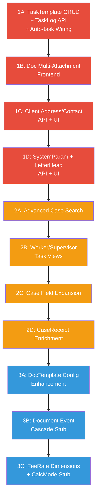

# FPMS MVP1 Enhancement Plan — Safe, Step-by-Step

## Background

Cross-auditing **FPMS SPEC 2.0** and **00_mvp1_scope.md** against the current implementation revealed gaps documented in [mvp1_gap.md](file:///Users/cfcc/Workshop/myprojects/fpms_mvp1_blueprint_atomic/docs/mvp1_gap.md) and [mvp_story_gap.md](file:///Users/cfcc/Workshop/myprojects/fpms_mvp1_blueprint_atomic/docs/mvp_story_gap.md).

**Key finding**: The codebase is more complete than the gap reports suggest. The baseline migration ([enh_10_02_mvp1_baseline_schema.py](file:///Users/cfcc/Workshop/myprojects/fpms_mvp1_blueprint_atomic/backend/alembic/versions/enh_10_02_mvp1_baseline_schema.py)) already created many tables that the gap report marks as missing:

| Table | DB Schema | ORM Model | API | Frontend |
|-------|:---------:|:---------:|:---:|:--------:|
| `t_task_template` | ✅ | ✅ | ❌ | ❌ |
| `t_task_log` | ✅ | ✅ | ❌ | ❌ |
| `t_doc_attachment` | ✅ | ✅ | ✅ partial | ✅ partial |
| `t_case_applicant` | ✅ | ✅ | ✅ | ✅ |
| `t_case_inventor` | ✅ | ✅ | ✅ | ✅ |
| `t_priority` | ✅ | ✅ | ✅ | ✅ |
| `t_doc_template` | ✅ | ✅ | ❌ | ❌ |
| `t_client_address` | ✅ | ✅ | ❌ | ❌ |
| `t_client_contact` | ✅ | ✅ | ❌ | ❌ |
| `t_system_param` | ✅ | ✅ | ❌ | ❌ |
| `t_letter_head` | ✅ | ✅ | ❌ | ❌ |
| `t_payment_line` | ✅ | ❌ | ❌ | ❌ |
| [TaskGenerationService](file:///Users/cfcc/Workshop/myprojects/fpms_mvp1_blueprint_atomic/backend/app/modules/tasks/task_generation_service.py#12-137) | — | ✅ | not wired | — |

The work remaining is primarily **API endpoints + frontend pages** for tables that already exist, plus some model field expansions.

---

## Strategy: Three Phases, Small Waves



> [!IMPORTANT]
> Each wave is a self-contained, testable increment. After completing each wave, we run tests to confirm no regressions before moving on.

---

## Phase 1: Close MVP1 Scope Gaps (P0)

### Wave 1A — TaskTemplate Deadline Calc + TaskLog API + Auto-task Wiring

This is the highest-priority gap — MVP1 scope requires "Task templates (minimal set)" and "log maintained".

#### [MODIFY] [models.py](file:///Users/cfcc/Workshop/myprojects/fpms_mvp1_blueprint_atomic/backend/app/modules/tasks/models.py)

Add deadline calculation fields to [TaskTemplate](file:///Users/cfcc/Workshop/myprojects/fpms_mvp1_blueprint_atomic/backend/app/modules/tasks/models.py#12-18):
- `deadline_base` (VARCHAR 32): e.g. "DOC_DATE", "FILING_DATE"
- `add_months` (INT, default 0)
- `add_days` (INT, default 0)
- `inner_offset_days` (INT, nullable): inner deadline offset from calculated deadline
- `remind1_offset_days`, `remind2_offset_days`, `remind3_offset_days` (INT, nullable)
- `default_worker_role` (VARCHAR 32, nullable)

#### [NEW] Migration for TaskTemplate columns

New Alembic migration adding columns to `t_task_template`.

#### [MODIFY] [schemas.py](file:///Users/cfcc/Workshop/myprojects/fpms_mvp1_blueprint_atomic/backend/app/modules/tasks/schemas.py)

Add `TaskTemplateCreateIn`, `TaskTemplateUpdateIn`, `TaskTemplateOut` schemas.

#### [MODIFY] [api.py](file:///Users/cfcc/Workshop/myprojects/fpms_mvp1_blueprint_atomic/backend/app/modules/tasks/api.py)

- Add CRUD endpoints for TaskTemplate: `GET /task-templates`, `POST /task-templates`, `PUT /task-templates/{id}`, `DELETE /task-templates/{id}`
- Add `GET /tasks/{id}/logs` endpoint returning list of [TaskLogOut](file:///Users/cfcc/Workshop/myprojects/fpms_mvp1_blueprint_atomic/backend/app/modules/tasks/schemas.py#91-101)
- Wire `TaskGenerationService.generate_from_document()` call inside `POST /documents` endpoint (in documents API)

#### [MODIFY] [task_generation_service.py](file:///Users/cfcc/Workshop/myprojects/fpms_mvp1_blueprint_atomic/backend/app/modules/tasks/task_generation_service.py)

Update [_get_offset_days()](file:///Users/cfcc/Workshop/myprojects/fpms_mvp1_blueprint_atomic/backend/app/modules/tasks/task_generation_service.py#99-108) to use the new `add_months` + `add_days` fields.
Update task creation logic to also set `internal_due_date` using `inner_offset_days`.

#### [MODIFY] [api.py](file:///Users/cfcc/Workshop/myprojects/fpms_mvp1_blueprint_atomic/backend/app/modules/documents/api.py)

After document creation, call `TaskGenerationService.generate_from_document()` and commit.

---

### Wave 1B — Document Multi-Attachment Frontend

Backend models and relationships already exist. Need to ensure API endpoints are complete and frontend surfaces them.

#### [MODIFY] [api.py](file:///Users/cfcc/Workshop/myprojects/fpms_mvp1_blueprint_atomic/backend/app/modules/documents/api.py)

Verify/add: `POST /documents/{id}/attachments` (upload), `DELETE /attachments/{id}`, `GET /attachments/{id}/download`

#### [MODIFY] [DocumentCreate.vue](file:///Users/cfcc/Workshop/myprojects/fpms_mvp1_blueprint_atomic/frontend/src/modules/documents/pages/DocumentCreate.vue)

Add multi-file upload zone after form fields.

#### [MODIFY] [DocumentDetail.vue](file:///Users/cfcc/Workshop/myprojects/fpms_mvp1_blueprint_atomic/frontend/src/modules/documents/pages/DocumentDetail.vue)

Show attachment list with download/delete buttons.

#### [MODIFY] [AttachmentList.vue](file:///Users/cfcc/Workshop/myprojects/fpms_mvp1_blueprint_atomic/frontend/src/modules/documents/components/AttachmentList.vue)

Enhance to support upload, download, delete operations.

---

### Wave 1C — Client Address/Contact CRUD

Models exist. Need API endpoints and frontend.

#### [NEW] `backend/app/modules/masterdata/address_api.py`

CRUD for ClientAddress: `GET /clients/{id}/addresses`, `POST`, `PUT`, `DELETE`

#### [NEW] `backend/app/modules/masterdata/contact_api.py`

CRUD for ClientContact: `GET /clients/{id}/contacts`, `POST`, `PUT`, `DELETE`

#### [NEW] `frontend/src/modules/clients/pages/ClientDetail.vue`

Client detail page with address and contact sub-tables (el-table + inline edit).

---

### Wave 1D — SystemParam + LetterHead API + UI

Models exist. Need API and frontend.

#### [NEW] `backend/app/modules/system/param_api.py`

CRUD for SystemParam.

#### [NEW] `backend/app/modules/system/letterhead_api.py`

CRUD for LetterHead.

#### [MODIFY] Settings page

Add SystemParam and LetterHead management to settings module.

---

## Phase 2: MVP1 P1 Enhancements

### Wave 2A — Advanced Case Search

#### [MODIFY] [service.py](file:///Users/cfcc/Workshop/myprojects/fpms_mvp1_blueprint_atomic/backend/app/modules/cases/service.py)

Add filter support: `client_id`, `case_type`, `patent_category`, `flow_dir`, `status`, `filing_date_from/to`, `recv_date_from/to`.

#### [MODIFY] [api.py](file:///Users/cfcc/Workshop/myprojects/fpms_mvp1_blueprint_atomic/backend/app/modules/cases/api.py)

Expose new filter query parameters.

#### [MODIFY] CaseList.vue

Add filter/search panel with dropdown and date-range pickers.

---

### Wave 2B — Task Worker/Supervisor Views

#### [MODIFY] TodayReminders.vue

Add tab switch: "As Worker" / "As Supervisor" (API already supports `as_role` param).

#### [MODIFY] TaskList.vue

Add worker_id / supervisor_id filter dropdowns.

---

### Wave 2C — Case Model Field Expansion

#### [MODIFY] [models.py](file:///Users/cfcc/Workshop/myprojects/fpms_mvp1_blueprint_atomic/backend/app/modules/cases/models.py)

Add NORMAL-case SPEC fields: `pub_date`, `grant_date`, `pub_no`, `grant_no`, `patent_no`, `valid_until`, `spec_pages`, `claim_count`, `notes`, `primary_agent_id`, `second_agent_id`, `draftor_id`.

#### [NEW] Migration for new Case columns

#### [MODIFY] schemas, API, CaseCreate.vue, CaseDetail.vue

Update to include new fields.

---

### Wave 2D — CaseReceipt Enrichment

#### [MODIFY] CaseReceipt model

Add `fee_code`, `year_no`, `receipt_date`, `is_arrears`, `invoice_no`.

#### [NEW] Migration + schema updates

---

## Phase 3: SPEC 2.0 Stubs (Interface Only)

> [!NOTE]
> Phase 3 focuses on **leaving interfaces/stubs** for features that require document templates (which are not yet available). No full implementation — just model fields + API endpoints ready for future template data.

### Wave 3A — DocTemplate Config Enhancement

Add SPEC fields to [DocTemplate](file:///Users/cfcc/Workshop/myprojects/fpms_mvp1_blueprint_atomic/backend/app/modules/documents/models.py#30-37) model: `status_effect`, `status_restore`, `deadline_template_code`, `fee_draft_type`, `fee_item_list` (JSON), `reply_to_template_code`, `need_notify_agent`.

### Wave 3B — Document Event Cascade Stub

Design and stub a `DocumentEventService` that will orchestrate: doc creation → status change + task creation + fee draft creation. Stub methods with `# TODO: implement when template data available`.

### Wave 3C — FeeRate Dimensions + CalcMode Stub

Add `group`, `country_code`, `case_type`, `patent_category`, `calc_mode`, `calc_params` (JSON), `effective_from`, `effective_to` to FeeRate model.

---

## User Review Required

> [!IMPORTANT]
> **Document template data**: Phases 3A/3B depend on actual document template configurations (e.g., "OA1 → deadline 4 months from doc_date"). Since specific templates are not available yet, we will only create the schema/interface. When template data is available, it can be seeded into the database.

> [!WARNING]
> **Database migration safety**: Each wave adds columns/tables but never removes existing ones. All new columns are nullable or have defaults, so existing data is preserved. However, you should **back up [fpms_dev.db](file:///Users/cfcc/Workshop/myprojects/fpms_mvp1_blueprint_atomic/backend/fpms_dev.db)** before running migrations.

---

## Verification Plan

### Automated Tests

All backend changes verified via `pytest` in the existing test infrastructure.

**Run command** (from project root):
```bash
cd backend && python -m pytest tests/ -v
```

**Per-wave test additions**:

| Wave | New test file | Coverage |
|------|--------------|----------|
| 1A | `tests/test_task_template_crud.py` | TaskTemplate CRUD, TaskLog read, auto-task from doc |
| 1B | `tests/test_doc_attachment.py` | Upload, download, delete attachments |
| 1C | `tests/test_client_address_contact.py` | Address/Contact CRUD |
| 1D | `tests/test_system_param.py` | SystemParam + LetterHead CRUD |
| 2A | `tests/test_case_search.py` | Advanced filter combinations |
| 2C | `tests/test_case_fields.py` | New case fields create/update |

**Existing tests** to run for regression:
- [tests/test_core.py](file:///Users/cfcc/Workshop/myprojects/fpms_mvp1_blueprint_atomic/backend/tests/test_core.py) — core API health
- [tests/test_flows.py](file:///Users/cfcc/Workshop/myprojects/fpms_mvp1_blueprint_atomic/backend/tests/test_flows.py) — end-to-end flow (case→doc→task→fee→bill→payment)
- [tests/test_v3_workflow.py](file:///Users/cfcc/Workshop/myprojects/fpms_mvp1_blueprint_atomic/backend/tests/test_v3_workflow.py) — V3 workflow/stepper

### Lint

```bash
cd backend && ruff check .
```

### Manual Verification

After each phase, the user should:
1. Start backend: `make dev-backend`
2. Start frontend: `make dev-frontend`
3. Verify the new pages/features visually in the browser
4. Confirm existing pages still work (no regressions)
